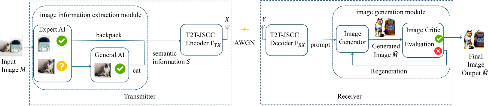
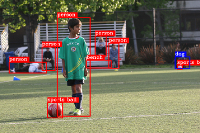
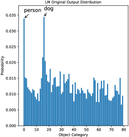
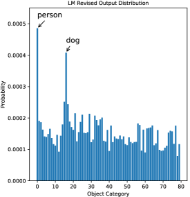
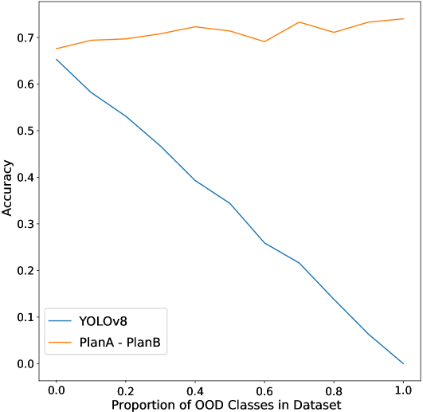
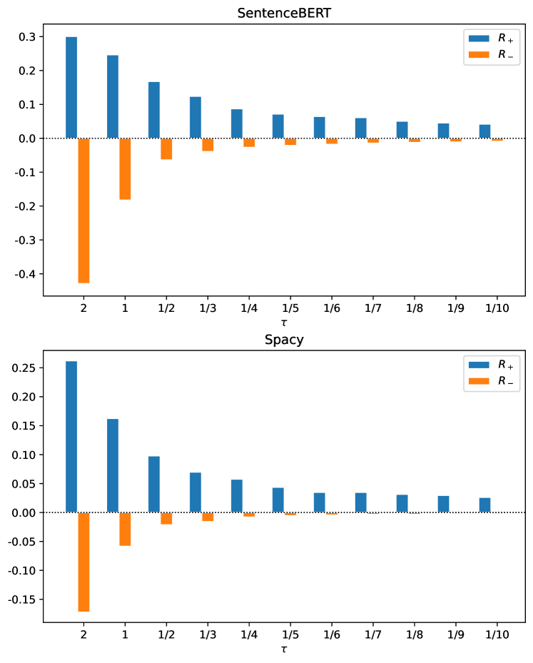
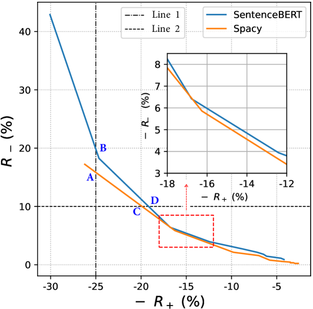
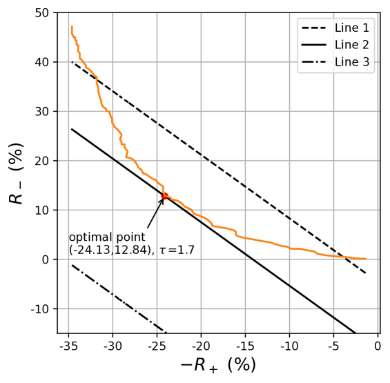
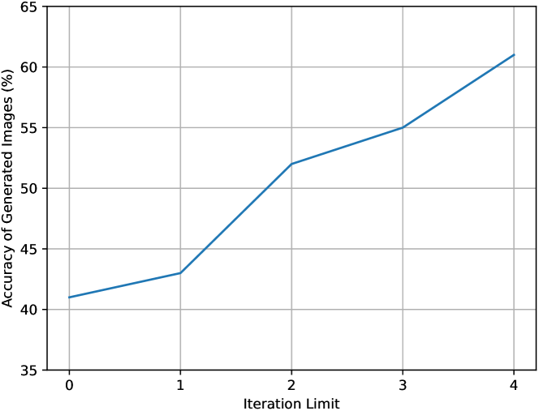
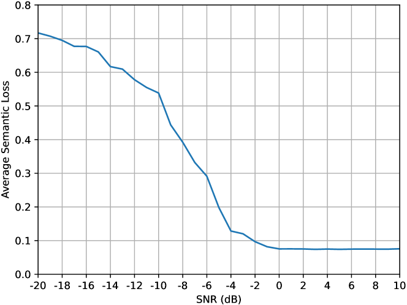

# 利用多模态大型语言模型应对图像语义通信系统中的分布外难题

发布时间：2024年07月21日

`LLM应用` `无线网络` `人工智能`

> Addressing Out-of-Distribution Challenges in Image Semantic Communication Systems with Multi-modal Large Language Models

# 摘要

> 语义通信技术为下一代无线网络带来了希望，但分布外（OOD）问题可能影响语义压缩的完整性。本文通过多模态大型语言模型（MLLMs）探讨解决这一问题，并提出创新的“Plan A - Plan B”框架，利用MLLMs的广泛知识与强大泛化能力，在传统ML模型遭遇OOD输入时提供支持。我们还设计了贝叶斯优化方案，根据图像上下文信息调整MLLM推理概率分布，通过剔除无关词汇和利用上下文相似性作为先验知识，显著提升语义压缩性能。在接收端，我们引入“生成-批评”框架，通过多MLLMs协作增强图像重建的可靠性。

> Semantic communication is a promising technology for next-generation wireless networks. However, the out-of-distribution (OOD) problem, where a pre-trained machine learning (ML) model is applied to unseen tasks that are outside the distribution of its training data, may compromise the integrity of semantic compression. This paper explores the use of multi-modal large language models (MLLMs) to address the OOD issue in image semantic communication. We propose a novel "Plan A - Plan B" framework that leverages the broad knowledge and strong generalization ability of an MLLM to assist a conventional ML model when the latter encounters an OOD input in the semantic encoding process. Furthermore, we propose a Bayesian optimization scheme that reshapes the probability distribution of the MLLM's inference process based on the contextual information of the image. The optimization scheme significantly enhances the MLLM's performance in semantic compression by 1) filtering out irrelevant vocabulary in the original MLLM output; and 2) using contextual similarities between prospective answers of the MLLM and the background information as prior knowledge to modify the MLLM's probability distribution during inference. Further, at the receiver side of the communication system, we put forth a "generate-criticize" framework that utilizes the cooperation of multiple MLLMs to enhance the reliability of image reconstruction.

[Arxiv](https://arxiv.org/abs/2407.15335)