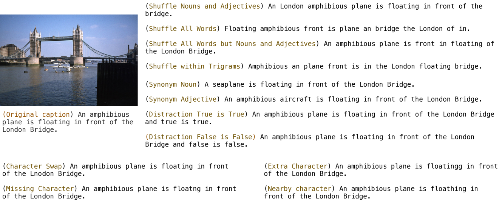

# 从视觉与语言结合的视角，探讨图像与文本检索基准的脆弱性。

发布时间：2024年07月21日

`LLM应用` `信息检索` `计算机视觉`

> Assessing Brittleness of Image-Text Retrieval Benchmarks from Vision-Language Models Perspective

# 摘要

> 图像-文本检索（ITR），作为信息检索的关键任务，由预训练的视觉-语言模型（VLMs）推动，持续刷新性能纪录。然而，现有ITR基准的脆弱性成为一大难题。标准数据集中的说明文字往往概括场景，忽略特定概念的细节。当前评估侧重同模态匹配，而非跨模态关系，易导致性能误读。本研究聚焦ITR评估流程的脆弱性，特别是概念粒度。我们分析MS-COCO和Flickr30k基准，并与增强版MS-COCO-FG和Flickr30k-FG对比，发现后者在概念粒度特征上得分更高。为探究VLMs在不同粒度数据集的性能，我们引入扰动分类法，并应用于数据集。在零-shot条件下，评估四种顶尖模型在标准与细粒度数据集上的表现，无论是否受扰动影响。结果表明，扰动虽降低性能，但细粒度数据集的下降幅度较小。所有模型和数据集的相对性能下降一致，揭示问题根源在于基准。我们提出改进ITR评估流程的议程，为研究指明方向。

> Image-text retrieval (ITR), an important task in information retrieval (IR), is driven by pretrained vision-language models (VLMs) that consistently achieve state-of-the-art performance. However, a significant challenge lies in the brittleness of existing ITR benchmarks. In standard datasets for the task, captions often provide broad summaries of scenes, neglecting detailed information about specific concepts. Additionally, the current evaluation setup assumes simplistic binary matches between images and texts and focuses on intra-modality rather than cross-modal relationships, which can lead to misinterpretations of model performance. Motivated by this gap, in this study, we focus on examining the brittleness of the ITR evaluation pipeline with a focus on concept granularity. We start by analyzing two common benchmarks, MS-COCO and Flickr30k, and compare them with their augmented versions, MS-COCO-FG and Flickr30k-FG, given a specified set of linguistic features capturing concept granularity. We discover that Flickr30k-FG and MS COCO-FG consistently achieve higher scores across all the selected features. To investigate the performance of VLMs on coarse and fine-grained datasets, we introduce a taxonomy of perturbations. We apply these perturbations to the selected datasets. We evaluate four state-of-the-art models - ALIGN, AltCLIP, CLIP, and GroupViT - on the standard and fine-grained datasets under zero-shot conditions, with and without the applied perturbations. The results demonstrate that although perturbations generally degrade model performance, the fine-grained datasets exhibit a smaller performance drop than their standard counterparts. Moreover, the relative performance drop across all setups is consistent across all models and datasets, indicating that the issue lies within the benchmarks. We conclude the paper by providing an agenda for improving ITR evaluation pipelines.

[Arxiv](https://arxiv.org/abs/2407.15239)