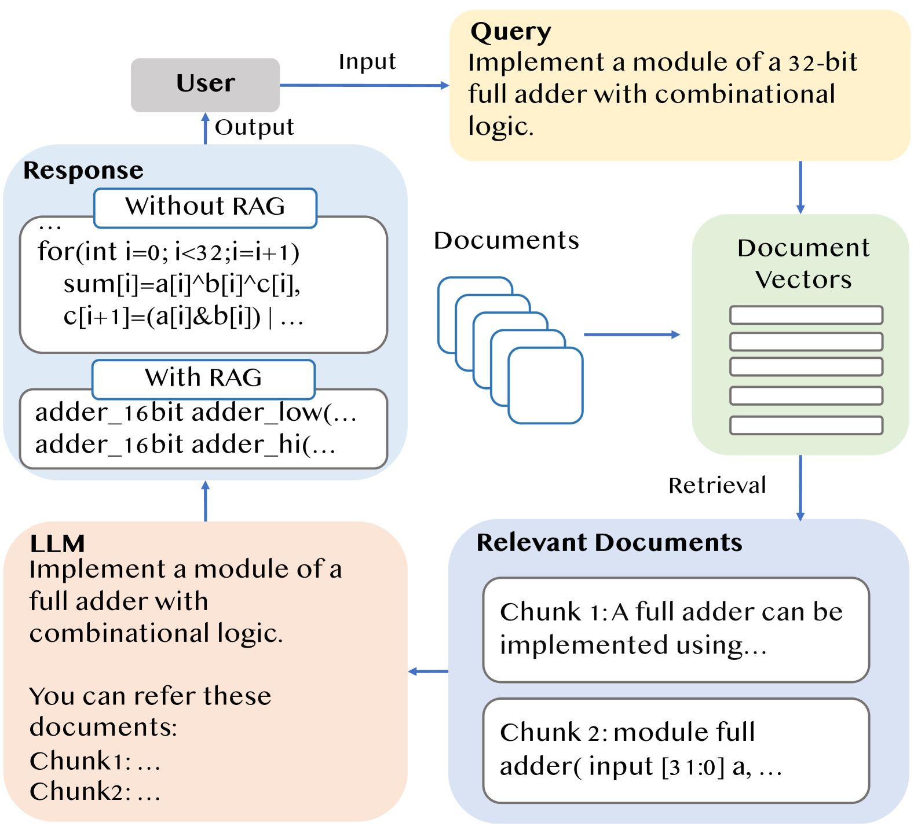
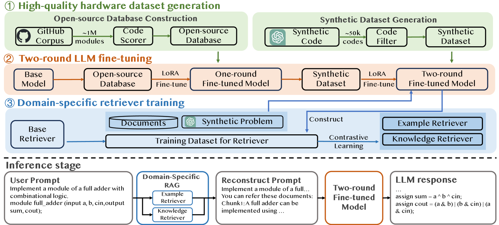
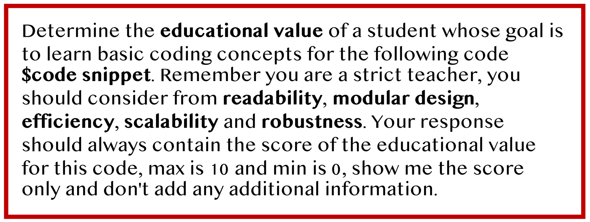
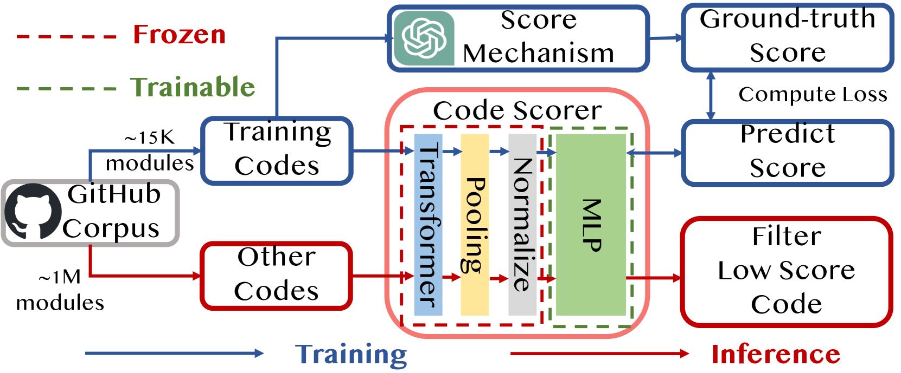
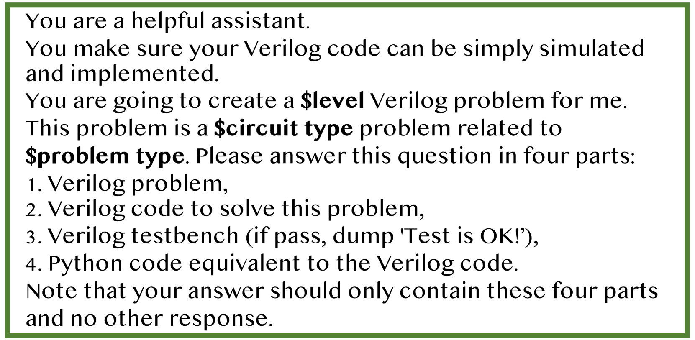
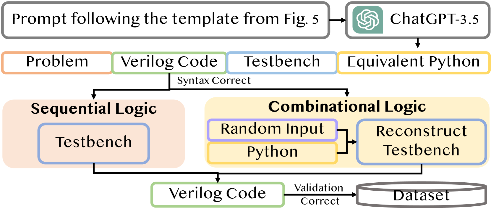
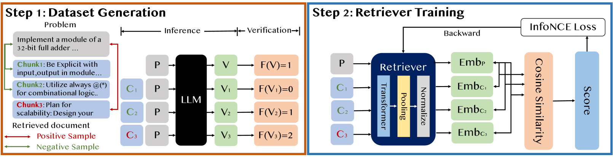

# AutoVCoder：基于 LLMs 的自动化 Verilog 代码生成系统框架

发布时间：2024年07月21日

`LLM应用` `软件开发` `硬件设计`

> AutoVCoder: A Systematic Framework for Automated Verilog Code Generation using LLMs

# 摘要

> 近期，大型语言模型（LLM）在软件代码生成领域，如C/C++和Python，已取得显著成就。但在生成如Verilog等寄存器传输级（RTL）代码时，LLM的语法和功能正确性仍显不足。为此，我们推出了AutoVCoder，一个创新的开源框架，大幅提升LLM生成Verilog代码的准确性，同时优化输出质量。该框架融合了三项前沿技术：高质量硬件数据集构建、两阶段LLM微调策略及领域专用检索增强生成（RAG）机制。实验数据显示，AutoVCoder在Verilog代码生成领域超越了业界及学术界的LLM。具体而言，相较于BetterV，AutoVCoder在EvalMachine和EvalHuman评测中分别提升了0.5%和2.2%的功能正确性，并在RTLLM评测中，与RTLCoder相比，语法和功能正确性均提高了3.4%。

> Recently, the use of large language models (LLMs) for software code generation, e.g., C/C++ and Python, has proven a great success. However, LLMs still suffer from low syntactic and functional correctness when it comes to the generation of register-transfer level (RTL) code, such as Verilog. To address this issue, in this paper, we develop AutoVCoder, a systematic open-source framework that significantly improves the LLMs' correctness of generating Verilog code and enhances the quality of its output at the same time. Our framework integrates three novel techniques, including a high-quality hardware dataset generation approach, a two-round LLM fine-tuning method and a domain-specific retrieval-augmented generation (RAG) mechanism. Experimental results demonstrate that AutoVCoder outperforms both industrial and academic LLMs in Verilog code generation. Specifically, AutoVCoder shows a 0.5% and 2.2% improvement in functional correctness on the EvalMachine and EvalHuman benchmarks compared with BetterV, and also achieves a 3.4% increase in syntax correctness and a 3.4% increase in functional correctness on the RTLLM benchmark compared with RTLCoder.

[Arxiv](https://arxiv.org/abs/2407.18333)