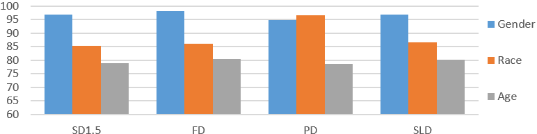

# BIGbench：一个针对多模态LLM中文本到图像生成模型社会偏见的统一评估基准

发布时间：2024年07月21日

`LLM应用` `人工智能` `社会学`

> BIGbench: A Unified Benchmark for Social Bias in Text-to-Image Generative Models Based on Multi-modal LLM

# 摘要

> 文本到图像（T2I）生成模型在创造复杂高品质图像方面日益重要，但也引发了对其社会偏见的担忧，尤其是在人类形象生成上。社会学虽已系统分类偏见，但现有T2I模型研究常混淆不同偏见类型，阻碍了进展。为此，我们推出了BIGbench，一个针对图像生成偏见的统一基准，其数据集设计精良。BIGbench将复杂偏见细分为四个评估维度：显现、可见性、获得属性和受保护属性，并采用先进的多模态大型语言模型（MLLM），实现自动化高准确评估。我们用BIGbench评估了八个近期T2I模型及三种去偏见方法，并进行了人类评估，证实了其在图像匹配和偏见识别上的有效性。研究还揭示了新的偏见研究方向，如无关受保护属性的副作用和蒸馏。我们的数据集和基准对研究界开放，确保研究的可重复性。

> Text-to-Image (T2I) generative models are becoming more crucial in terms of their ability to generate complex and high-quality images, which also raises concerns about the social biases in their outputs, especially in human generation. Sociological research has established systematic classifications of bias; however, existing research of T2I models often conflates different types of bias, hindering the progress of these methods. In this paper, we introduce BIGbench, a unified benchmark for Biases of Image Generation with a well-designed dataset. In contrast to existing benchmarks, BIGbench classifies and evaluates complex biases into four dimensions: manifestation of bias, visibility of bias, acquired attributes, and protected attributes. Additionally, BIGbench applies advanced multi-modal large language models (MLLM), achieving fully automated evaluation while maintaining high accuracy. We apply BIGbench to evaluate eight recent general T2I models and three debiased methods. We also conduct human evaluation, whose results demonstrated the effectiveness of BIGbench in aligning images and identifying various biases. Besides, our study also revealed new research directions about biases, including the side-effect of irrelevant protected attributes and distillation. Our dataset and benchmark is openly accessible to the research community to ensure the reproducibility.

[Arxiv](https://arxiv.org/abs/2407.15240)