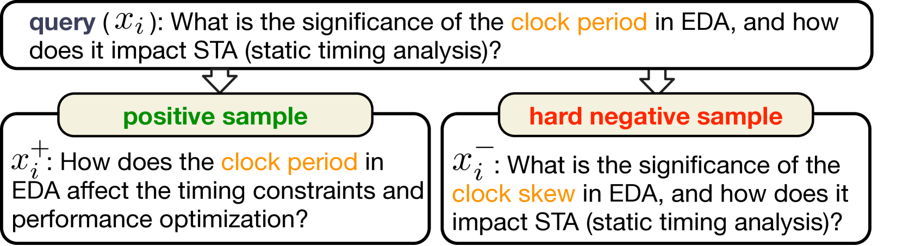
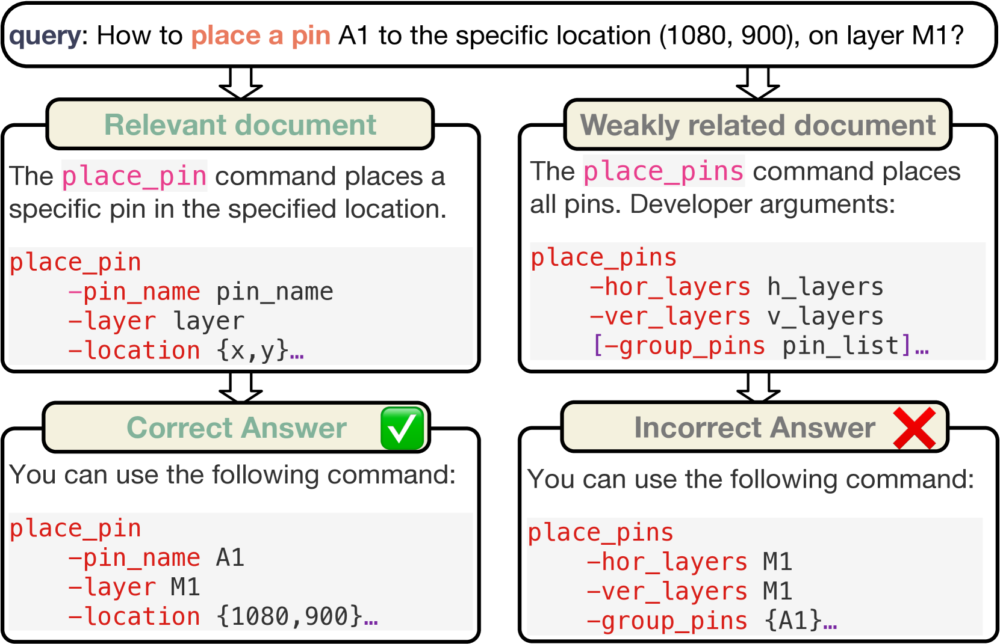
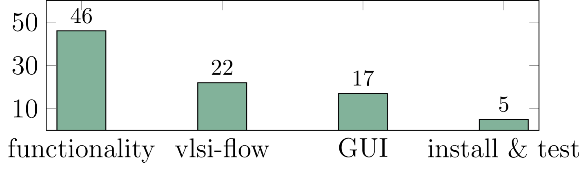

# 定制化检索增强生成技术，助力EDA工具文档QA的基准测试。

发布时间：2024年07月21日

`RAG` `电子设计自动化` `问答系统`

> Customized Retrieval Augmented Generation and Benchmarking for EDA Tool Documentation QA

# 摘要

> RAG技术通过整合外部数据库的事实信息，显著提升了生成式AI模型的准确性与可靠性，尤其在基于文档的问答任务中表现突出。然而，当涉及电子设计自动化等知识密集型垂直领域时，通用预训练的RAG流程面临挑战。为此，我们设计了一个专为EDA工具文档QA定制的RAG框架，并引入了三种领域特定技术：对比学习微调文本嵌入模型、从专有LLM中提炼的重新排序器，以及基于高质量领域语料库微调的生成式LLM。同时，我们推出了针对OpenROAD设计平台的文档QA评估基准ORD-QA，并验证了我们的RAG方案在性能上的优越性。所有相关资源已在GitHub上开源，供进一步研究与应用。

> Retrieval augmented generation (RAG) enhances the accuracy and reliability of generative AI models by sourcing factual information from external databases, which is extensively employed in document-grounded question-answering (QA) tasks. Off-the-shelf RAG flows are well pretrained on general-purpose documents, yet they encounter significant challenges when being applied to knowledge-intensive vertical domains, such as electronic design automation (EDA). This paper addresses such issue by proposing a customized RAG framework along with three domain-specific techniques for EDA tool documentation QA, including a contrastive learning scheme for text embedding model fine-tuning, a reranker distilled from proprietary LLM, and a generative LLM fine-tuned with high-quality domain corpus. Furthermore, we have developed and released a documentation QA evaluation benchmark, ORD-QA, for OpenROAD, an advanced RTL-to-GDSII design platform. Experimental results demonstrate that our proposed RAG flow and techniques have achieved superior performance on ORD-QA as well as on a commercial tool, compared with state-of-the-arts. The ORD-QA benchmark and the training dataset for our customized RAG flow are open-source at https://github.com/lesliepy99/RAG-EDA.

[Arxiv](https://arxiv.org/abs/2407.15353)