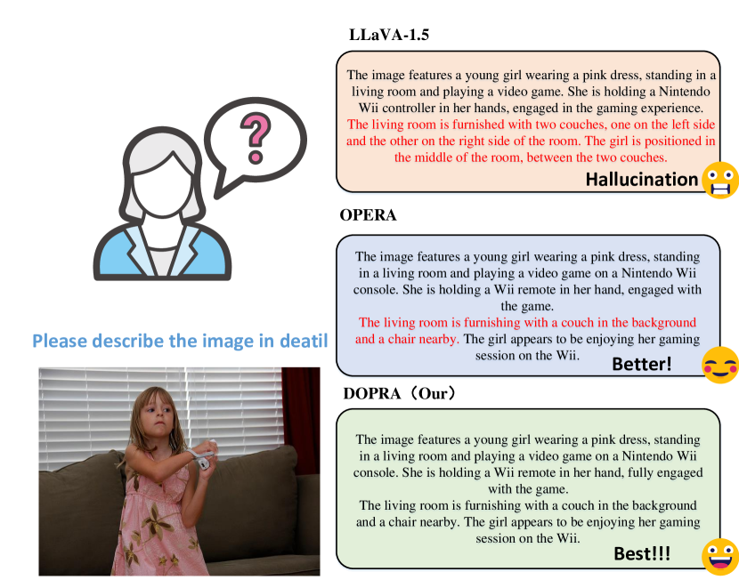

# DOPRA：针对特定权重层，实现过度累积的惩罚与资源重新分配

发布时间：2024年07月21日

`LLM应用` `人工智能` `计算机视觉`

> DOPRA: Decoding Over-accumulation Penalization and Re-allocation in Specific Weighting Layer

# 摘要

> 我们推出的 DOPRA 方法，通过解码特定层加权惩罚和重新分配，有效减轻了多模态大型语言模型中的幻觉问题，无需额外资源，既经济又高效。DOPRA 深入分析了模型过度依赖自注意力矩阵中部分摘要令牌、忽略图像关键信息的问题，并在解码过程中，针对特定层（如第 12 层）实施加权叠加惩罚和重新分配策略，以对抗这种过度依赖。此外，DOPRA 的回顾性分配过程能重新审视生成令牌序列，优化令牌选择，使其更贴合实际图像内容，显著减少自动生成标题中的幻觉描述。DOPRA 通过这些精准调整，系统性地提升了 MLLM 的输出质量。

> In this work, we introduce DOPRA, a novel approach designed to mitigate hallucinations in multi-modal large language models (MLLMs). Unlike existing solutions that typically involve costly supplementary training data or the integration of external knowledge sources, DOPRA innovatively addresses hallucinations by decoding specific weighted layer penalties and redistribution, offering an economical and effective solution without additional resources. DOPRA is grounded in unique insights into the intrinsic mechanisms controlling hallucinations within MLLMs, especially the models' tendency to over-rely on a subset of summary tokens in the self-attention matrix, neglecting critical image-related information. This phenomenon is particularly pronounced in certain strata. To counteract this over-reliance, DOPRA employs a strategy of weighted overlay penalties and redistribution in specific layers, such as the 12th layer, during the decoding process. Furthermore, DOPRA includes a retrospective allocation process that re-examines the sequence of generated tokens, allowing the algorithm to reallocate token selection to better align with the actual image content, thereby reducing the incidence of hallucinatory descriptions in auto-generated captions. Overall, DOPRA represents a significant step forward in improving the output quality of MLLMs by systematically reducing hallucinations through targeted adjustments during the decoding process.

[Arxiv](https://arxiv.org/abs/2407.15130)