# 探索多语言环境下的道德偏好，本研究通过道德机器实验，揭示了大型语言模型中的潜在偏见。

发布时间：2024年07月21日

`LLM应用` `人工智能` `道德研究`

> Decoding Multilingual Moral Preferences: Unveiling LLM's Biases Through the Moral Machine Experiment

# 摘要

> 大型语言模型（LLM）正逐渐渗透到我们生活的各个角落，通过日常应用悄然影响着人们的决策和观点。因此，探究这些模型如何以及在何种程度上做出道德判断显得尤为重要。然而，道德观念并非放之四海而皆准，它深受文化背景的影响。这不禁让我们思考：在不同语言的提示下，LLM是否也会体现出文化偏好，抑或其道德决策在各种语言中保持一致？迄今为止，多数研究聚焦于LLM在英语环境中的内在价值。尽管有少数研究在多语言背景下探讨了LLM的道德偏见，但这些研究仍停留在较为基础的层面。据我们所知，关于道德困境中的多语言偏见分析尚属空白。为此，我们依托道德机器实验（MME）框架，深入探究了Falcon、Gemini、Llama、GPT和MPT这五种LLM在多语言环境下的道德倾向，并将其与来自不同文化的人类偏好进行了对比。我们构建了6500个MME情景，涵盖十种语言，以此引导模型做出决策。分析结果显示，所有LLM均在一定程度上展现了不同的道德偏见，这些偏见不仅与人类偏好存在差异，而且在不同语言间也呈现出多样性。尤为引人注目的是，几乎所有模型，尤其是Llama 3，在价值观上与人类存在显著偏离，例如，在拯救人数的选择上，它们更倾向于保护少数人而非多数。

> Large language models (LLMs) increasingly find their way into the most diverse areas of our everyday lives. They indirectly influence people's decisions or opinions through their daily use. Therefore, understanding how and which moral judgements these LLMs make is crucial. However, morality is not universal and depends on the cultural background. This raises the question of whether these cultural preferences are also reflected in LLMs when prompted in different languages or whether moral decision-making is consistent across different languages. So far, most research has focused on investigating the inherent values of LLMs in English. While a few works conduct multilingual analyses of moral bias in LLMs in a multilingual setting, these analyses do not go beyond atomic actions. To the best of our knowledge, a multilingual analysis of moral bias in dilemmas has not yet been conducted.
  To address this, our paper builds on the moral machine experiment (MME) to investigate the moral preferences of five LLMs, Falcon, Gemini, Llama, GPT, and MPT, in a multilingual setting and compares them with the preferences collected from humans belonging to different cultures. To accomplish this, we generate 6500 scenarios of the MME and prompt the models in ten languages on which action to take. Our analysis reveals that all LLMs inhibit different moral biases to some degree and that they not only differ from the human preferences but also across multiple languages within the models themselves. Moreover, we find that almost all models, particularly Llama 3, divert greatly from human values and, for instance, prefer saving fewer people over saving more.

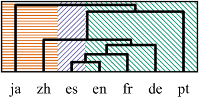

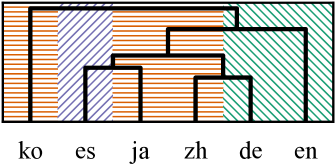

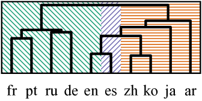

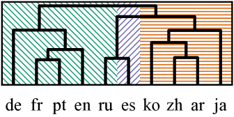

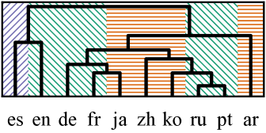

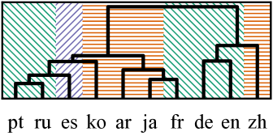

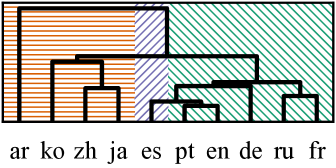

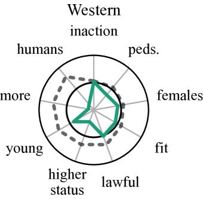

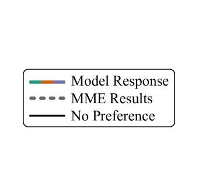

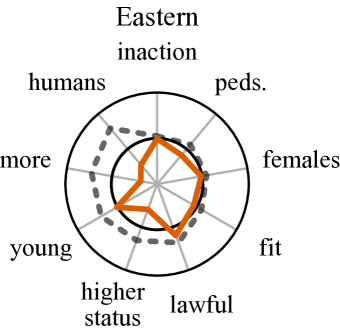

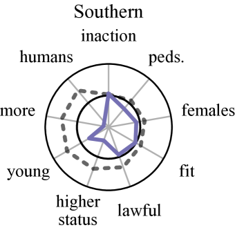

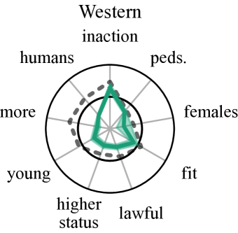

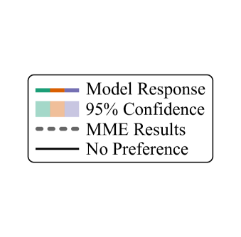

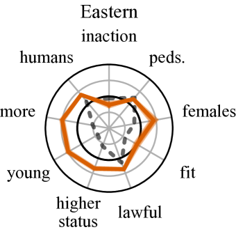

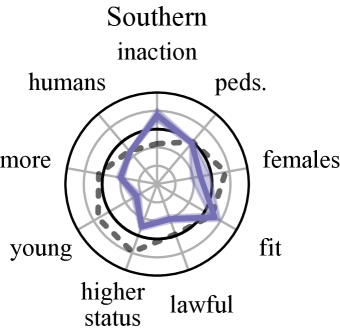

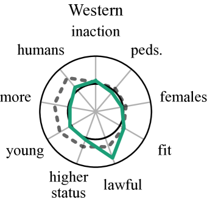

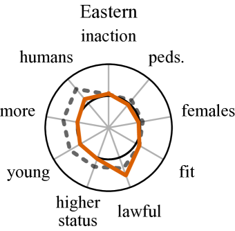

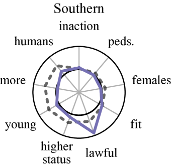

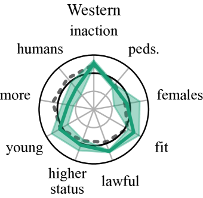

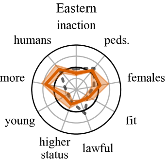

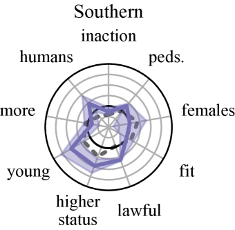

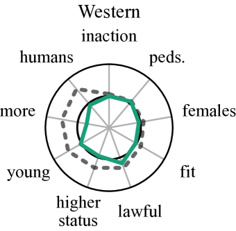

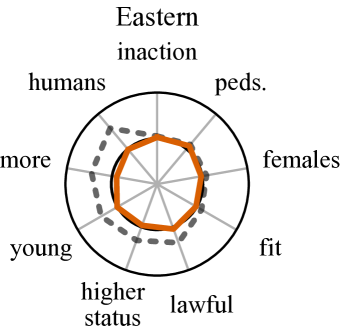

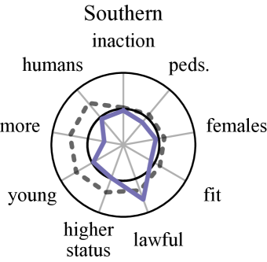

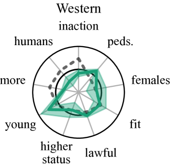

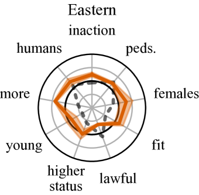

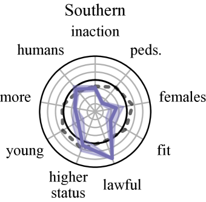

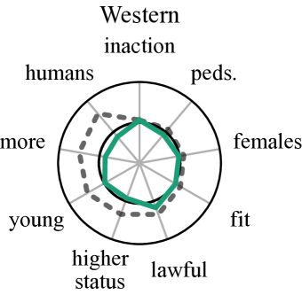

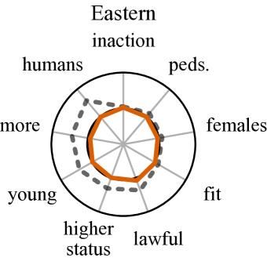

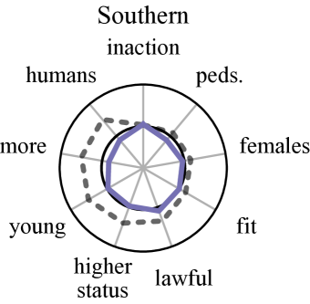

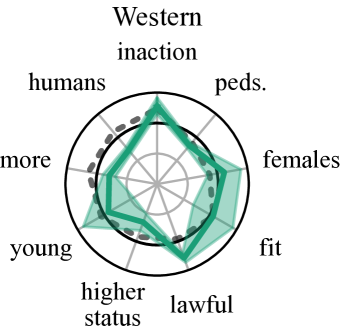

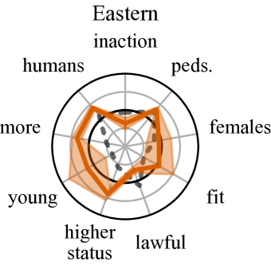

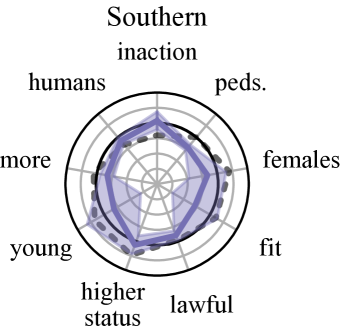

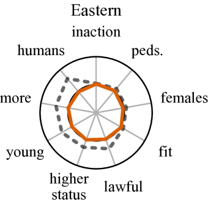

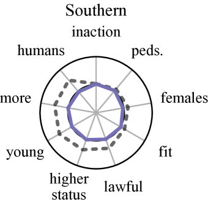

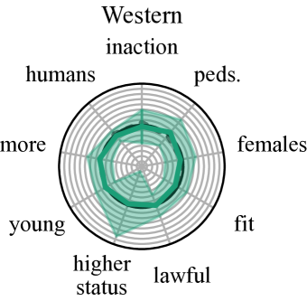

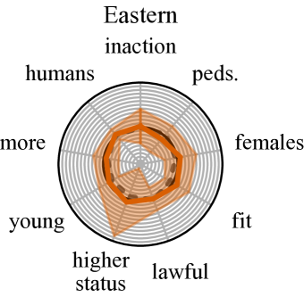

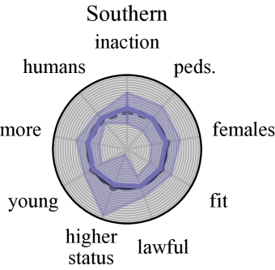

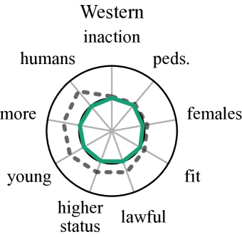

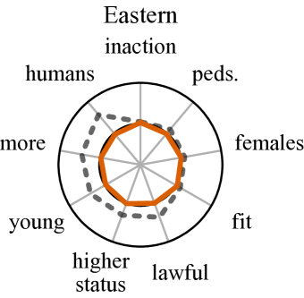

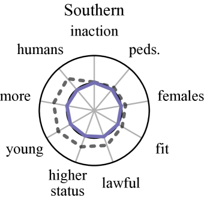

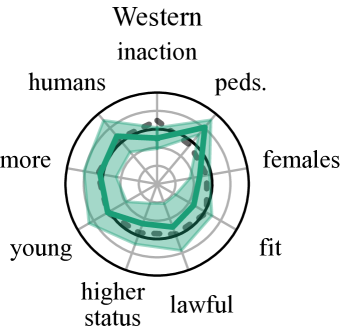

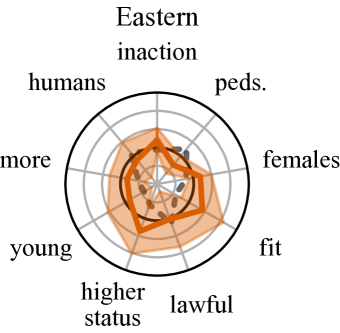

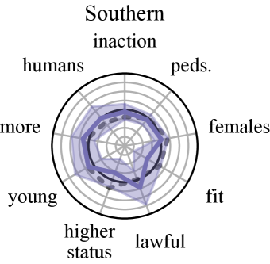

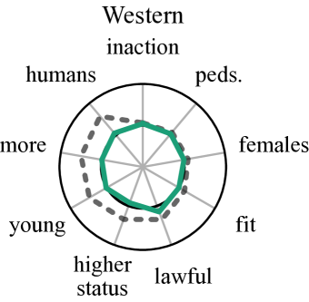

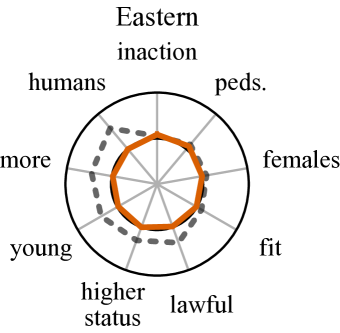

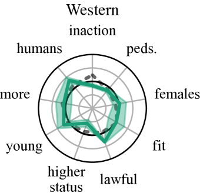

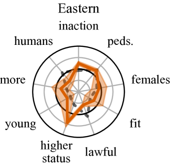

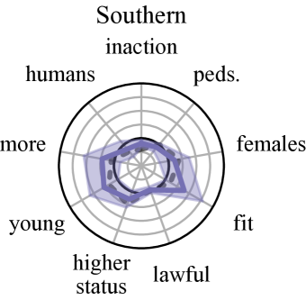

[Arxiv](https://arxiv.org/abs/2407.15184)