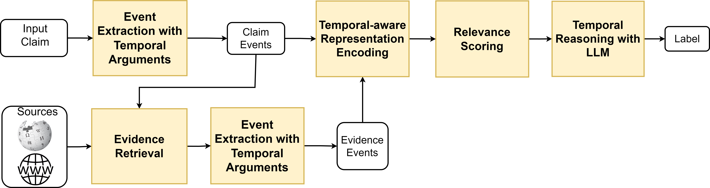
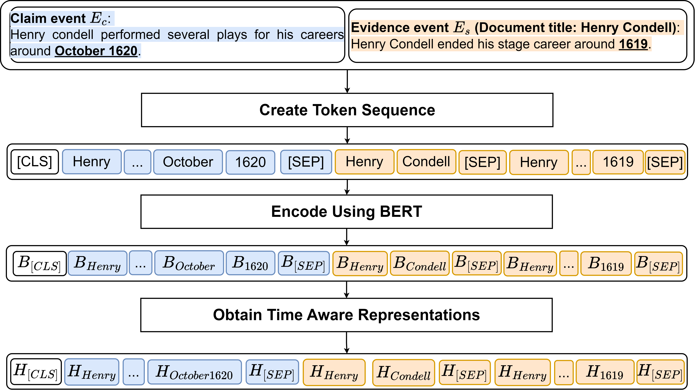
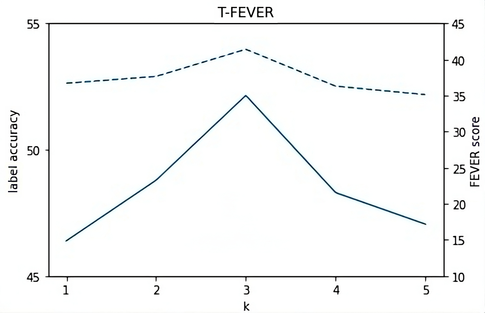
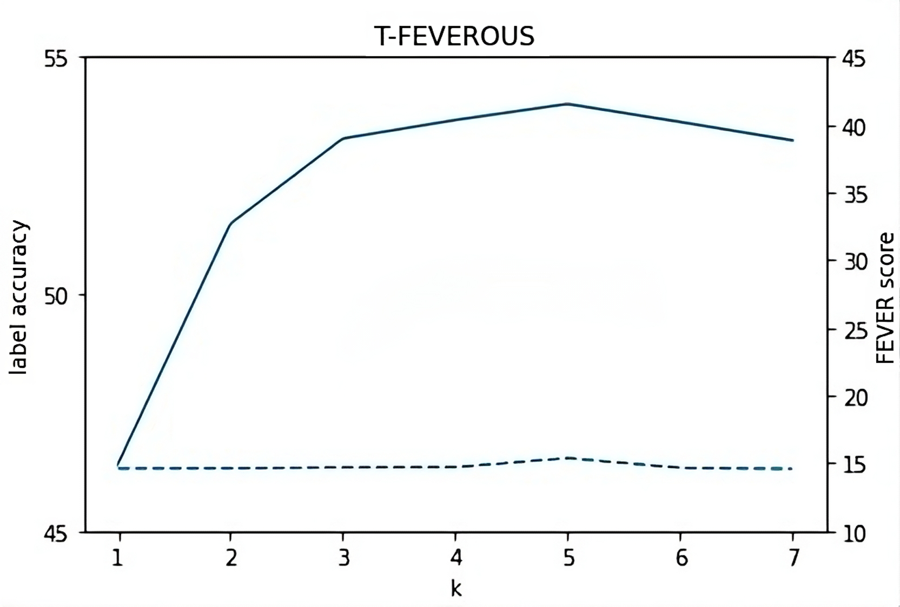

# 时间事实验证的证据基础

发布时间：2024年07月21日

`LLM应用` `数字信任` `自动化事实验证`

> Evidence-Based Temporal Fact Verification

# 摘要

> 自动化事实验证在数字信任建设中至关重要。尽管研究兴趣渐增，时间事实验证却鲜受关注。我们提出了一种端到端解决方案，通过提取时间线索并运用大型语言模型进行时序推理，来应对这一挑战。我们构建了两个数据集，以捕捉事件的语义及时间关系，从而精准检索证据并辅助大型语言模型进行推理，判断声明真伪。实验显示，该方法大幅提升了时间声明验证的准确性，推动了自动化事实验证技术的前沿发展。

> Automated fact verification plays an essential role in fostering trust in the digital space. Despite the growing interest, the verification of temporal facts has not received much attention in the community. Temporal fact verification brings new challenges where cues of the temporal information need to be extracted and temporal reasoning involving various temporal aspects of the text must be applied. In this work, we propose an end-to-end solution for temporal fact verification that considers the temporal information in claims to obtain relevant evidence sentences and harness the power of large language model for temporal reasoning. Recognizing that temporal facts often involve events, we model these events in the claim and evidence sentences. We curate two temporal fact datasets to learn time-sensitive representations that encapsulate not only the semantic relationships among the events, but also their chronological proximity. This allows us to retrieve the top-k relevant evidence sentences and provide the context for a large language model to perform temporal reasoning and outputs whether a claim is supported or refuted by the retrieved evidence sentences. Experiment results demonstrate that the proposed approach significantly enhances the accuracy of temporal claim verification, thereby advancing current state-of-the-art in automated fact verification.

[Arxiv](https://arxiv.org/abs/2407.15291)