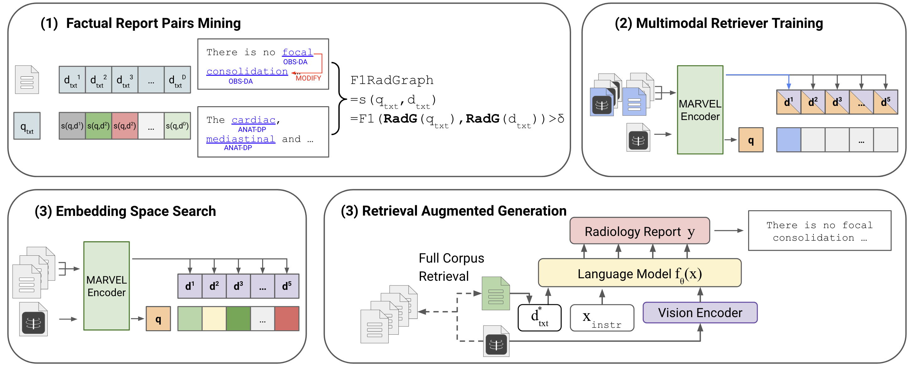
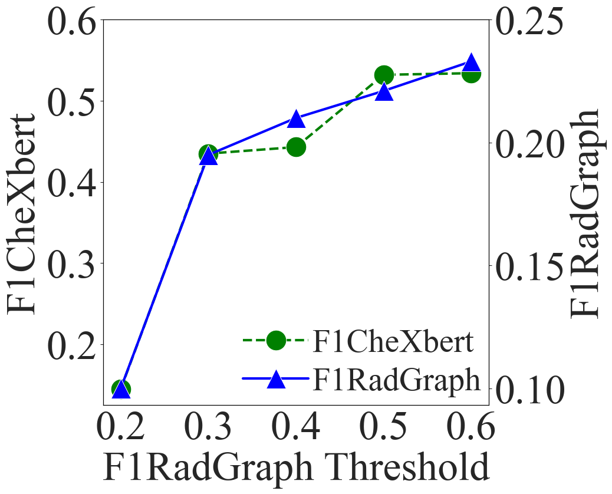
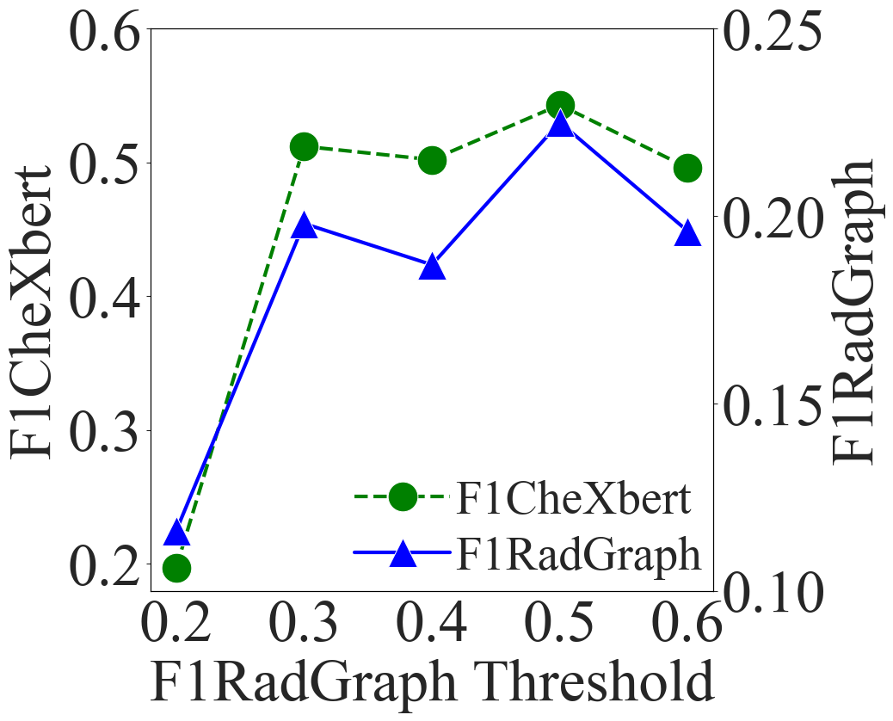
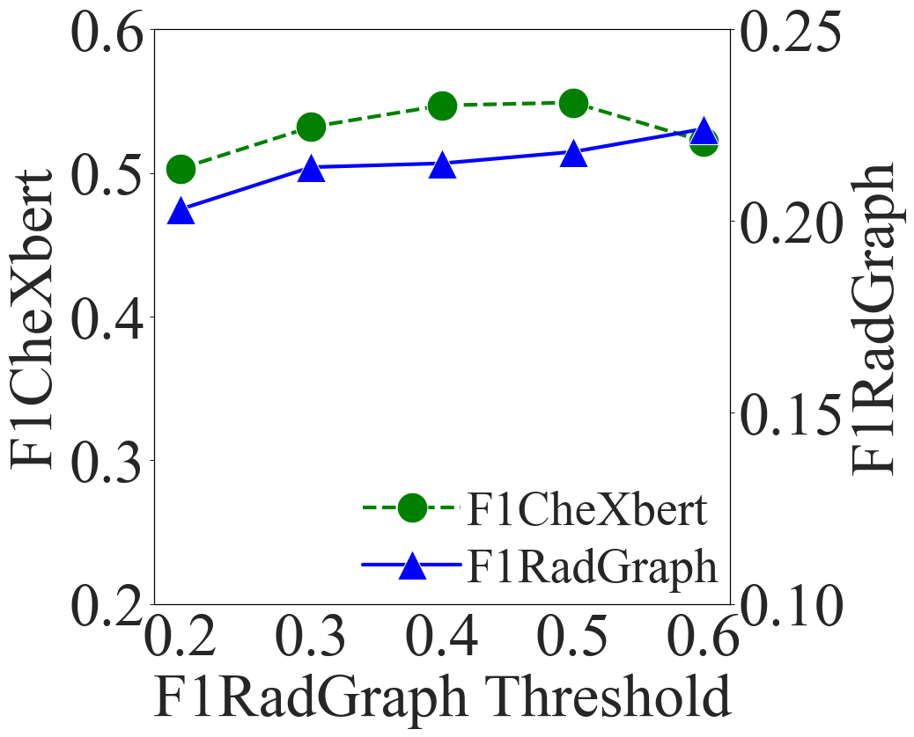
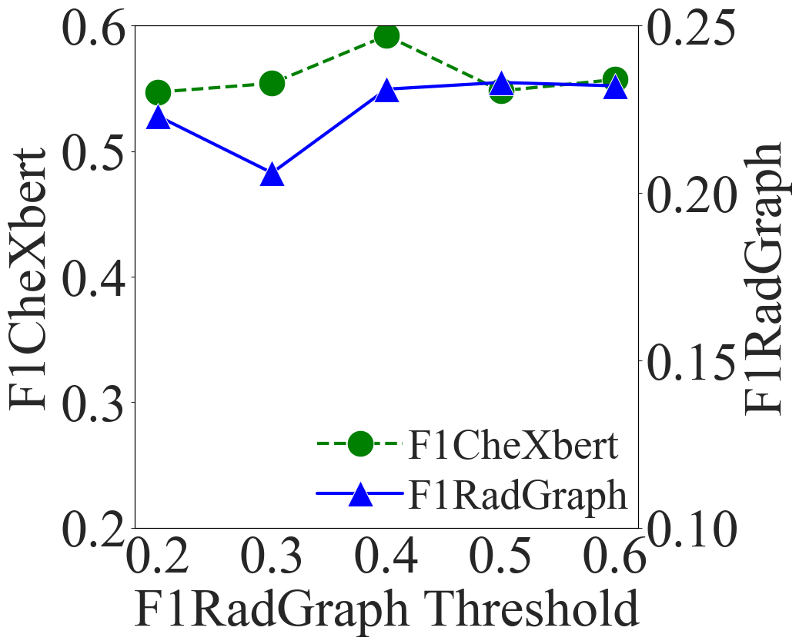
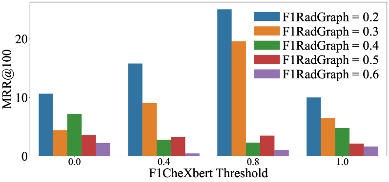
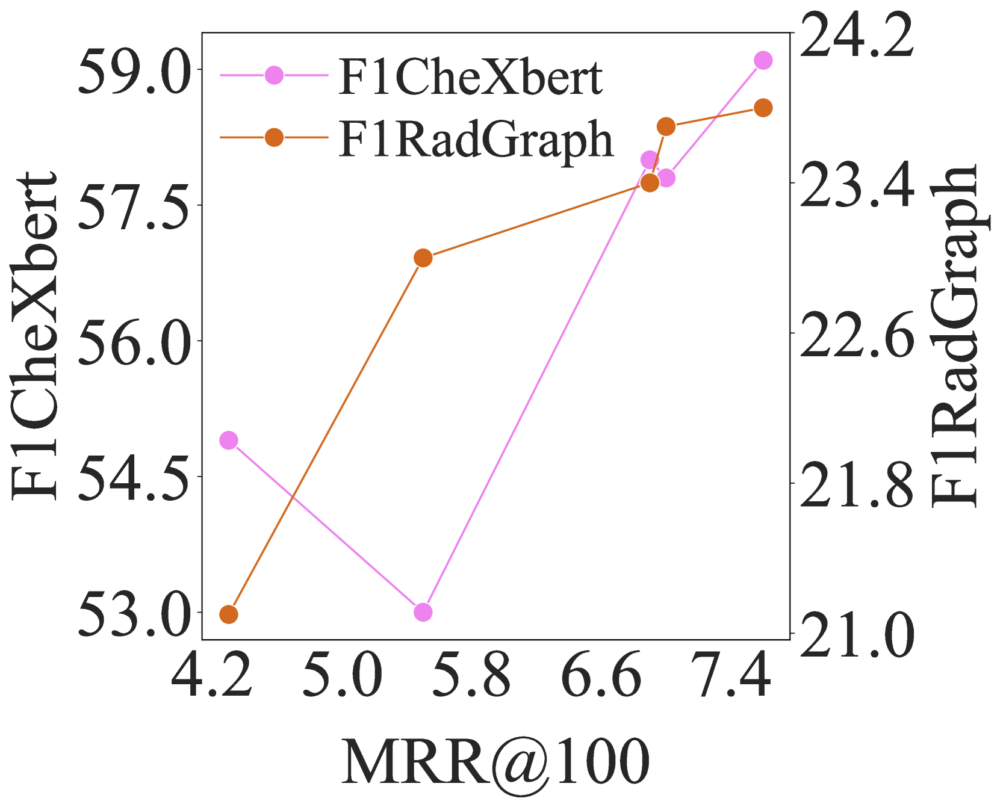
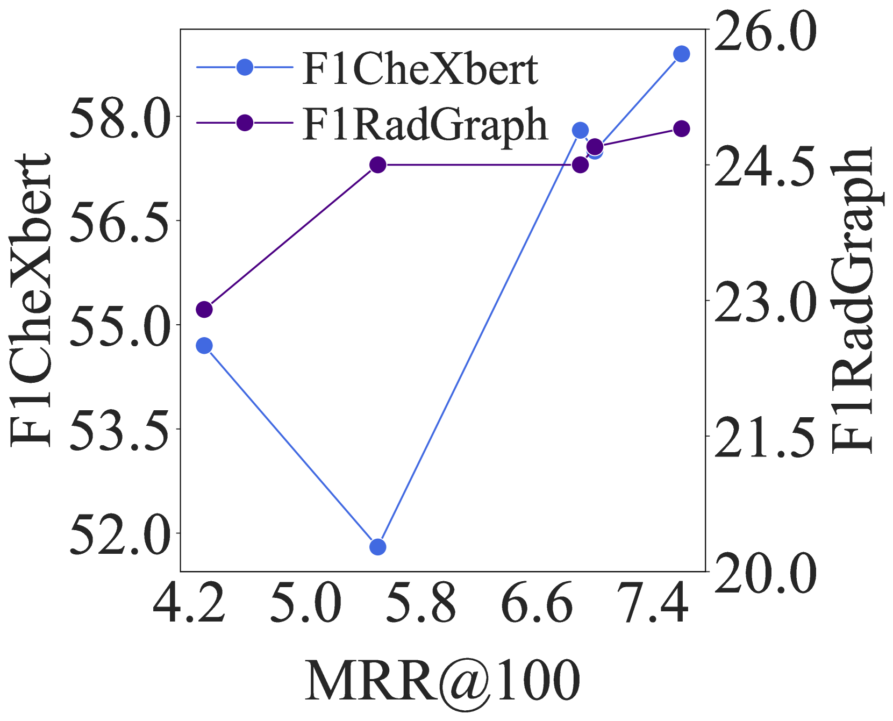

# 结合事实的多模态检索增强技术，助力生成精准的医学放射学报告。

发布时间：2024年07月21日

`RAG` `放射学`

> Fact-Aware Multimodal Retrieval Augmentation for Accurate Medical Radiology Report Generation

# 摘要

> 多模态基础模型在自动化放射报告生成方面潜力巨大，有助于心脏疾病诊断。但生成的报告常含严重事实错误。本文介绍了一种事实感知的多模态检索增强方法（FactMM-RAG），通过RadGraph挖掘事实报告对，并整合事实知识训练通用多模态检索器。该检索器能识别高质量参考报告，增强多模态模型，提升报告的事实准确性。实验显示，我们的检索器在语言生成和放射学指标上均优于现有技术，F1CheXbert和F1RadGraph得分分别提升6.5%和2%。深入分析表明，事实感知训练策略有效且无需诊断标签，成功将事实感知能力传递至多模态模型，优化放射报告生成。

> Multimodal foundation models hold significant potential for automating radiology report generation, thereby assisting clinicians in diagnosing cardiac diseases. However, generated reports often suffer from serious factual inaccuracy. In this paper, we introduce a fact-aware multimodal retrieval-augmented pipeline in generating accurate radiology reports (FactMM-RAG). We first leverage RadGraph to mine factual report pairs, then integrate factual knowledge to train a universal multimodal retriever. Given a radiology image, our retriever can identify high-quality reference reports to augment multimodal foundation models, thus enhancing the factual completeness and correctness of report generation. Experiments on two benchmark datasets show that our multimodal retriever outperforms state-of-the-art retrievers on both language generation and radiology-specific metrics, up to 6.5% and 2% score in F1CheXbert and F1RadGraph. Further analysis indicates that employing our factually-informed training strategy imposes an effective supervision signal, without relying on explicit diagnostic label guidance, and successfully propagates fact-aware capabilities from the multimodal retriever to the multimodal foundation model in radiology report generation.

[Arxiv](https://arxiv.org/abs/2407.15268)