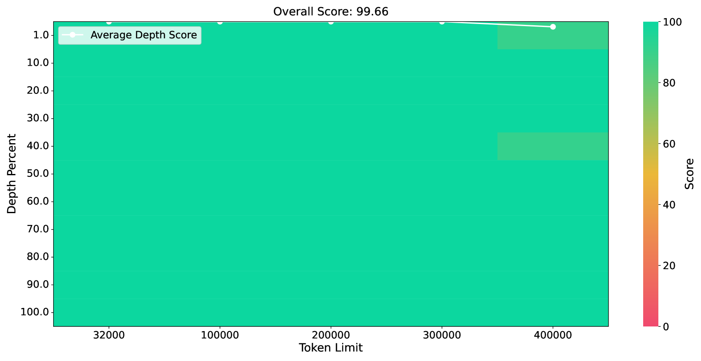

# 告别长度外推，探索一种无需训练的无限上下文，同时保持有限的注意力范围。

发布时间：2024年07月21日

`LLM应用` `人工智能` `计算机科学`

> Farewell to Length Extrapolation, a Training-Free Infinite Context with Finite Attention Scope

# 摘要

> 大型语言模型（LLM）在实际应用中面临的最大挑战之一是支持的上下文长度有限。为此，我们创新性地提出了LongCache方法，通过全上下文缓存选择和无需额外训练的集成技术，让LLM能够处理无限长度的上下文，同时保持性能与传统全注意力机制相当。我们在多个基准测试中验证了LongCache的有效性，并成功将其应用于包括LLaMA3和Mistral-v0.3在内的主流模型，使其在复杂测试中支持高达400K的上下文长度。未来，我们将通过GPU优化进一步提升LongCache的效率。

> The maximum supported context length is a critical bottleneck limiting the practical application of the Large Language Model (LLM). Although existing length extrapolation methods can extend the context of LLMs to millions of tokens, these methods all have an explicit upper bound. In this work, we propose LongCache, a training-free approach that enables LLM to support an infinite context with finite context scope, through full-context cache selection and training-free integration. This effectively frees LLMs from the length extrapolation issue. We validate LongCache on the LongBench and L-Eval and demonstrate its performance is on par with traditional full-attention mechanisms. Furthermore, we have applied LongCache on mainstream LLMs, including LLaMA3 and Mistral-v0.3, enabling them to support context lengths of at least 400K in Needle-In-A-Haystack tests. We will improve the efficiency of LongCache by GPU-aware optimization soon.

[Arxiv](https://arxiv.org/abs/2407.15176)