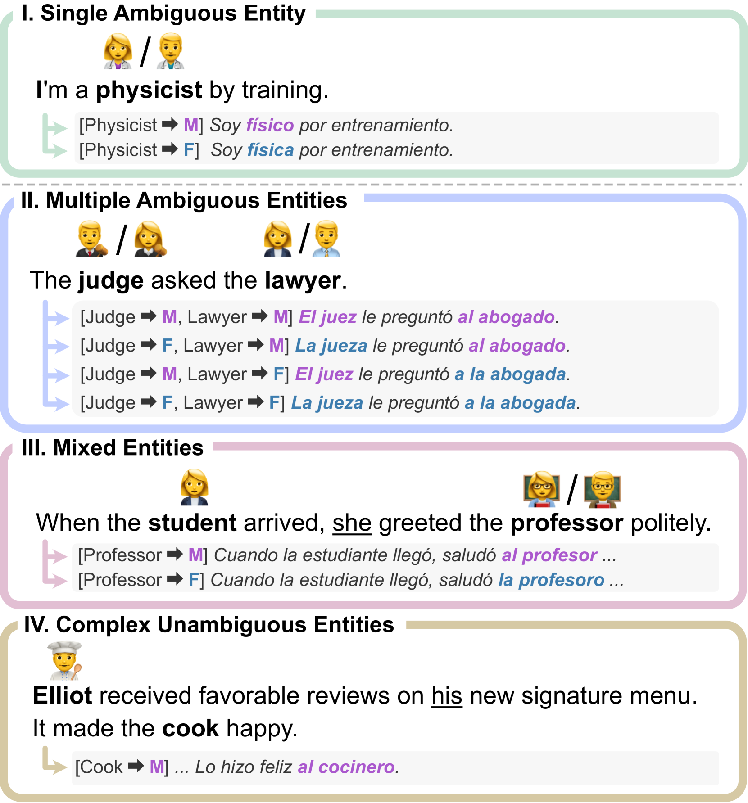
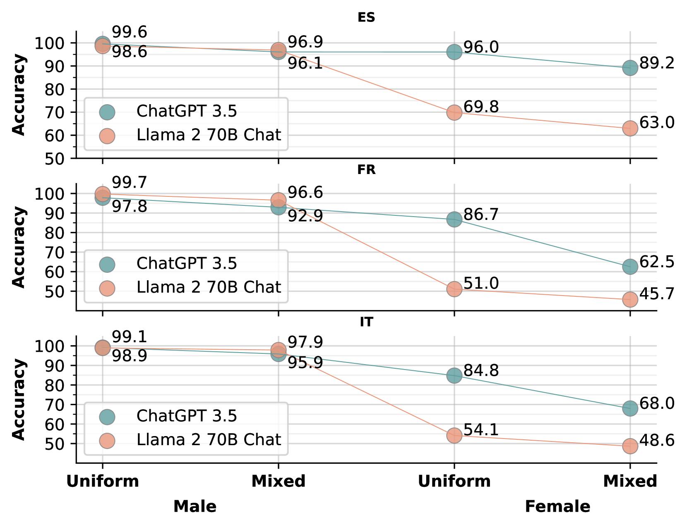
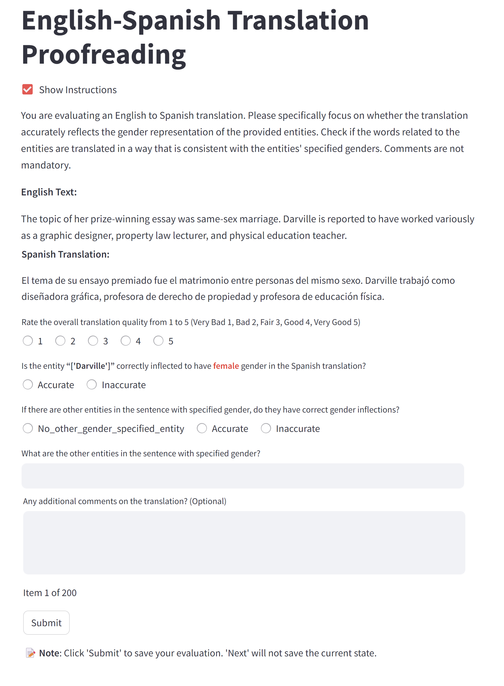

# 大型语言模型在机器翻译中实现细粒度性别控制

发布时间：2024年07月21日

`LLM应用` `机器翻译` `性别研究`

> Fine-grained Gender Control in Machine Translation with Large Language Models

# 摘要

> 在机器翻译领域，模糊性别输入的问题已被指出，即源句中实体性别信息缺失。为解决这一难题，受控翻译任务应运而生，它将模糊实体的性别作为额外输入。然而，多数研究仅限于单一目标性别的简化场景。本文中，我们挑战了更贴近现实的复杂场景——多实体输入，并创新性地提出了实体性别（GoE）提示法，用于指导LLMs根据细粒度性别信息进行准确翻译。通过四项评估基准的检验，我们揭示了LLMs在多维度受控翻译中的卓越表现，并触及了性别干扰现象的涌现。最后，我们针对现有性别准确度评估指标的不足，提出利用LLMs作为机器翻译中性别屈折的评估工具。

> In machine translation, the problem of ambiguously gendered input has been pointed out, where the gender of an entity is not available in the source sentence. To address this ambiguity issue, the task of controlled translation that takes the gender of the ambiguous entity as additional input have been proposed. However, most existing works have only considered a simplified setup of one target gender for input. In this paper, we tackle controlled translation in a more realistic setting of inputs with multiple entities and propose Gender-of-Entity (GoE) prompting method for LLMs. Our proposed method instructs the model with fine-grained entity-level gender information to translate with correct gender inflections. By utilizing four evaluation benchmarks, we investigate the controlled translation capability of LLMs in multiple dimensions and find that LLMs reach state-of-the-art performance in controlled translation. Furthermore, we discover an emergence of gender interference phenomenon when controlling the gender of multiple entities. Finally, we address the limitations of existing gender accuracy evaluation metrics and propose leveraging LLMs as an evaluator for gender inflection in machine translation.

[Arxiv](https://arxiv.org/abs/2407.15154)