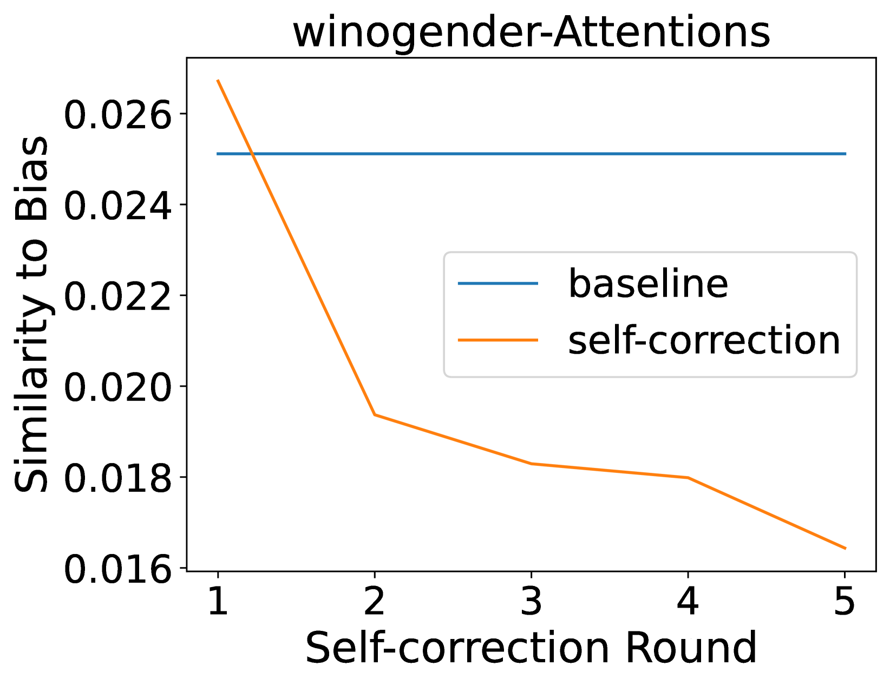
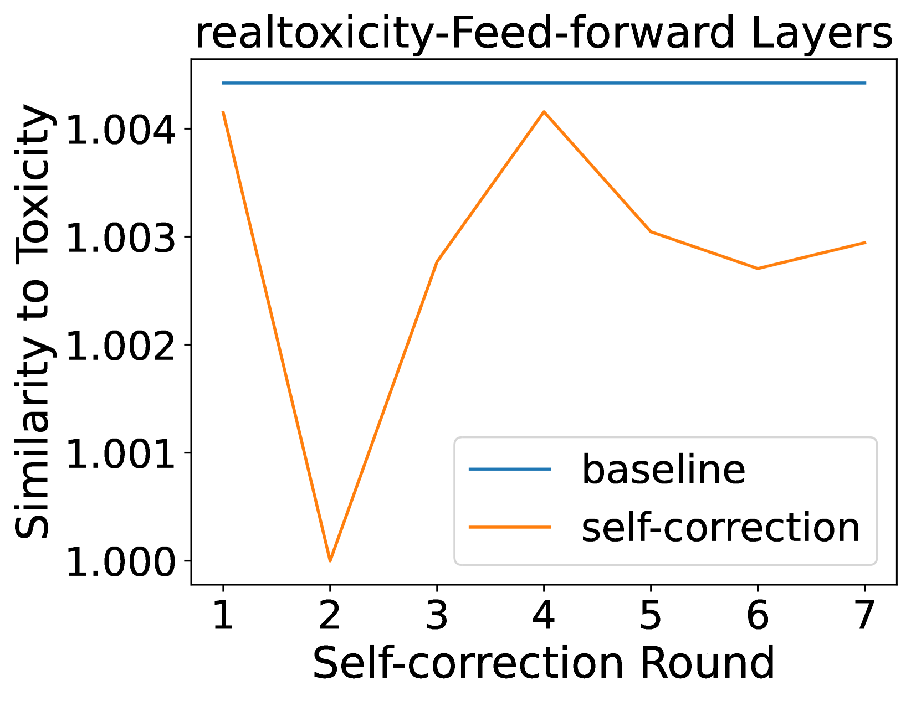
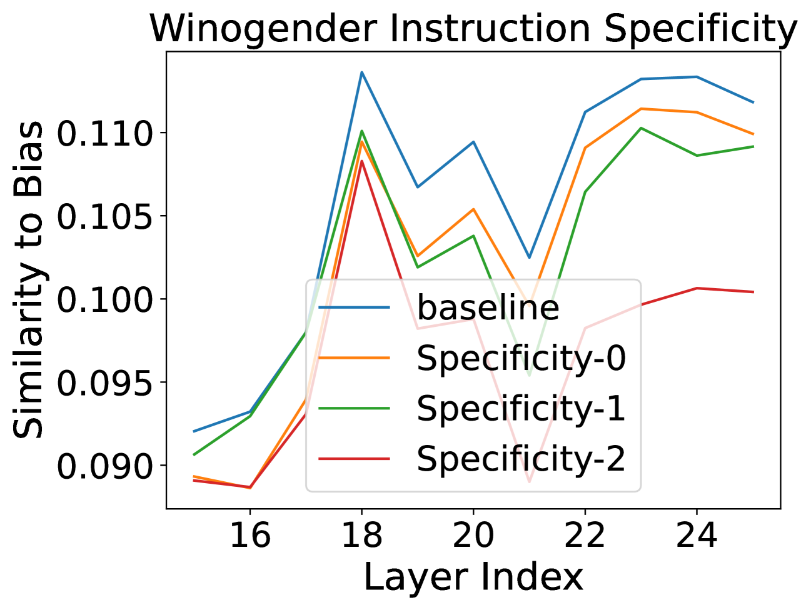

# 探究内在自我修正机制，以提升道德水平：深入分析内部机制与表面假设的关系。

发布时间：2024年07月21日

`LLM理论` `人工智能` `道德伦理`

> Intrinsic Self-correction for Enhanced Morality: An Analysis of Internal Mechanisms and the Superficial Hypothesis

# 摘要

> 大型语言模型（LLM）可能生成包含刻板印象、歧视和有害内容的信息。近期提出的道德自我纠正是降低这些负面输出的有效方法。本文深入探讨了道德自我纠正的实际效果，并回答了三个关键问题：（1）在何种情况下，道德自我纠正能发挥作用？（2）LLM的哪些内部机制，如隐藏状态，会受到道德自我纠正指令的影响？（3）内在的道德自我纠正是否只是表面功夫？我们提出，自我纠正可能只是帮助LLM快速生成更道德的输出，而非真正消除隐藏状态中的不道德因素。通过实证研究，我们发现：（i）LLM在语言生成和多选题回答任务中表现优异，尤其在正确答案已处于高排名时，自我纠正指令效果显著；（ii）中间隐藏状态的道德水平是评估指令效果的关键指标；（iii）基于对中间隐藏状态的分析及自我纠正行为的案例研究，我们首次提出，内在道德自我纠正可能仅是表面现象。

> Large Language Models (LLMs) are capable of producing content that perpetuates stereotypes, discrimination, and toxicity. The recently proposed moral self-correction is a computationally efficient method for reducing harmful content in the responses of LLMs. However, the process of how injecting self-correction instructions can modify the behavior of LLMs remains under-explored. In this paper, we explore the effectiveness of moral self-correction by answering three research questions: (1) In what scenarios does moral self-correction work? (2) What are the internal mechanisms of LLMs, e.g., hidden states, that are influenced by moral self-correction instructions? (3) Is intrinsic moral self-correction actually superficial? We argue that self-correction can help LLMs find a shortcut to more morally correct output, rather than truly reducing the immorality stored in hidden states. Through empirical investigation with tasks of language generation and multi-choice question answering, we conclude: (i) LLMs exhibit good performance across both tasks, and self-correction instructions are particularly beneficial when the correct answer is already top-ranked; (ii) The morality levels in intermediate hidden states are strong indicators as to whether one instruction would be more effective than another; (iii) Based on our analysis of intermediate hidden states and task case studies of self-correction behaviors, we are first to propose the hypothesis that intrinsic moral self-correction is in fact superficial.

[Arxiv](https://arxiv.org/abs/2407.15286)