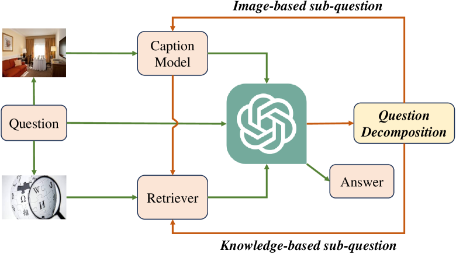
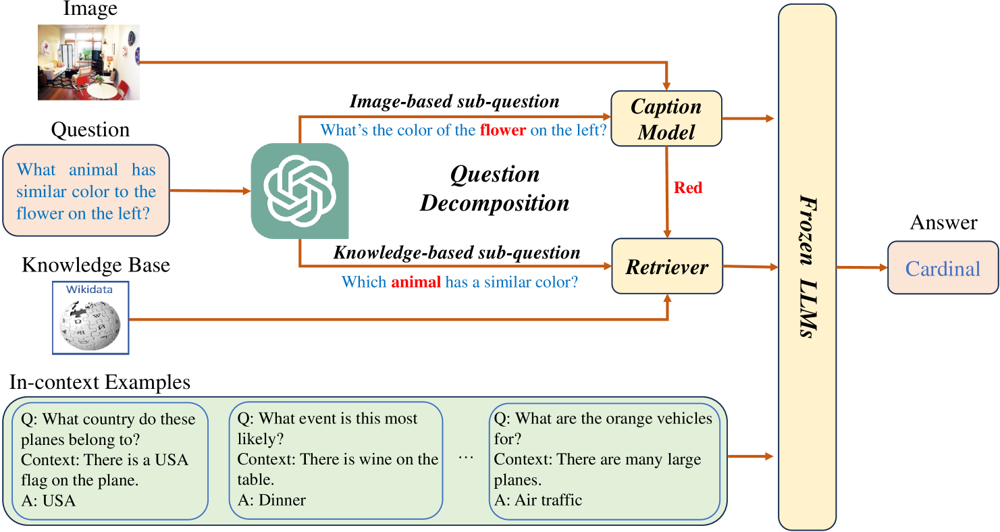
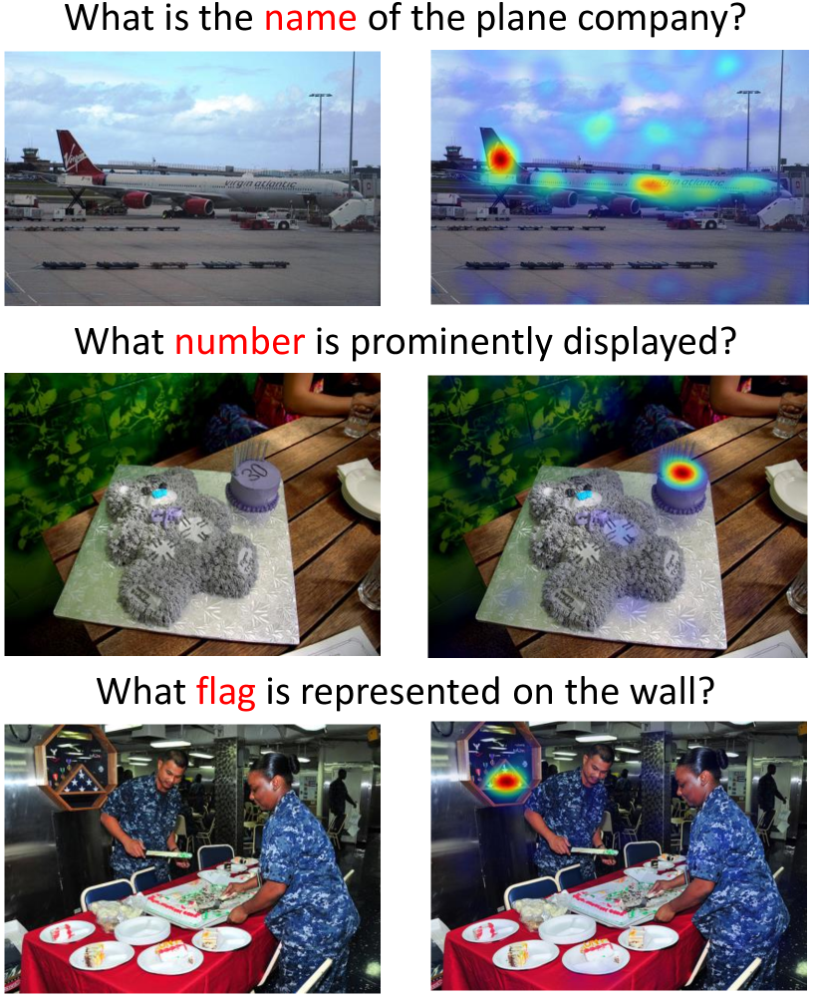
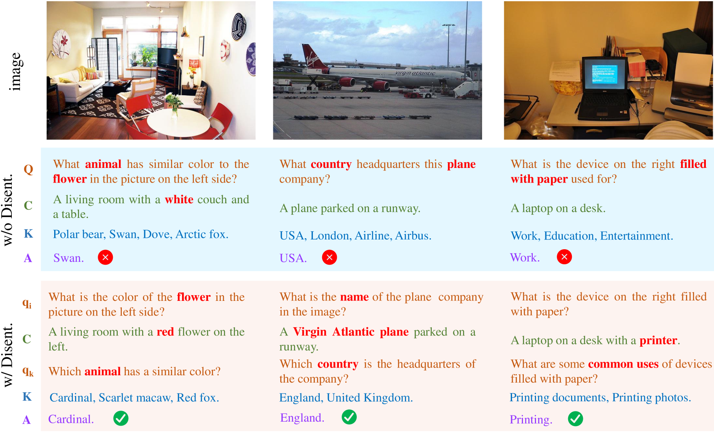

# 大型语言模型在基于知识的视觉问答中的知识获取解耦

发布时间：2024年07月21日

`LLM应用` `计算机视觉` `知识库`

> Knowledge Acquisition Disentanglement for Knowledge-based Visual Question Answering with Large Language Models

# 摘要

> KVQA 需要结合图像和世界知识来解答问题。现有方法先从图像和外部知识库中提取信息，再用大型语言模型（LLM）生成答案。但原始问题中的复杂元素可能使模型在获取不同来源的知识时感到困惑，影响答案的准确性。此外，传统的“单向”回答流程未能明确识别LLM所需的知识，降低了回答质量。为此，我们推出了DKA框架，通过解耦知识获取过程并利用LLM的反馈来精准定位所需知识，无需额外训练。DKA将复杂问题拆分为两个简单子问题：一个针对图像信息，另一个针对知识库信息，从而使知识获取模型能够专注于相关内容，避免无关信息的干扰，提高知识检索的精确度和答案的准确性。实验结果显示，DKA在多个基准数据集上超越了现有技术。我们已将相关数据和代码公开，以支持未来的研究工作。

> Knowledge-based Visual Question Answering (KVQA) requires both image and world knowledge to answer questions. Current methods first retrieve knowledge from the image and external knowledge base with the original complex question, then generate answers with Large Language Models (LLMs). However, since the original question contains complex elements that require knowledge from different sources, acquiring different kinds of knowledge in a coupled manner may confuse models and hinder them from retrieving precise knowledge. Furthermore, the ``forward-only'' answering process fails to explicitly capture the knowledge needs of LLMs, which can further hurt answering quality. To cope with the above limitations, we propose DKA: Disentangled Knowledge Acquisition from LLM feedback, a training-free framework that disentangles knowledge acquisition to avoid confusion and uses LLM's feedback to specify the required knowledge. Specifically, DKA requires LLMs to specify what knowledge they need to answer the question and decompose the original complex question into two simple sub-questions: Image-based sub-question and Knowledge-based sub-question. Then we use the two sub-questions to retrieve knowledge from the image and knowledge base, respectively. In this way, two knowledge acquisition models can focus on the content that corresponds to them and avoid disturbance of irrelevant elements in the original complex question, which can help to provide more precise knowledge and better align the knowledge needs of LLMs to yield correct answers. Experiments on benchmark datasets show that DKA significantly outperforms SOTA models. To facilitate future research, our data and code are available at \url{https://github.com/Lackel/DKA}.

[Arxiv](https://arxiv.org/abs/2407.15346)