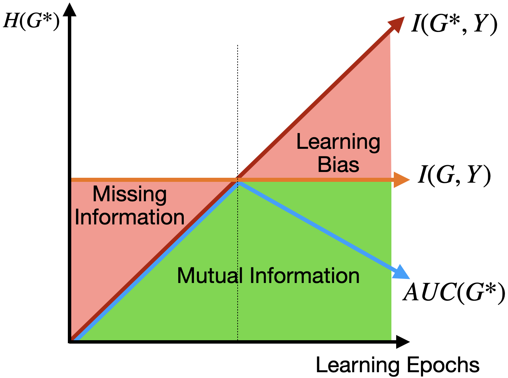
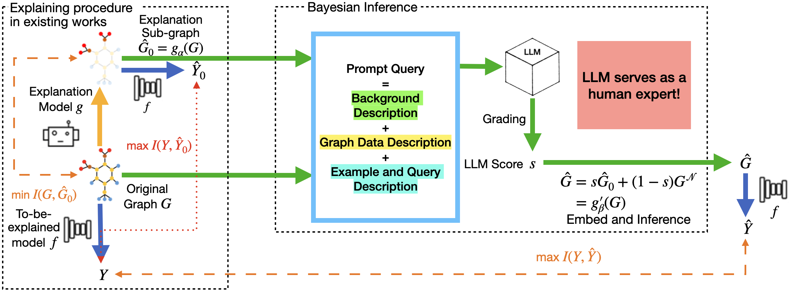
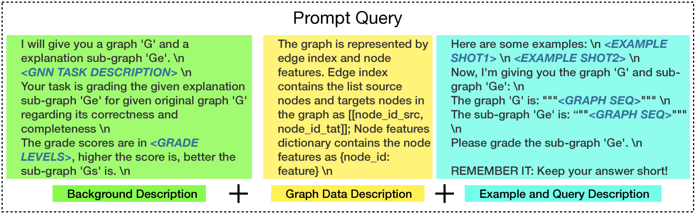

# LLMExplainer：利用大型语言模型进行贝叶斯推理，实现图解释的生成

发布时间：2024年07月21日

`LLM应用` `人工智能` `数据科学`

> LLMExplainer: Large Language Model based Bayesian Inference for Graph Explanation Generation

# 摘要

> 近期研究尝试通过多样的无监督学习模型增强图神经网络 (GNN) 的可解释性，但数据集的稀缺导致学习偏差问题频发。为此，我们创新性地将大型语言模型 (LLM) 嵌入 GNN 解释网络，并将其作为贝叶斯推理 (BI) 模块，有效缓解了学习偏差。我们的实验涵盖了合成与真实数据集，证明了 BI 模块的理论与实践价值。本研究的创新点在于：首先，我们探索了 LLM 作为贝叶斯推理提升算法性能的新途径；其次，我们首次揭示了 GNN 解释中的学习偏差问题。

> Recent studies seek to provide Graph Neural Network (GNN) interpretability via multiple unsupervised learning models. Due to the scarcity of datasets, current methods easily suffer from learning bias. To solve this problem, we embed a Large Language Model (LLM) as knowledge into the GNN explanation network to avoid the learning bias problem. We inject LLM as a Bayesian Inference (BI) module to mitigate learning bias. The efficacy of the BI module has been proven both theoretically and experimentally. We conduct experiments on both synthetic and real-world datasets. The innovation of our work lies in two parts: 1. We provide a novel view of the possibility of an LLM functioning as a Bayesian inference to improve the performance of existing algorithms; 2. We are the first to discuss the learning bias issues in the GNN explanation problem.

[Arxiv](https://arxiv.org/abs/2407.15351)