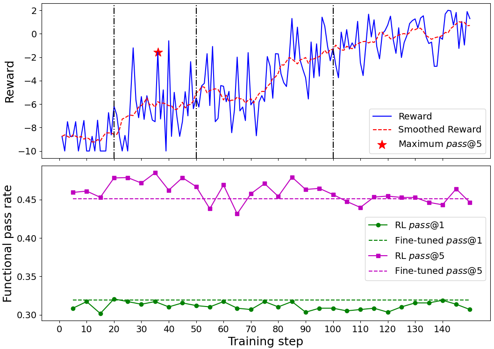
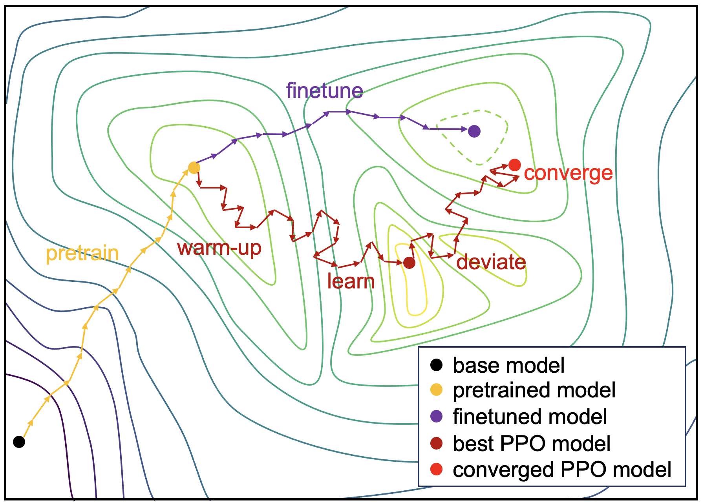

# 基于黄金代码反馈的 Verilog 生成大型语言模型

发布时间：2024年07月21日

`LLM应用` `半导体` `电子工程`

> Large Language Model for Verilog Generation with Golden Code Feedback

# 摘要

> 大型语言模型的最新进展，特别是从自然语言指令生成 Verilog 代码的能力，引起了广泛关注。尽管商业模型如 ChatGPT 领先，开源模型却因性能不足而受限。本研究通过结合强化学习与黄金代码反馈，显著提升了预训练模型的性能，实现了行业领先。我们的 6.7B 参数模型在性能上超越了现有的 13B 和 16B 模型。研究还指出，与 Verilog 代码并行语义相匹配的监督信号是提升生成效率的关键。相关代码和数据已公开，模型权重也可在线获取。

> Recent advancements in large language models (LLMs) have catalyzed significant interest in the automatic generation of Register-Transfer Level (RTL) code, particularly Verilog, from natural language instructions. While commercial LLMs like ChatGPT have dominated this domain, open-source alternatives have lagged considerably in performance, limiting the flexibility and data privacy of this emerging technology. This study introduces a novel approach utilizing reinforcement learning with golden code feedback to enhance the performance of pre-trained models. Leveraging open-source data and base models, we have achieved state-of-the-art (SOTA) results with a substantial margin. Notably, our 6.7B parameter model \ours{} demonstrates superior performance compared to current best-in-class 13B and 16B models. Furthermore, through a comprehensive analysis of the limitations in direct fine-tuning and the training dynamics of reinforcement learning, we posit that the development of comprehensive supervisory signals, which are align with the inherent parallel semantics of Verilog code, is critical to effective generation. The code and data associated with this research are publicly available at \url{https://github.com/CatIIIIIIII/veriseek}. The model weights can be accessed at \url{https://huggingface.co/WANGNingroci/VeriSeek}.

[Arxiv](https://arxiv.org/abs/2407.18271)