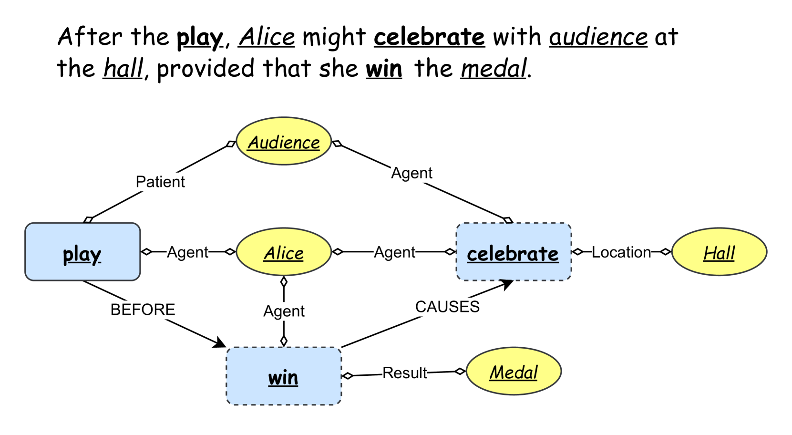
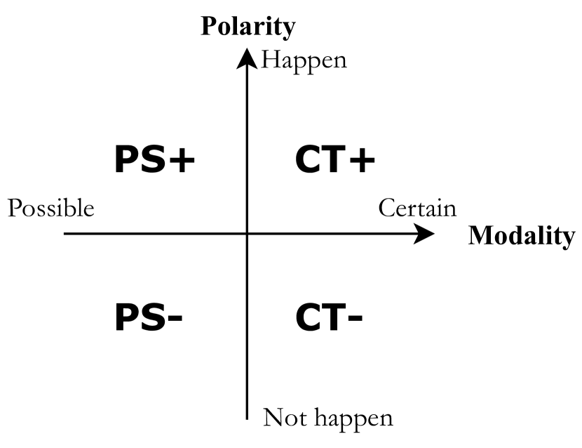
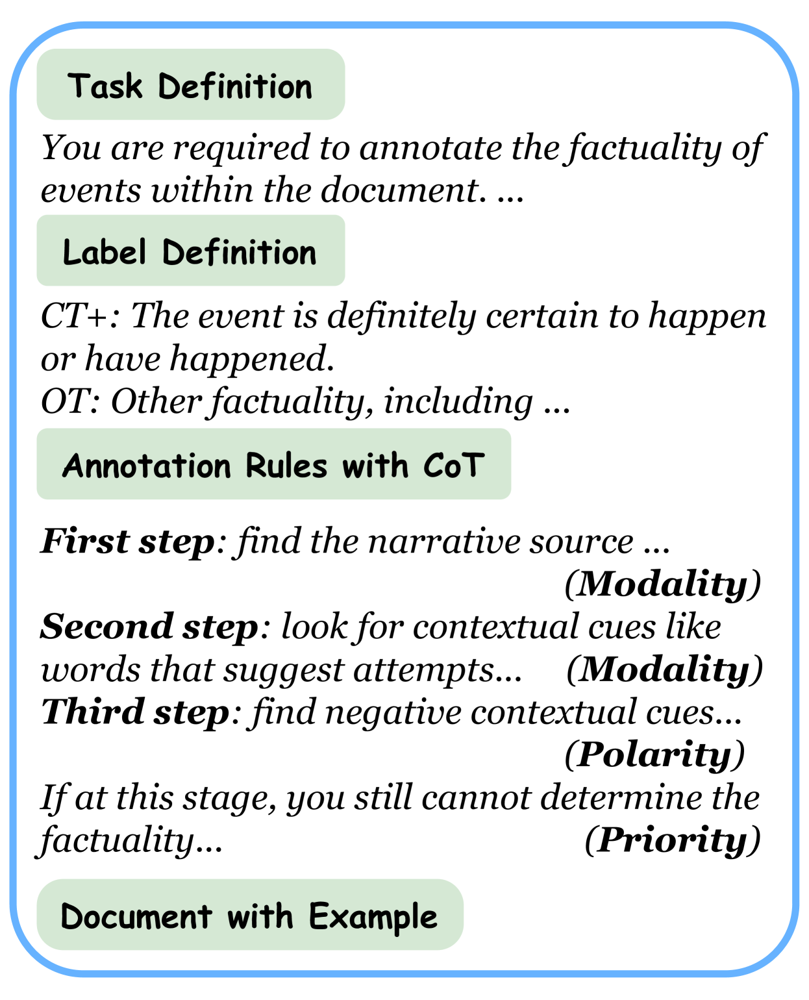
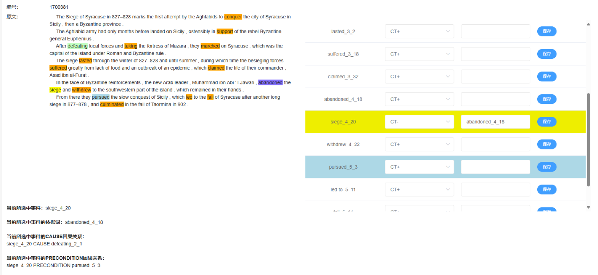

# MAVEN-Fact：一款大规模的事件事实性检测数据集

发布时间：2024年07月21日

`LLM应用` `人工智能` `数据科学`

> MAVEN-Fact: A Large-scale Event Factuality Detection Dataset

# 摘要

> 事件事实性检测（EFD）任务对于准确理解和利用事件知识至关重要，但受限于缺乏高质量的大规模数据，该领域研究进展缓慢。为此，我们推出了MAVEN-Fact，一个基于MAVEN的巨量且高质量的EFD数据集，包含112,276个事件的事实性标注，是目前最大的EFD数据集。实验显示，MAVEN-Fact对传统微调模型和大型语言模型（LLMs）均构成挑战。由于MAVEN中详尽的事件论据和关系标注，MAVEN-Fact还支持深入分析，我们发现这些标注对微调模型有益，但对LLMs无明显帮助。此外，我们初步探索了EFD在减少LLMs事件相关幻觉中的应用，发现其效果显著。数据集和代码已公开，可从\url{https://github.com/lcy2723/MAVEN-FACT}获取。

> Event Factuality Detection (EFD) task determines the factuality of textual events, i.e., classifying whether an event is a fact, possibility, or impossibility, which is essential for faithfully understanding and utilizing event knowledge. However, due to the lack of high-quality large-scale data, event factuality detection is under-explored in event understanding research, which limits the development of EFD community. To address these issues and provide faithful event understanding, we introduce MAVEN-Fact, a large-scale and high-quality EFD dataset based on the MAVEN dataset. MAVEN-Fact includes factuality annotations of 112,276 events, making it the largest EFD dataset. Extensive experiments demonstrate that MAVEN-Fact is challenging for both conventional fine-tuned models and large language models (LLMs). Thanks to the comprehensive annotations of event arguments and relations in MAVEN, MAVEN-Fact also supports some further analyses and we find that adopting event arguments and relations helps in event factuality detection for fine-tuned models but does not benefit LLMs. Furthermore, we preliminarily study an application case of event factuality detection and find it helps in mitigating event-related hallucination in LLMs. Our dataset and codes can be obtained from \url{https://github.com/lcy2723/MAVEN-FACT}

[Arxiv](https://arxiv.org/abs/2407.15352)