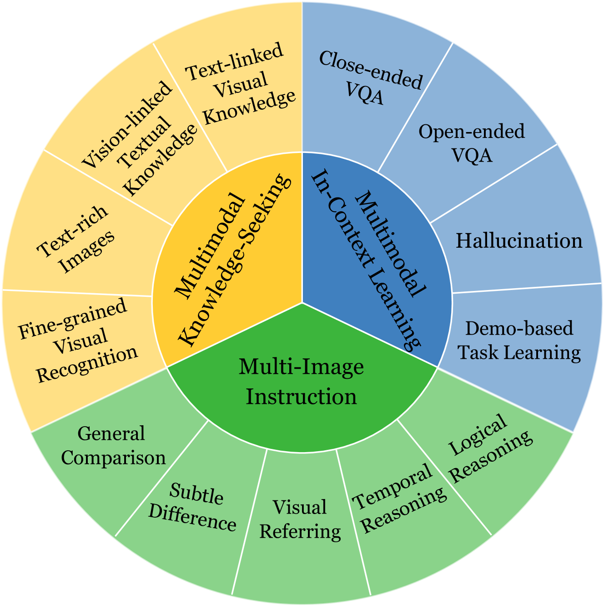
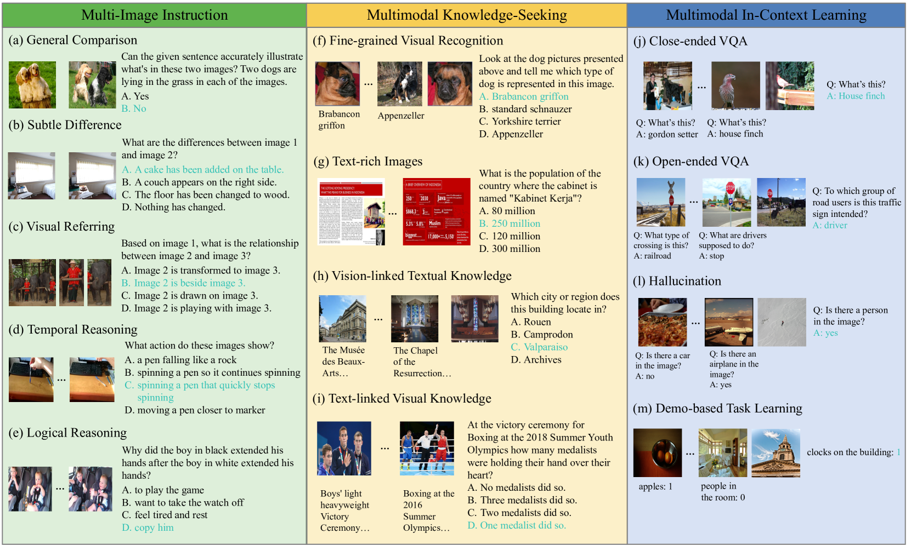
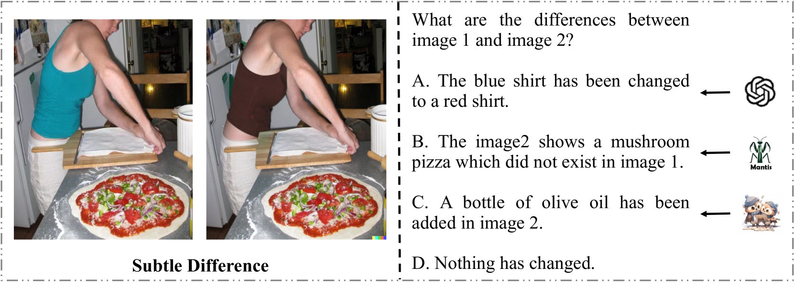
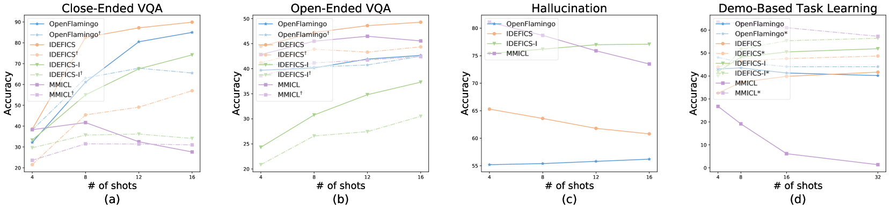

# MIBench：探究多模态大型语言模型在处理多张图像时的性能表现

发布时间：2024年07月21日

`LLM应用` `计算机视觉` `人工智能`

> MIBench: Evaluating Multimodal Large Language Models over Multiple Images

# 摘要

> 借助LLM的强大能力，众多多模态大型语言模型（MLLM）在跨多个基准的视觉语言任务中取得了显著成绩。然而，现有的大多数MLLM和基准主要集中在单图像输入上，对于处理多图像的实际场景，MLLM的表现尚未得到充分研究。尽管有少数基准涉及多图像，但其评估维度和样本数量极为有限。为此，我们提出了一个新的基准——MIBench，旨在全面评估MLLM在多图像场景中的细粒度能力。MIBench将多图像能力细分为多图像指令（MII）、多模态知识寻求（MKS）和多模态上下文学习（MIC）三种场景，并构建了包含13K标注样本的13个任务。在数据构建中，我们为MII和MKS设计了具有挑战性的多项选择题，而对于MIC，我们设置了四个子任务，以深入评估模型的上下文学习能力。我们在MIBench上测试了多个开源和闭源的MLLM，结果表明，尽管这些模型在单图像任务中表现优异，但在处理多图像输入时，它们在细粒度感知、多图像推理和上下文学习稳定性方面存在显著不足。MIBench的标注数据已公开，可访问https://huggingface.co/datasets/StarBottle/MIBench获取。

> Built on the power of LLMs, numerous multimodal large language models (MLLMs) have recently achieved remarkable performance on various vision-language tasks across multiple benchmarks. However, most existing MLLMs and benchmarks primarily focus on single-image input scenarios, leaving the performance of MLLMs when handling realistic multiple images remain underexplored. Although a few benchmarks consider multiple images, their evaluation dimensions and samples are very limited. Therefore, in this paper, we propose a new benchmark MIBench, to comprehensively evaluate fine-grained abilities of MLLMs in multi-image scenarios. Specifically, MIBench categorizes the multi-image abilities into three scenarios: multi-image instruction (MII), multimodal knowledge-seeking (MKS) and multimodal in-context learning (MIC), and constructs 13 tasks with a total of 13K annotated samples. During data construction, for MII and MKS, we extract correct options from manual annotations and create challenging distractors to obtain multiple-choice questions. For MIC, to enable an in-depth evaluation, we set four sub-tasks and transform the original datasets into in-context learning formats. We evaluate several open-source MLLMs and close-source MLLMs on the proposed MIBench. The results reveal that although current models excel in single-image tasks, they exhibit significant shortcomings when faced with multi-image inputs, such as confused fine-grained perception, limited multi-image reasoning, and unstable in-context learning. The annotated data in MIBench is available at https://huggingface.co/datasets/StarBottle/MIBench.

[Arxiv](https://arxiv.org/abs/2407.15272)