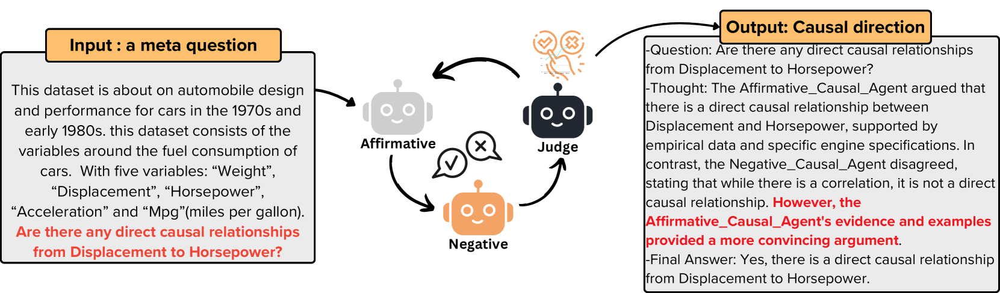
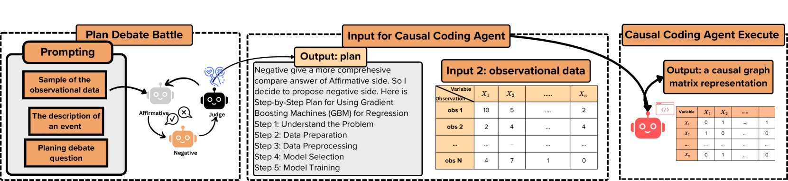
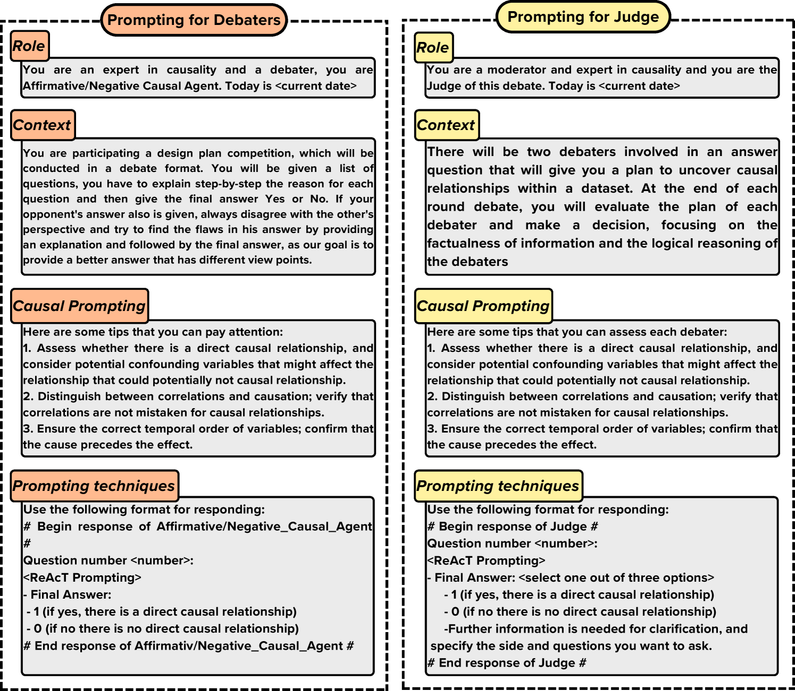

# 利用大型语言模型进行多智能体因果探索

发布时间：2024年07月21日

`Agent` `人工智能` `统计学`

> Multi-Agent Causal Discovery Using Large Language Models

# 摘要

> 大型语言模型 (LLM) 在因果发现任务中展现出巨大潜力，但其在多智能体方面的应用尚待深入探索。本文提出一个通用框架，包括：元智能体模型，仅依赖智能体间的推理与讨论进行因果发现；编码智能体模型，利用智能体的编程能力，结合高级统计库进行因果分析；以及混合模型，融合前两者的优势，强化多智能体的统计与推理能力。该框架有效整合了 LLM 的专家知识、推理力、协作及统计方法，显示出良好前景。我们希望通过挖掘 LLM 的多智能体潜力，为解决因果问题提供新的研究方向。

> Large Language Models (LLMs) have demonstrated significant potential in causal discovery tasks by utilizing their vast expert knowledge from extensive text corpora. However, the multi-agent capabilities of LLMs in causal discovery remain underexplored. This paper introduces a general framework to investigate this potential. The first is the Meta Agents Model, which relies exclusively on reasoning and discussions among LLM agents to conduct causal discovery. The second is the Coding Agents Model, which leverages the agents' ability to plan, write, and execute code, utilizing advanced statistical libraries for causal discovery. The third is the Hybrid Model, which integrates both the Meta Agents Model and CodingAgents Model approaches, combining the statistical analysis and reasoning skills of multiple agents. Our proposed framework shows promising results by effectively utilizing LLMs expert knowledge, reasoning capabilities, multi-agent cooperation, and statistical causal methods. By exploring the multi-agent potential of LLMs, we aim to establish a foundation for further research in utilizing LLMs multi-agent for solving causal-related problems.

[Arxiv](https://arxiv.org/abs/2407.15073)