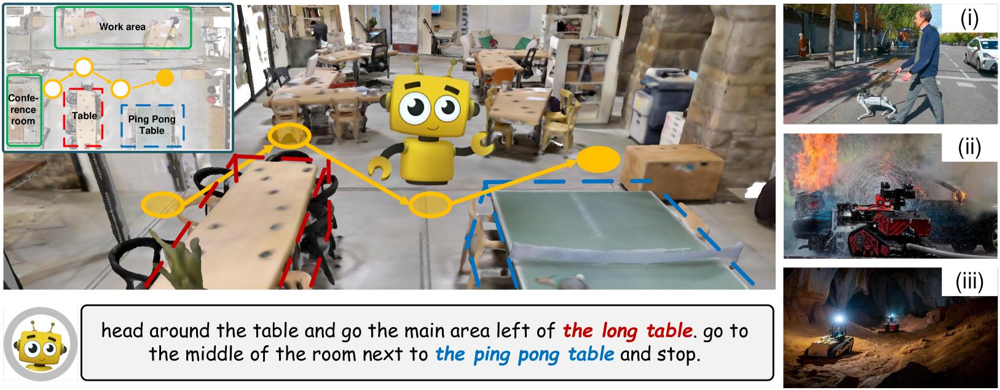
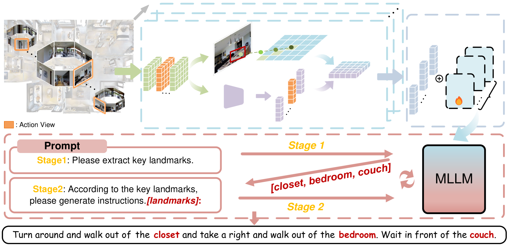
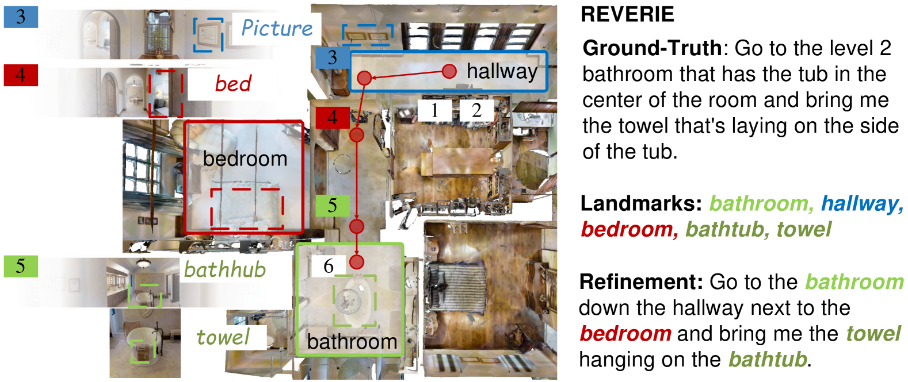

# 利用BEV感知技术与大型语言模型，实现导航指令的智能生成。

发布时间：2024年07月21日

`Agent` `机器人学` `人机交互`

> Navigation Instruction Generation with BEV Perception and Large Language Models

# 摘要

> 在机器人学和人与计算机交互领域，导航指令生成一直备受瞩目，它要求具身代理描述导航路线。现有方法虽直接，却忽视了3D环境的几何信息和对象语义。为此，我们创新性地提出了BEVInstructor，它巧妙地将鸟瞰图（BEV）特征融入多模态大型语言模型（MLLMs），以生成更精准的导航指令。通过构建PerspectiveBEVVisual编码器，BEVInstructor融合BEV与视角特征，深入理解3D环境。同时，利用MLLMs的语言优势，我们提出视角-BEV提示调优，实现参数高效更新。此外，BEVInstructor还采用实例引导的迭代细化流程，逐步提升指令质量。在R2R、REVERIE和UrbanWalk等多个数据集上，BEVInstructor均展现出卓越性能。

> Navigation instruction generation, which requires embodied agents to describe the navigation routes, has been of great interest in robotics and human-computer interaction. Existing studies directly map the sequence of 2D perspective observations to route descriptions. Though straightforward, they overlook the geometric information and object semantics of the 3D environment. To address these challenges, we propose BEVInstructor, which incorporates Bird's Eye View (BEV) features into Multi-Modal Large Language Models (MLLMs) for instruction generation. Specifically, BEVInstructor constructs a PerspectiveBEVVisual Encoder for the comprehension of 3D environments through fusing BEV and perspective features. To leverage the powerful language capabilities of MLLMs, the fused representations are used as visual prompts for MLLMs, and perspective-BEV prompt tuning is proposed for parameter-efficient updating. Based on the perspective-BEV prompts, BEVInstructor further adopts an instance-guided iterative refinement pipeline, which improves the instructions in a progressive manner. BEVInstructor achieves impressive performance across diverse datasets (i.e., R2R, REVERIE, and UrbanWalk).

[Arxiv](https://arxiv.org/abs/2407.15087)