# 利用 LLM 编码与伪事件调控，整合先验知识，提升视频时刻检索的精准度。

发布时间：2024年07月21日

`LLM应用` `视频检索` `人工智能`

> Prior Knowledge Integration via LLM Encoding and Pseudo Event Regulation for Video Moment Retrieval

# 摘要

> 本文探讨了如何利用大型语言模型 (LLM) 整合通用知识，并将伪事件作为先验知识应用于视频时刻检索 (VMR) 模型中的时间内容分布。鉴于 LLM 作为解码器在生成离散文本描述上的局限性，我们提出改用 LLM 编码器。研究表明，即使未经文本嵌入训练，LLM 编码器也能有效优化多模态嵌入中的概念间关系，并可将此能力迁移至 BLIP 和 T5 等嵌入。我们设计了一个通用框架，将 LLM 编码器融入现有 VMR 架构的融合模块中，并通过实验验证了其卓越性能。源代码已公开，详见 https://github.com/fletcherjiang/LLMEPET。

> In this paper, we investigate the feasibility of leveraging large language models (LLMs) for integrating general knowledge and incorporating pseudo-events as priors for temporal content distribution in video moment retrieval (VMR) models. The motivation behind this study arises from the limitations of using LLMs as decoders for generating discrete textual descriptions, which hinders their direct application to continuous outputs like salience scores and inter-frame embeddings that capture inter-frame relations. To overcome these limitations, we propose utilizing LLM encoders instead of decoders. Through a feasibility study, we demonstrate that LLM encoders effectively refine inter-concept relations in multimodal embeddings, even without being trained on textual embeddings. We also show that the refinement capability of LLM encoders can be transferred to other embeddings, such as BLIP and T5, as long as these embeddings exhibit similar inter-concept similarity patterns to CLIP embeddings. We present a general framework for integrating LLM encoders into existing VMR architectures, specifically within the fusion module. Through experimental validation, we demonstrate the effectiveness of our proposed methods by achieving state-of-the-art performance in VMR. The source code can be accessed at https://github.com/fletcherjiang/LLMEPET.

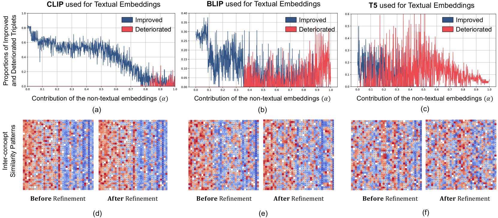

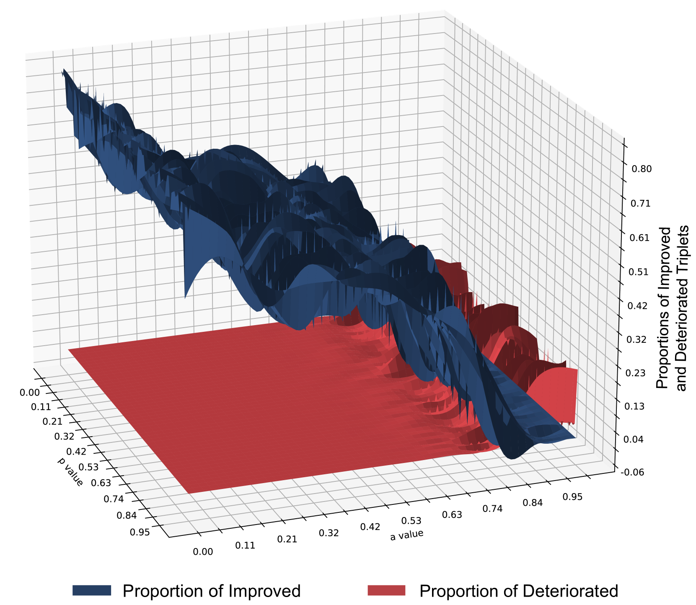

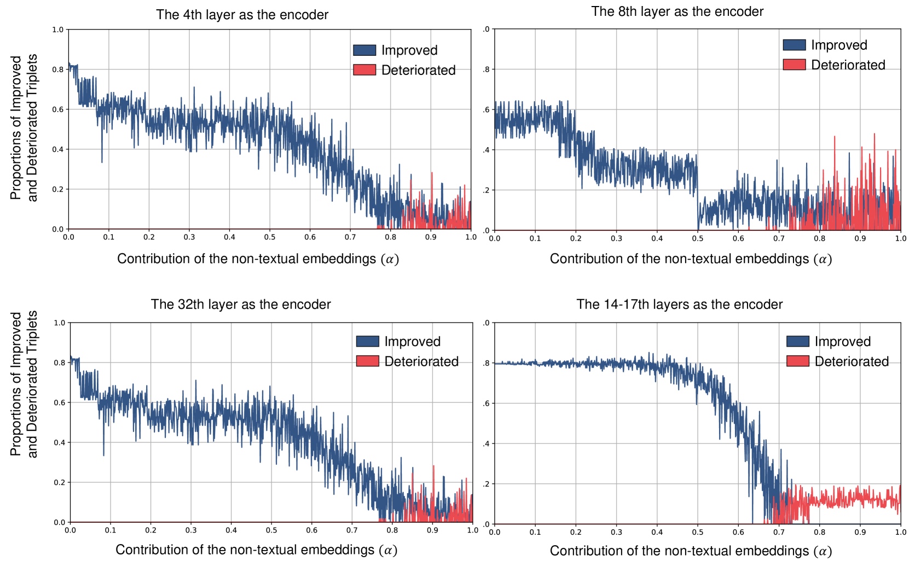

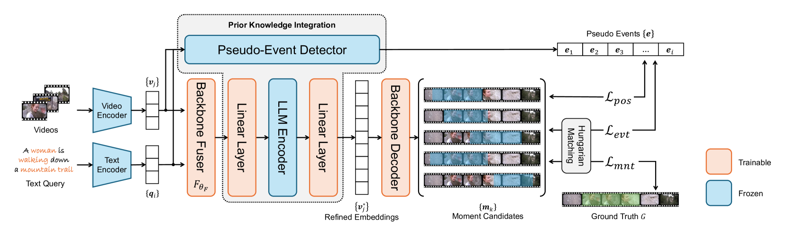

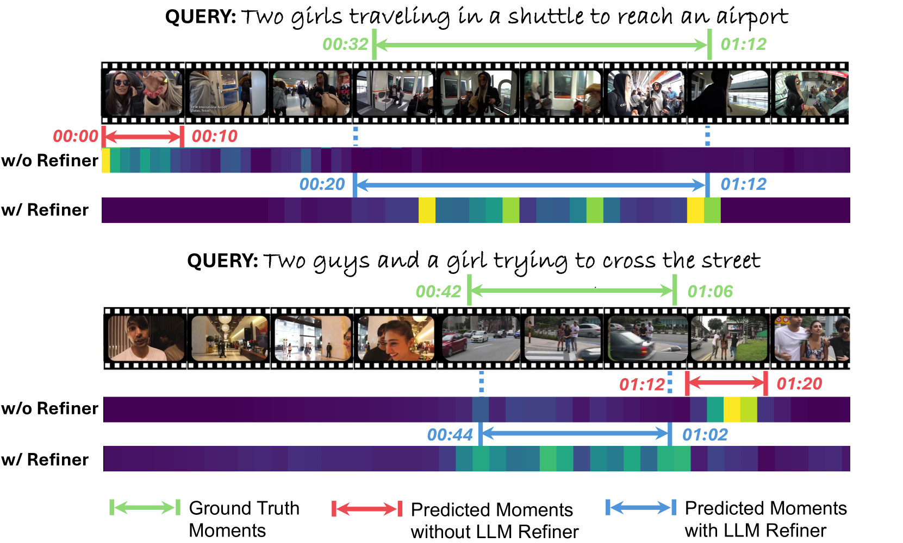

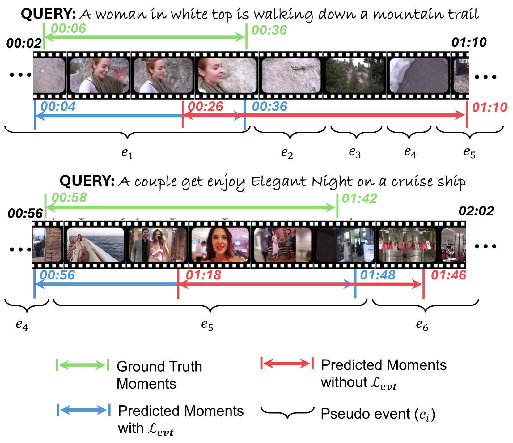

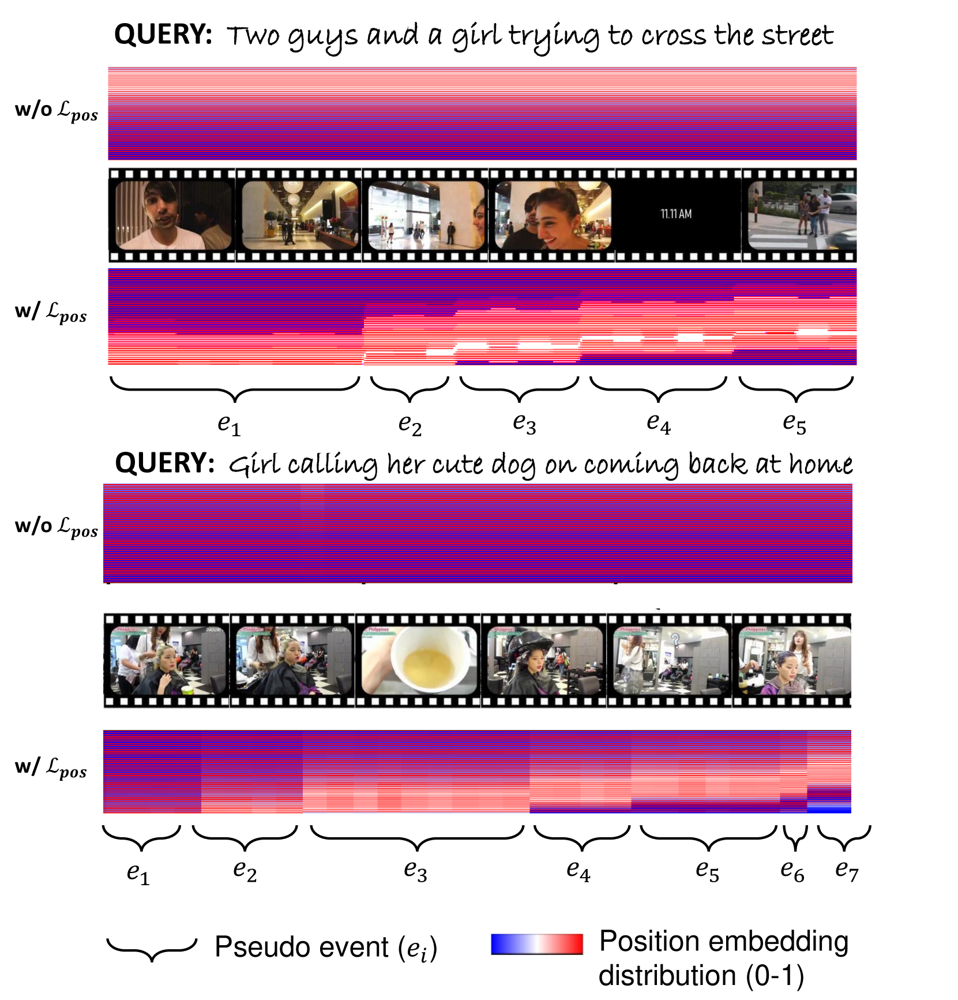

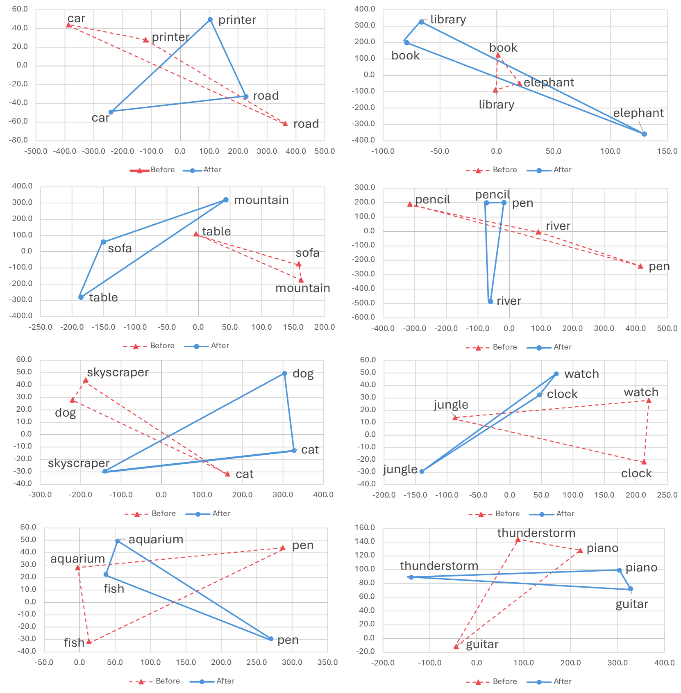

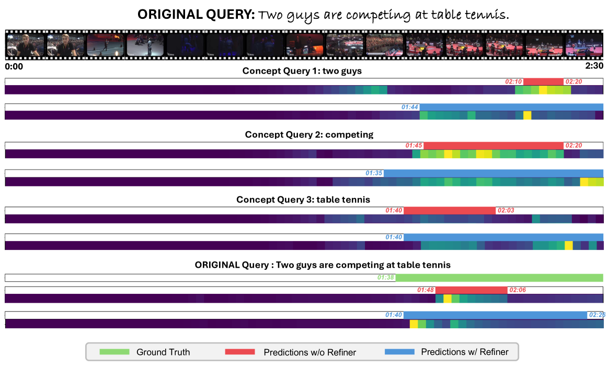

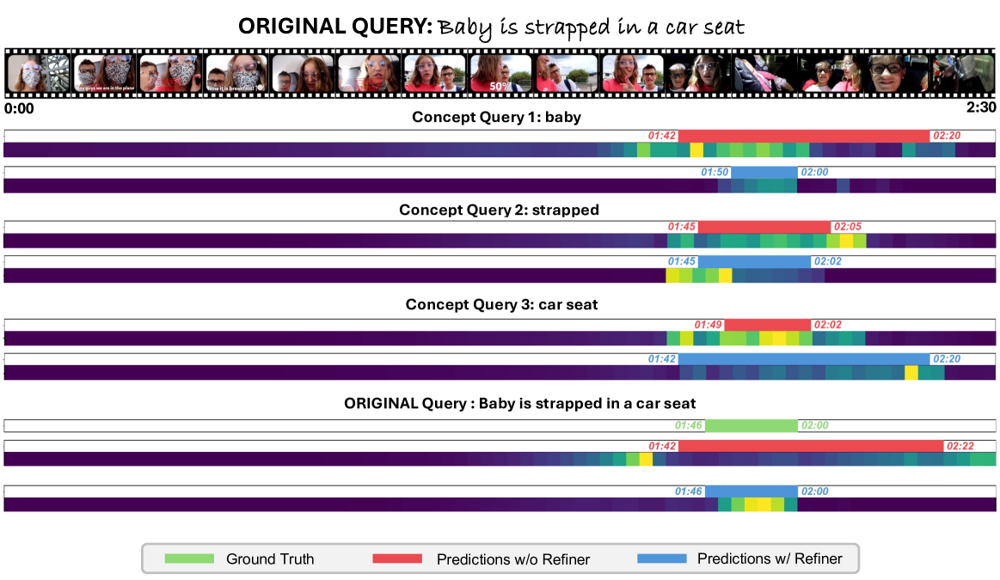

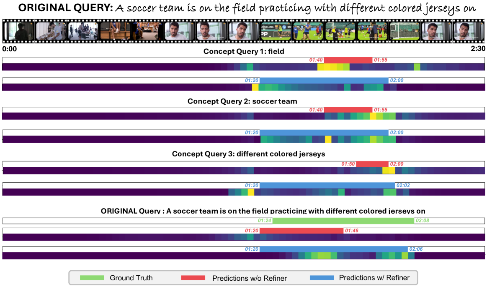

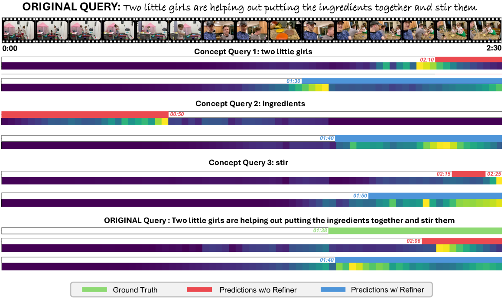

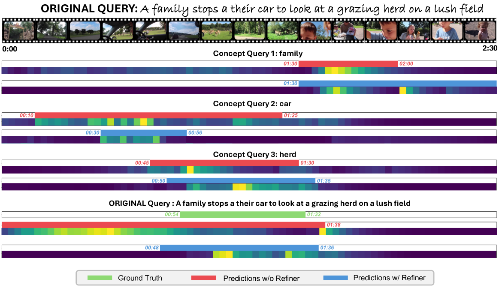

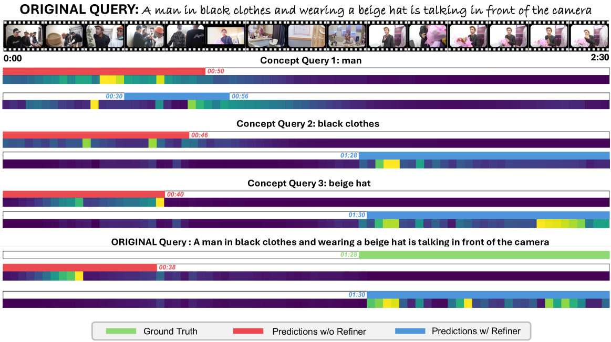

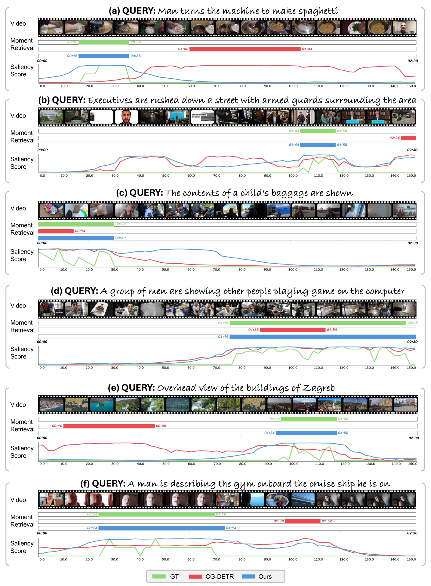

[Arxiv](https://arxiv.org/abs/2407.15051)