# RazorAttention：利用检索头技术，实现KV缓存的高效压缩

发布时间：2024年07月21日

`LLM应用` `计算机科学` `人工智能`

> RazorAttention: Efficient KV Cache Compression Through Retrieval Heads

# 摘要

> KV 缓存的内存和计算需求对长上下文语言模型的部署构成了重大挑战。以往的方法通过选择性丢弃令牌来缓解这一问题，但这会不可逆地丢失未来查询可能需要的关键信息。本文提出了一种新的 KV 缓存压缩技术，保留了所有令牌信息。研究发现：i) 多数注意力头主要关注局部上下文；ii) 仅有少数被称为检索头的注意力头能关注所有输入令牌。基于这些发现，我们提出了 RazorAttention，一种无需训练的 KV 缓存压缩算法，为关键的检索头保留完整缓存，并在非检索头中丢弃远程令牌。此外，引入“补偿令牌”机制以进一步恢复被丢弃的信息。在多种大型语言模型上的广泛评估显示，RazorAttention 使 KV 缓存大小减少超过 70%，且对性能影响甚微。RazorAttention 还与 FlashAttention 兼容，成为一种高效且即插即用的解决方案，无需额外开销或重新训练即可提升 LLM 推理效率。

> The memory and computational demands of Key-Value (KV) cache present significant challenges for deploying long-context language models. Previous approaches attempt to mitigate this issue by selectively dropping tokens, which irreversibly erases critical information that might be needed for future queries. In this paper, we propose a novel compression technique for KV cache that preserves all token information. Our investigation reveals that: i) Most attention heads primarily focus on the local context; ii) Only a few heads, denoted as retrieval heads, can essentially pay attention to all input tokens. These key observations motivate us to use separate caching strategy for attention heads. Therefore, we propose RazorAttention, a training-free KV cache compression algorithm, which maintains a full cache for these crucial retrieval heads and discards the remote tokens in non-retrieval heads. Furthermore, we introduce a novel mechanism involving a "compensation token" to further recover the information in the dropped tokens. Extensive evaluations across a diverse set of large language models (LLMs) demonstrate that RazorAttention achieves a reduction in KV cache size by over 70% without noticeable impacts on performance. Additionally, RazorAttention is compatible with FlashAttention, rendering it an efficient and plug-and-play solution that enhances LLM inference efficiency without overhead or retraining of the original model.

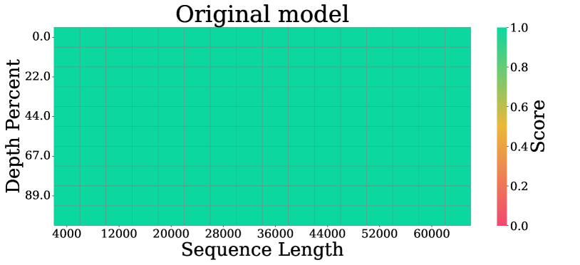

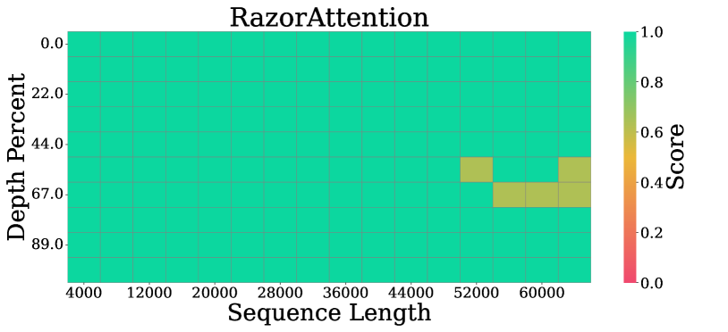

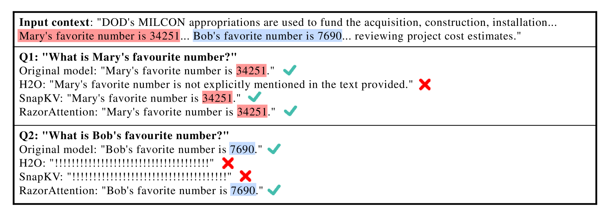

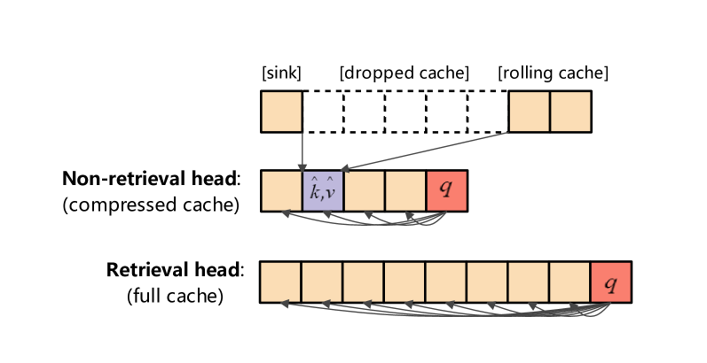

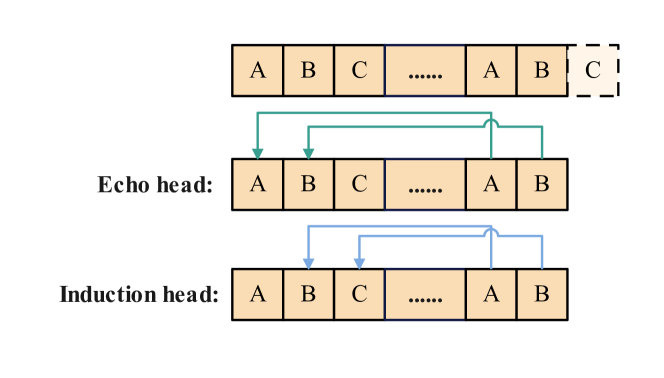

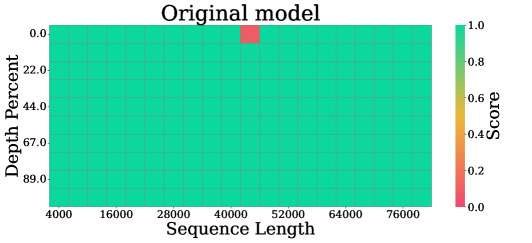

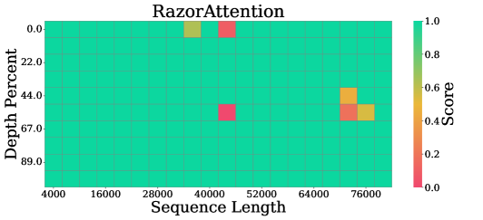

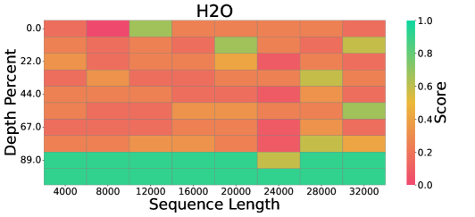

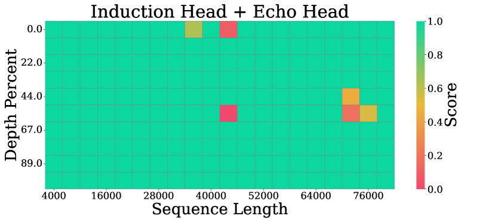

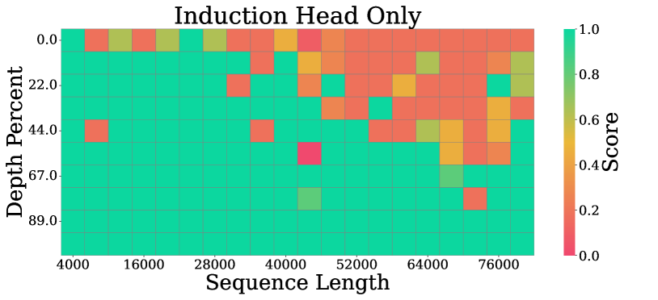

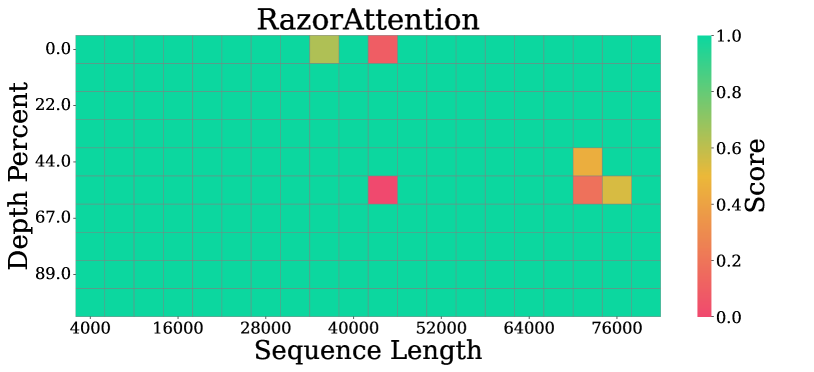

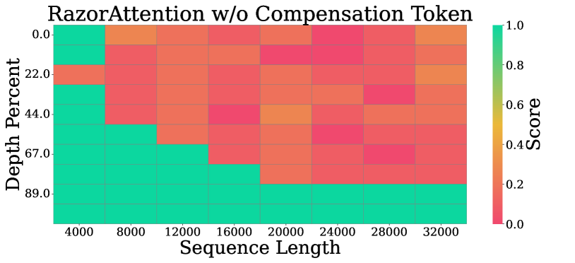

[Arxiv](https://arxiv.org/abs/2407.15891)