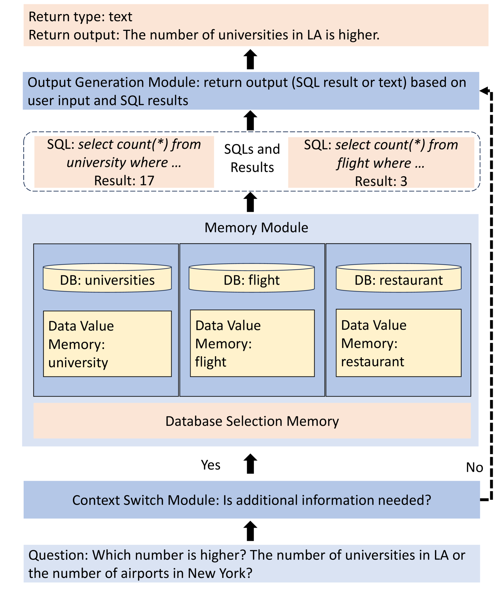
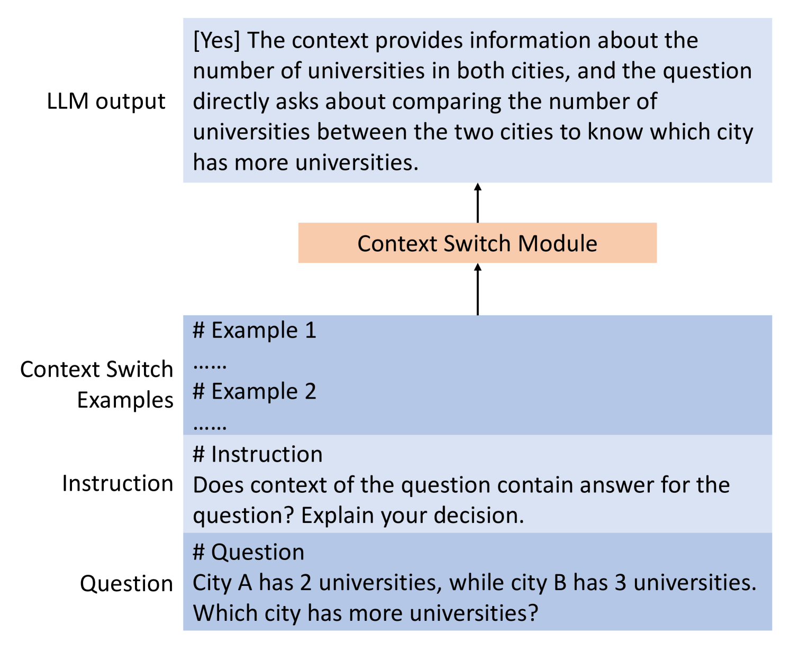
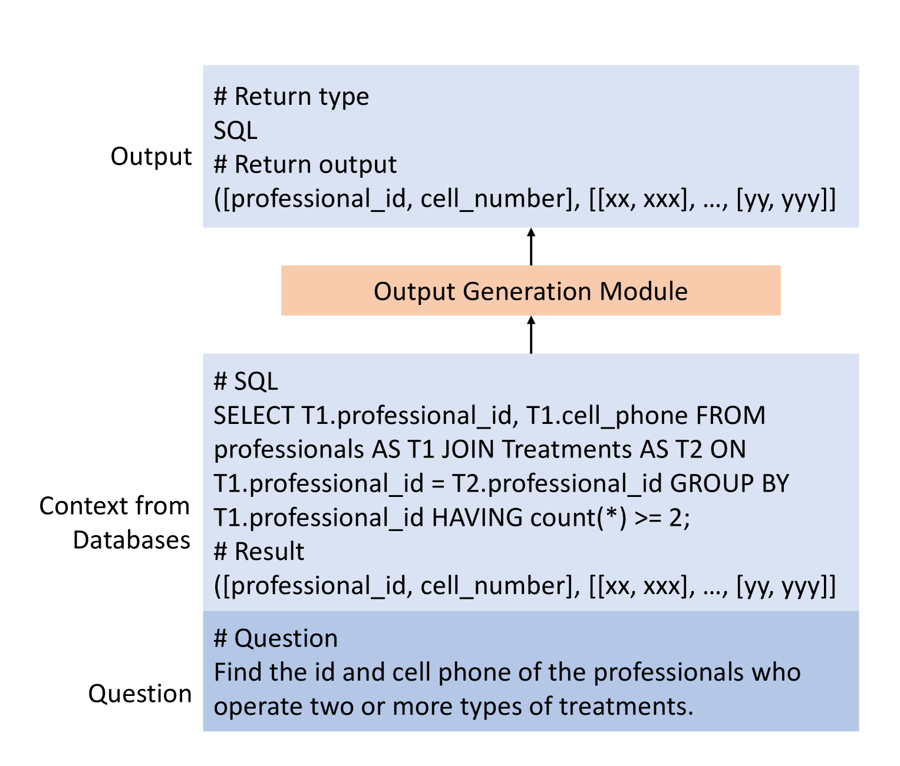
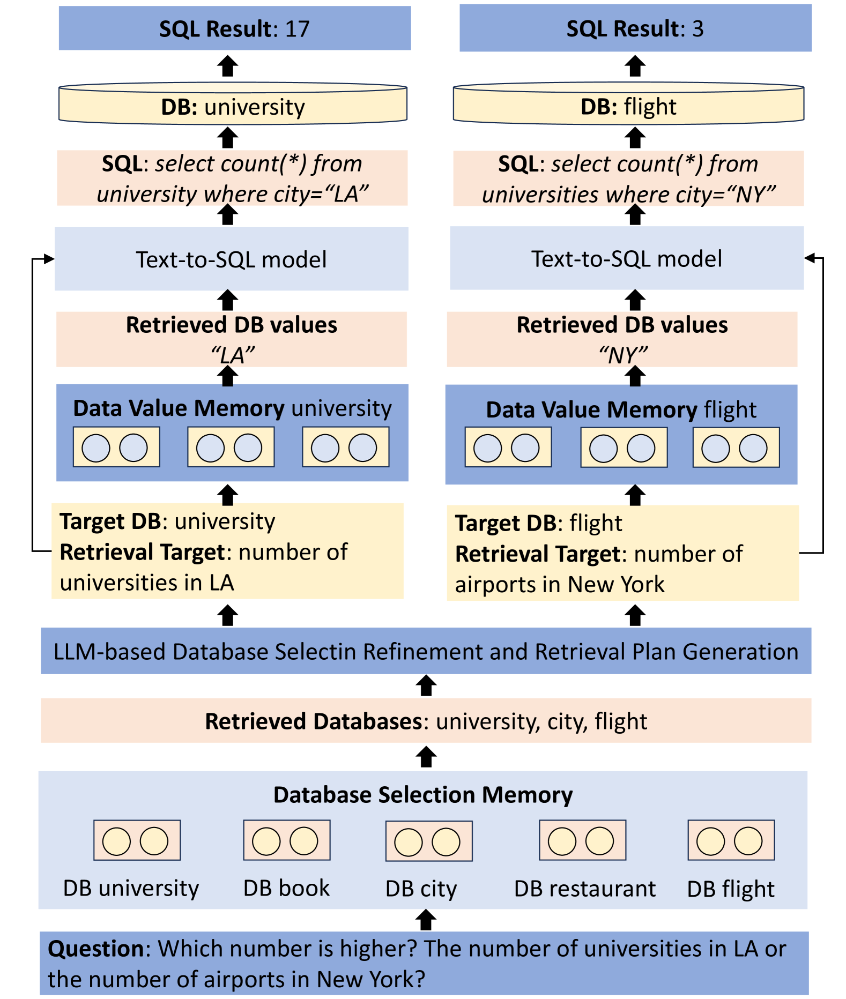
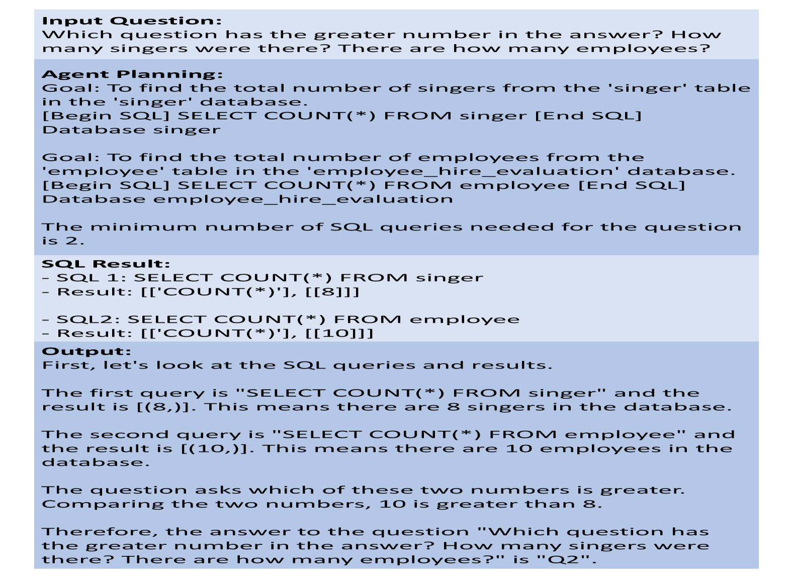

# 关系数据库强化的大型语言模型

发布时间：2024年07月21日

`LLM应用` `数据库`

> Relational Database Augmented Large Language Model

# 摘要

> 大型语言模型（LLM）在众多自然语言处理任务中表现卓越，但因其仅能通过训练或监督微调吸收新知，故不适用于需要精确、最新且私密信息的场景，这些信息往往未包含在训练数据中。为解决这一难题，我们提出将关系数据库作为外部记忆融入LLM，以确保数据的新鲜度、准确性和一致性，并助力LLM执行复杂运算。为此，我们设计了一套新颖的LLM无关记忆架构，并精心构建了信息检索流程及提示机制，以最大化框架效能。实验证明，该框架能有效提升LLM在数据库相关问题上的解答能力。

> Large language models (LLMs) excel in many natural language processing (NLP) tasks. However, since LLMs can only incorporate new knowledge through training or supervised fine-tuning processes, they are unsuitable for applications that demand precise, up-to-date, and private information not available in the training corpora. This precise, up-to-date, and private information is typically stored in relational databases. Thus, a promising solution is to augment LLMs with the inclusion of relational databases as external memory. This can ensure the timeliness, correctness, and consistency of data, and assist LLMs in performing complex arithmetic operations beyond their inherent capabilities. However, bridging the gap between LLMs and relational databases is challenging. It requires the awareness of databases and data values stored in databases to select correct databases and issue correct SQL queries. Besides, it is necessary for the external memory to be independent of the LLM to meet the needs of real-world applications. We introduce a novel LLM-agnostic memory architecture comprising a database selection memory, a data value memory, and relational databases. And we design an elegant pipeline to retrieve information from it. Besides, we carefully design the prompts to instruct the LLM to maximize the framework's potential. To evaluate our method, we compose a new dataset with various types of questions. Experimental results show that our framework enables LLMs to effectively answer database-related questions, which is beyond their direct ability.

[Arxiv](https://arxiv.org/abs/2407.15071)