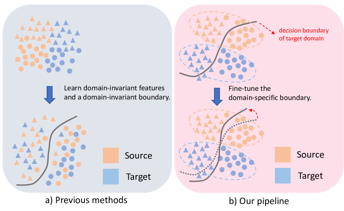
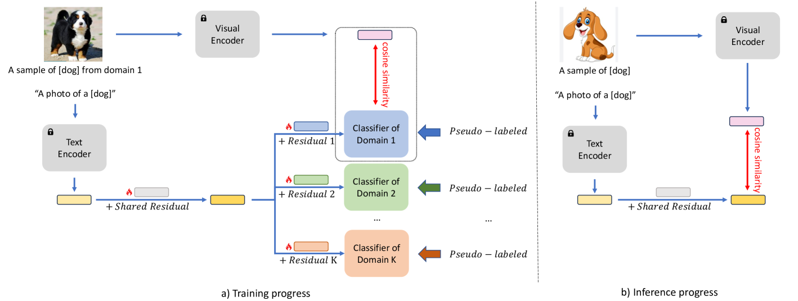

# 在 CLIP 时代，我们需重新审视领域适应与泛化的策略。

发布时间：2024年07月21日

`LLM应用` `计算机视觉` `机器学习`

> Rethinking Domain Adaptation and Generalization in the Era of CLIP

# 摘要

> 近期研究聚焦于领域适应中共享知识的学习，CLIP 这一大型视觉-语言预训练模型在零-shot识别上表现卓越，通过参数高效调整更能提升特定任务性能。我们发现，引入简单领域先验能增强 CLIP 在特定领域的零-shot识别能力，且其适应性不甚依赖源领域数据，得益于其丰富的预训练数据集。此外，我们构建了基于 CLIP 的零-shot适应与伪标签自训练基准，并提出从多未标记领域提升 CLIP 的任务泛化能力，这一实用且独特的视角。我们相信，这些发现将促使业界重新审视领域适应的基准及其算法在 CLIP 时代的作用。

> In recent studies on domain adaptation, significant emphasis has been placed on the advancement of learning shared knowledge from a source domain to a target domain. Recently, the large vision-language pre-trained model, i.e., CLIP has shown strong ability on zero-shot recognition, and parameter efficient tuning can further improve its performance on specific tasks. This work demonstrates that a simple domain prior boosts CLIP's zero-shot recognition in a specific domain. Besides, CLIP's adaptation relies less on source domain data due to its diverse pre-training dataset. Furthermore, we create a benchmark for zero-shot adaptation and pseudo-labeling based self-training with CLIP. Last but not least, we propose to improve the task generalization ability of CLIP from multiple unlabeled domains, which is a more practical and unique scenario. We believe our findings motivate a rethinking of domain adaptation benchmarks and the associated role of related algorithms in the era of CLIP.

[Arxiv](https://arxiv.org/abs/2407.15173)