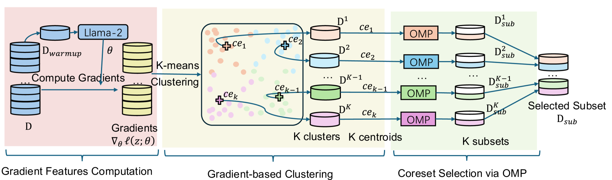

# TAGCOS：一种任务无关的梯度聚类核心集选择方法，专为指令调优数据设计。

发布时间：2024年07月21日

`LLM理论` `人工智能`

> TAGCOS: Task-agnostic Gradient Clustered Coreset Selection for Instruction Tuning Data

# 摘要

> 指令调优在NLP领域大放异彩，将大型语言模型打造成全能聊天机器人。但随着指令数据集的多样性和数量激增，计算资源需求也随之攀升。为此，我们需精心挑选一个精简而信息丰富的子集（Coreset），以媲美全数据集的性能。这一目标的实现充满挑战：首先，数据选择需精准反映样本质量；其次，数据集的多样性不容忽视；最后，大型模型的高效Coreset选择算法至关重要。为此，我们创新提出TAGCOS方法，利用样本梯度进行数据表示，通过聚类分组相似数据，并采用高效贪心算法进行Coreset选择。实验证明，仅需5%的数据，我们的算法便能超越其他无监督方法，性能直逼全数据集。

> Instruction tuning has achieved unprecedented success in NLP, turning large language models into versatile chatbots. However, the increasing variety and volume of instruction datasets demand significant computational resources. To address this, it is essential to extract a small and highly informative subset (i.e., Coreset) that achieves comparable performance to the full dataset. Achieving this goal poses non-trivial challenges: 1) data selection requires accurate data representations that reflect the training samples' quality, 2) considering the diverse nature of instruction datasets, and 3) ensuring the efficiency of the coreset selection algorithm for large models. To address these challenges, we propose Task-Agnostic Gradient Clustered COreset Selection (TAGCOS). Specifically, we leverage sample gradients as the data representations, perform clustering to group similar data, and apply an efficient greedy algorithm for coreset selection. Experimental results show that our algorithm, selecting only 5% of the data, surpasses other unsupervised methods and achieves performance close to that of the full dataset.

[Arxiv](https://arxiv.org/abs/2407.15235)