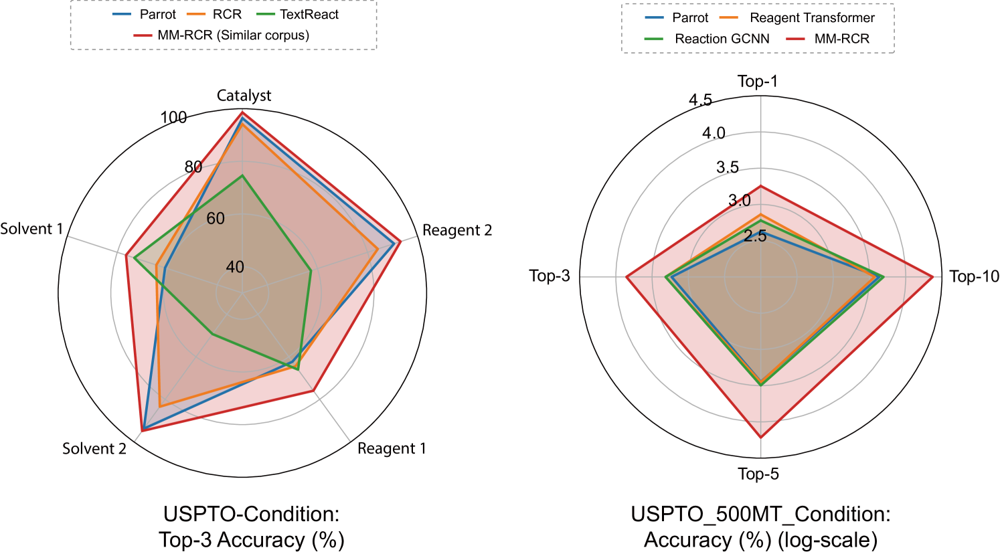

# 化学反应条件推荐中的文本增强多模态 LLM

发布时间：2024年07月21日

`LLM应用`

> Text-Augmented Multimodal LLMs for Chemical Reaction Condition Recommendation

# 摘要

> 高通量反应条件筛选是化学合成的基石，但现有方法既繁琐又昂贵。传统计算机辅助合成规划工具因数据稀疏和反应表示不足而受限。如今，大型语言模型虽能应对分子设计和化学逻辑问答等化学问题，却未能精准预测反应条件。为此，我们研发了MM-RCR，一种融合文本与多模态信息的大型语言模型，它从SMILES、反应图及文本中提炼统一反应表示，助力化学反应推荐。通过构建120万对问答数据集训练，MM-RCR在两大公开基准测试中表现卓越，并在域外及高通量实验数据上展现出优异泛化性。MM-RCR有望大幅提升化学合成中高通量条件筛选的效率。

> High-throughput reaction condition (RC) screening is fundamental to chemical synthesis. However, current RC screening suffers from laborious and costly trial-and-error workflows. Traditional computer-aided synthesis planning (CASP) tools fail to find suitable RCs due to data sparsity and inadequate reaction representations. Nowadays, large language models (LLMs) are capable of tackling chemistry-related problems, such as molecule design, and chemical logic Q\&A tasks. However, LLMs have not yet achieved accurate predictions of chemical reaction conditions. Here, we present MM-RCR, a text-augmented multimodal LLM that learns a unified reaction representation from SMILES, reaction graphs, and textual corpus for chemical reaction recommendation (RCR). To train MM-RCR, we construct 1.2 million pair-wised Q\&A instruction datasets. Our experimental results demonstrate that MM-RCR achieves state-of-the-art performance on two open benchmark datasets and exhibits strong generalization capabilities on out-of-domain (OOD) and High-Throughput Experimentation (HTE) datasets. MM-RCR has the potential to accelerate high-throughput condition screening in chemical synthesis.

[Arxiv](https://arxiv.org/abs/2407.15141)