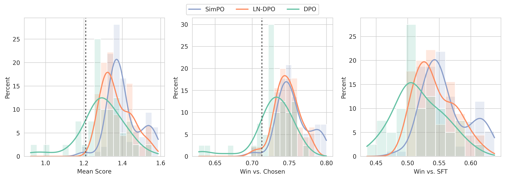
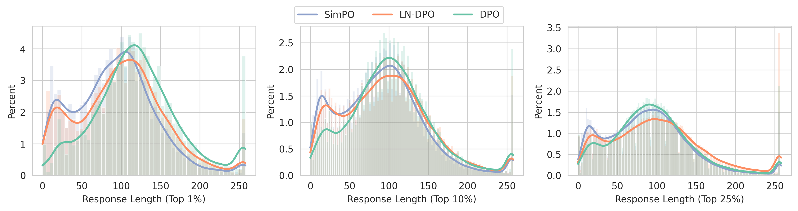
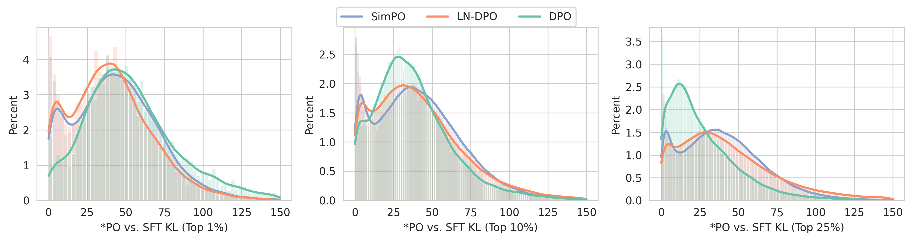
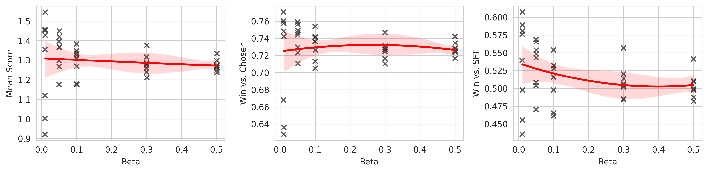
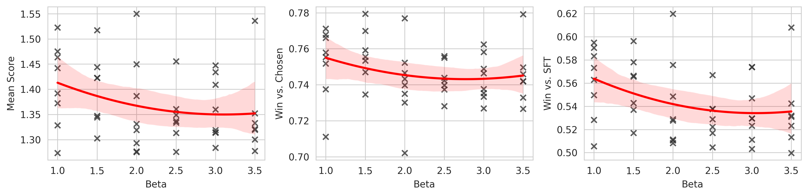
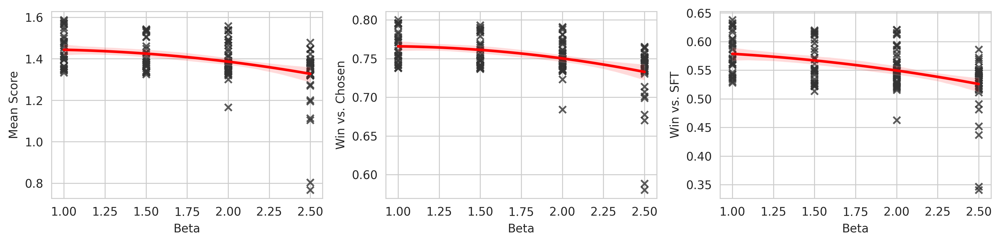
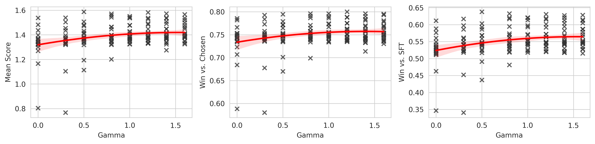
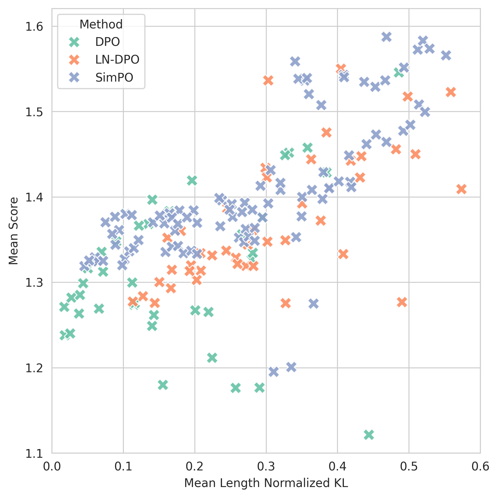
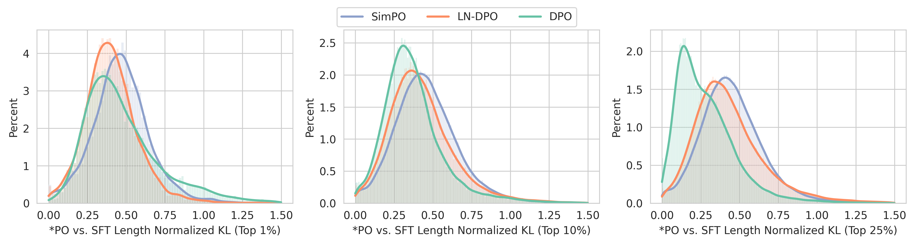

# 《搭便车者的指南：人类与*PO 的和谐共处》

发布时间：2024年07月21日

`LLM应用` `人工智能` `机器学习`

> The Hitchhiker's Guide to Human Alignment with *PO

# 摘要

> 随着 LLM 在多领域的应用日益广泛，模型训练中的人类偏好对齐变得至关重要。尽管偏好优化方法 (*PO) 在当前技术前沿占据主导，但过往研究多聚焦于通过复杂的超参数网格搜索寻找最佳方法，这对普通从业者而言并不现实。本文旨在探索一种既高效又对超参数变化稳健的算法，以提升实际应用中的表现。我们模拟了一个真实的分布外 (OOD) 场景，深入剖析了现有方法的优劣。通过 SFT 模型的 KL 散度和响应长度统计分析，我们发现广泛使用的 DPO 方法常生成质量欠佳的长篇响应。鉴于此，我们提出了一种简化的 DPO 扩展——LN-DPO，它能在保持质量的同时，生成更为精炼的响应，为实际应用带来新的可能性。

> With the growing utilization of large language models (LLMs) across domains, alignment towards human preferences has become one of the most critical aspects of training models. At the forefront of state-of-the-art human alignment methods are preference optimization methods (*PO). However, prior research has often concentrated on identifying the best-performing method, typically involving a grid search over hyperparameters, which can be impractical for general practitioners. In this paper, we aim to identify the algorithm that, while being performant, is simultaneously more robust to varying hyperparameters, thereby increasing the likelihood of achieving better results. We focus on a realistic out-of-distribution (OOD) scenario that mirrors real-world applications of human alignment, offering practical insights into the strengths and weaknesses of these methods. Furthermore, to better understand the shortcomings of generations from the different methods, we analyze the model generations through the lens of KL divergence of the SFT model and the response length statistics. Our analysis reveals that the widely adopted DPO method consistently produces lengthy responses of inferior quality that are very close to the SFT responses. Motivated by these findings, we propose an embarrassingly simple extension to the DPO algorithm, LN-DPO, resulting in more concise responses without sacrificing quality compared to the policy obtained by vanilla DPO.

[Arxiv](https://arxiv.org/abs/2407.15229)