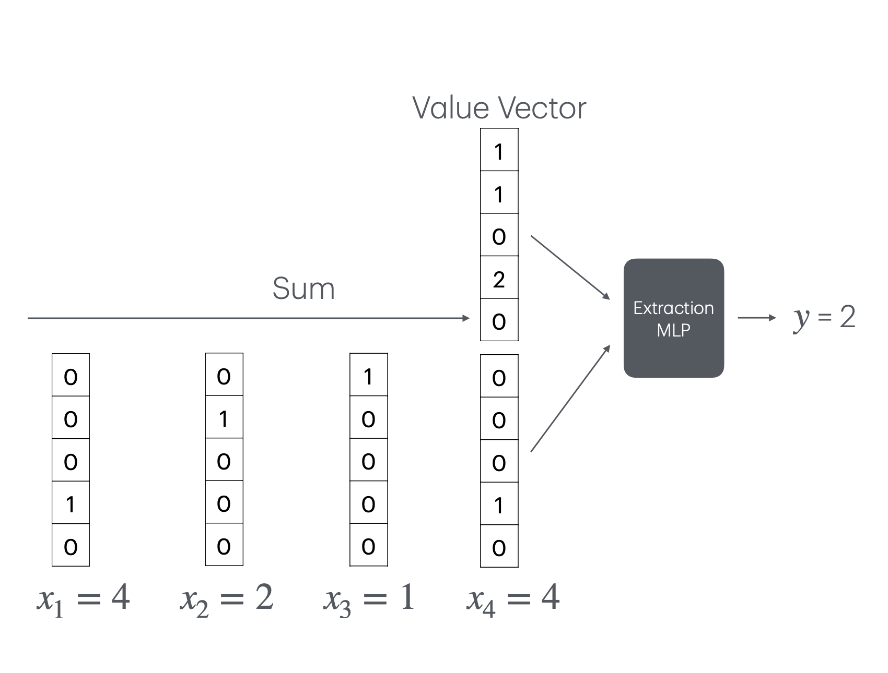
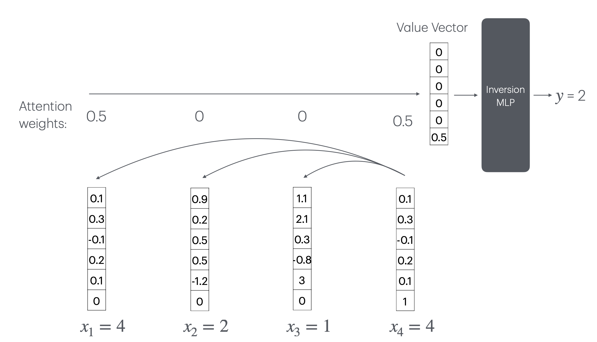
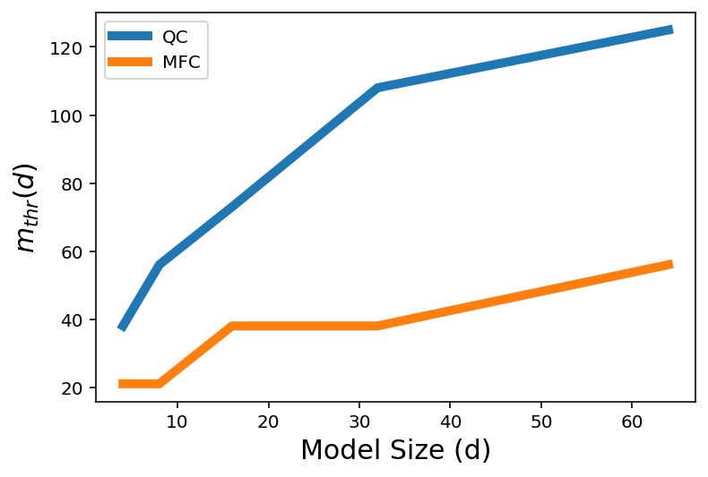
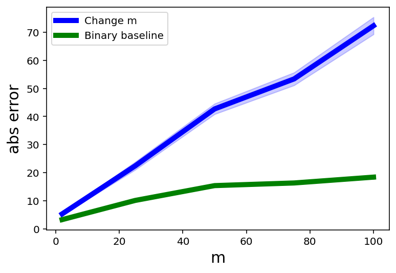

# Transformer 何时能数到 n？

发布时间：2024年07月21日

`LLM理论` `人工智能`

> When Can Transformers Count to n?

# 摘要

> 大型transformer模型虽能应对复杂挑战，但在简单计数任务上却显露短板。我们探讨的是基础的token计数问题：在字符串中统计特定词汇的出现频率。若transformer状态维度与上下文长度成线性关系，此任务可解。但我们的方案受限于此，理论分析亦指出，尺寸有限的transformer恐难胜任。实证研究印证了理论预测的性能突变。这凸显了深入探究transformer处理简单任务能力的必要性。

> Large language models based on the transformer architectures can solve highly complex tasks. But are there simple tasks that such models cannot solve? Here we focus on very simple counting tasks, that involve counting how many times a token in the vocabulary have appeared in a string. We show that if the dimension of the transformer state is linear in the context length, this task can be solved. However, the solution we propose does not scale beyond this limit, and we provide theoretical arguments for why it is likely impossible for a size limited transformer to implement this task. Our empirical results demonstrate the same phase-transition in performance, as anticipated by the theoretical argument. Our results demonstrate the importance of understanding how transformers can solve simple tasks.

[Arxiv](https://arxiv.org/abs/2407.15160)