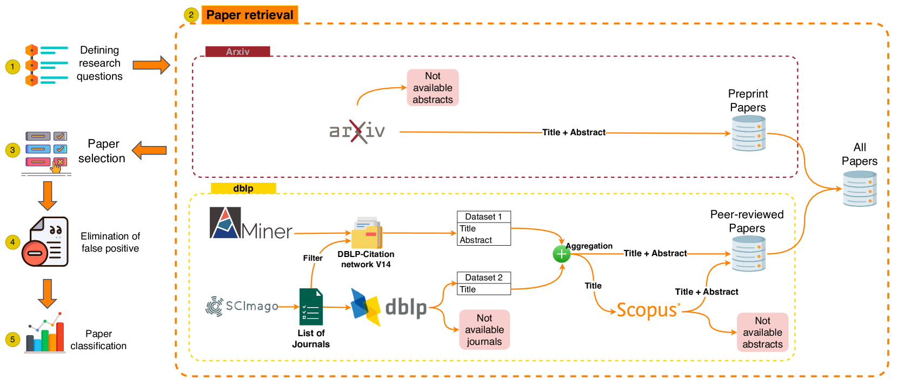

# XAI 与 LLMs 的交融：探索可解释 AI 与大型语言模型间的纽带

发布时间：2024年07月21日

`LLM理论` `人工智能`

> XAI meets LLMs: A Survey of the Relation between Explainable AI and Large Language Models

# 摘要

> 本调查聚焦于大型语言模型（LLM）研究的核心难题，特别强调了可解释性的关键作用。随着AI与商业界对此领域的关注日益升温，我们强调了LLM透明度的重要性。当前，LLM研究与可解释AI（XAI）并行发展，一方面通过XAI提升性能，另一方面则聚焦于模型可解释性的新趋势。我们的论文倡导一种平衡视角，同等重视可解释性与功能创新。鉴于LLM领域的迅猛进步，本调查涵盖了同行评审及预印本论文，全面展现了XAI在LLM研究中的角色。最后，我们呼吁研究界携手共进，推动LLM与XAI领域的同步发展。

> In this survey, we address the key challenges in Large Language Models (LLM) research, focusing on the importance of interpretability. Driven by increasing interest from AI and business sectors, we highlight the need for transparency in LLMs. We examine the dual paths in current LLM research and eXplainable Artificial Intelligence (XAI): enhancing performance through XAI and the emerging focus on model interpretability. Our paper advocates for a balanced approach that values interpretability equally with functional advancements. Recognizing the rapid development in LLM research, our survey includes both peer-reviewed and preprint (arXiv) papers, offering a comprehensive overview of XAI's role in LLM research. We conclude by urging the research community to advance both LLM and XAI fields together.

[Arxiv](https://arxiv.org/abs/2407.15248)