# ALLaM：专为阿拉伯语与英语设计的大型语言模型

发布时间：2024年07月22日

`LLM应用` `语言技术` `教育评估`

> ALLaM: Large Language Models for Arabic and English

# 摘要

> 我们推出了 ALLaM，一系列专为阿拉伯语言技术生态系统设计的大型语言模型。ALLaM 在训练中精心融合了语言对齐与大规模知识转移。通过词汇扩展和预训练阿拉伯语与英语混合文本，我们的自回归解码器架构成功引导模型掌握阿拉伯语，同时保持英语能力不受影响。我们还发现，平行/翻译数据在语言间知识对齐中极为有效。更重要的是，与人类偏好深度对齐的模型，其性能远超那些规模虽大但对齐质量较低的模型。ALLaM 在 MMLU 阿拉伯语、ACVA 及阿拉伯考试等多个领域创下佳绩，其对齐模型在阿拉伯语和英语表现上均有所提升。

> We present ALLaM: Arabic Large Language Model, a series of large language models to support the ecosystem of Arabic Language Technologies (ALT). ALLaM is carefully trained considering the values of language alignment and knowledge transfer at scale. Our autoregressive decoder-only architecture models demonstrate how second-language acquisition via vocabulary expansion and pretraining on a mixture of Arabic and English text can steer a model towards a new language (Arabic) without any catastrophic forgetting in the original language (English). Furthermore, we highlight the effectiveness of using parallel/translated data to aid the process of knowledge alignment between languages. Finally, we show that extensive alignment with human preferences can significantly enhance the performance of a language model compared to models of a larger scale with lower quality alignment. ALLaM achieves state-of-the-art performance in various Arabic benchmarks, including MMLU Arabic, ACVA, and Arabic Exams. Our aligned models improve both in Arabic and English from their base aligned models.

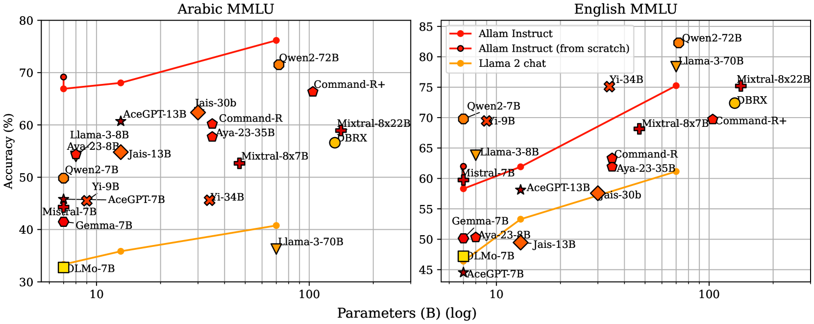

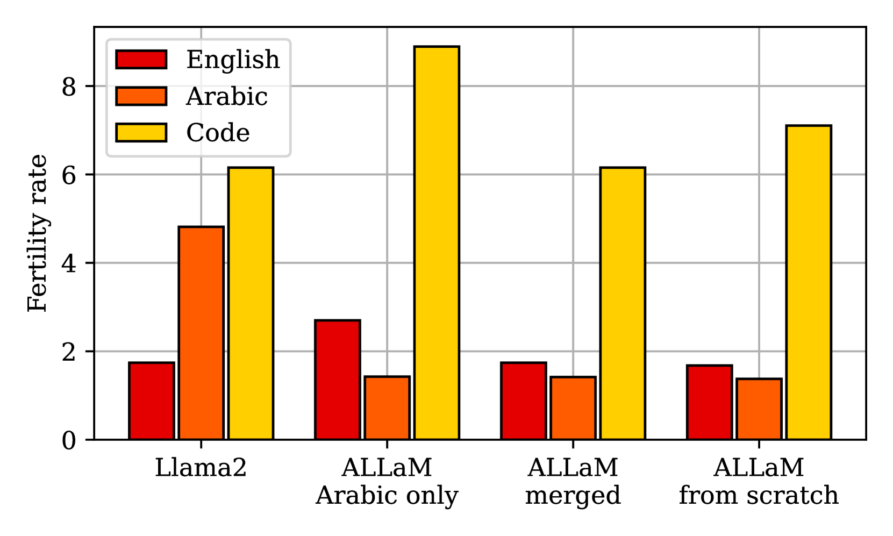

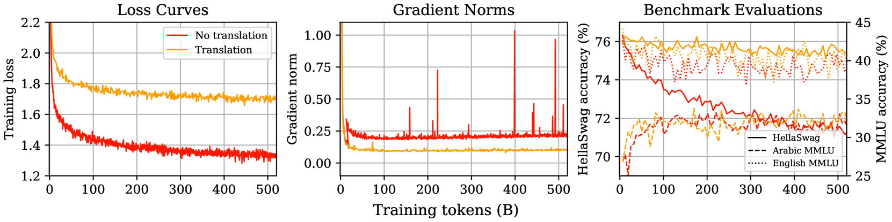

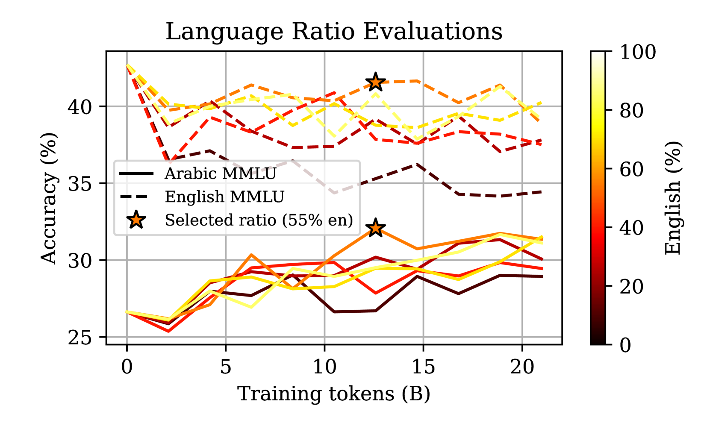

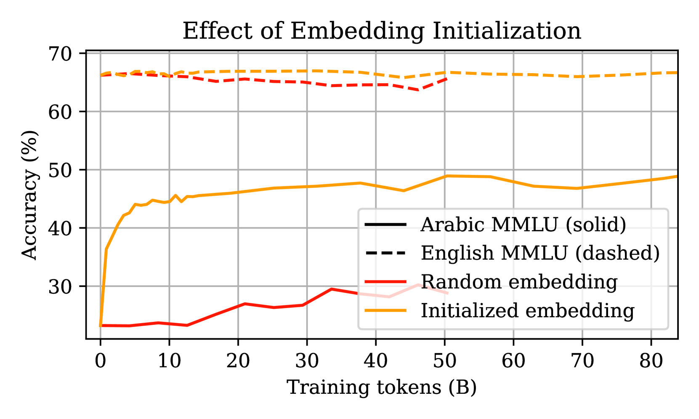

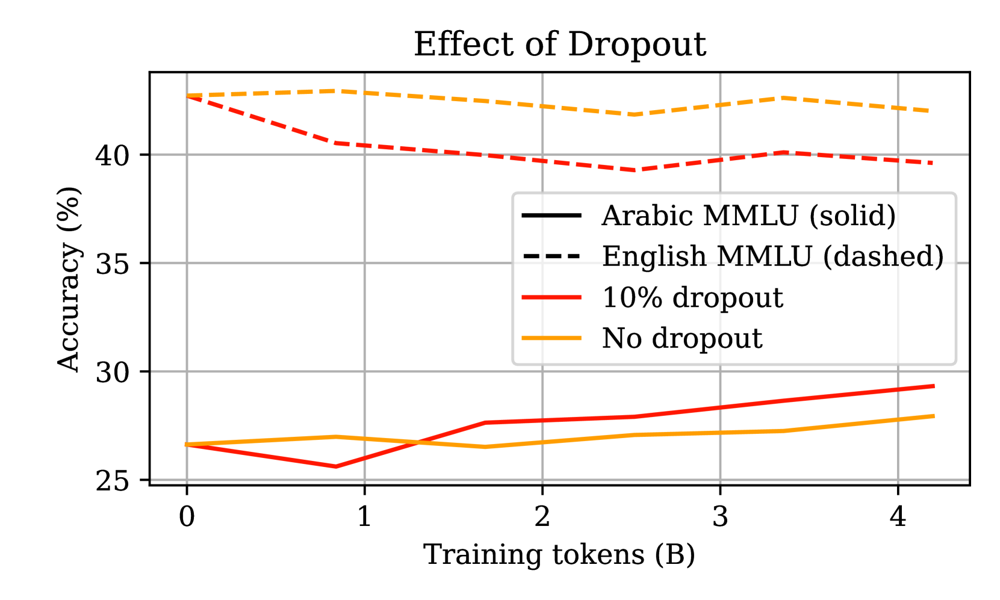

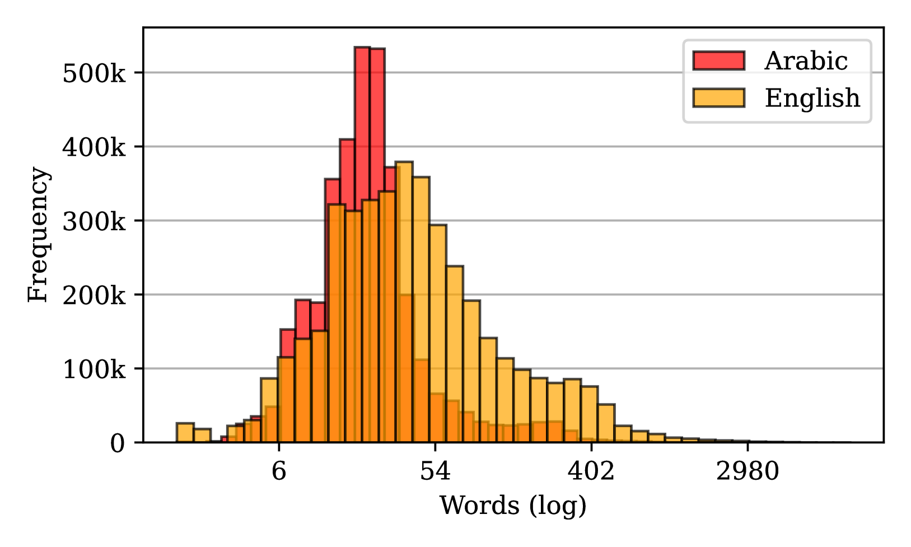

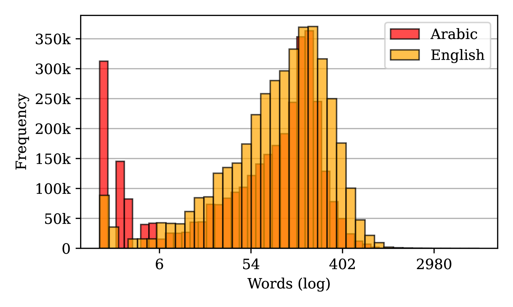

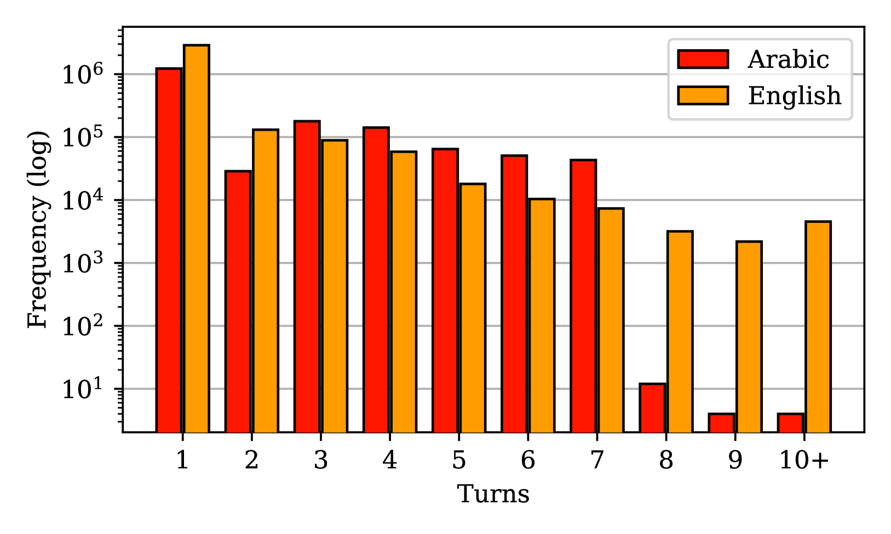

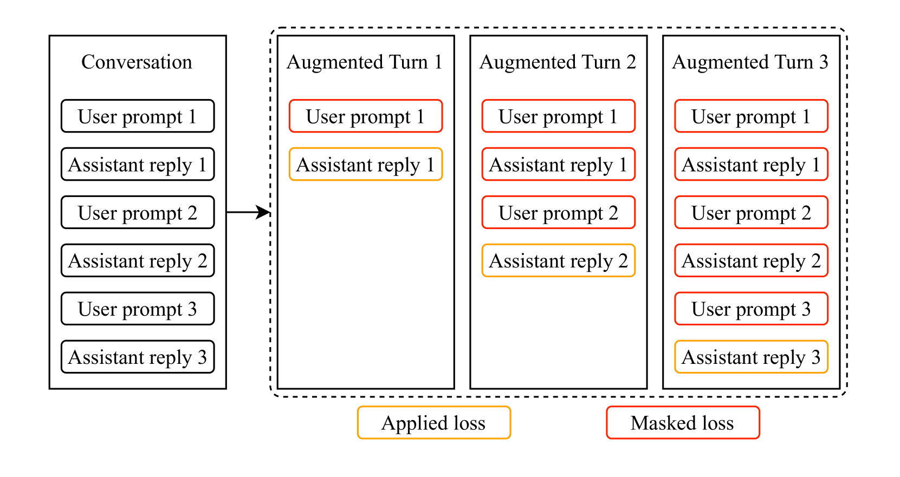

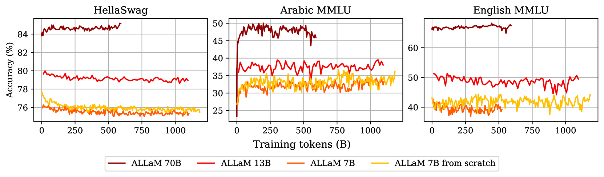

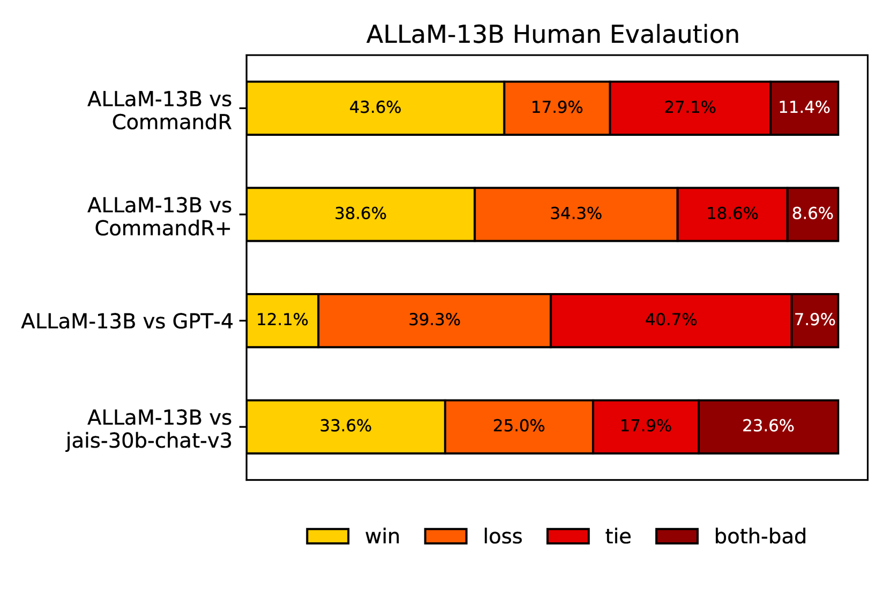

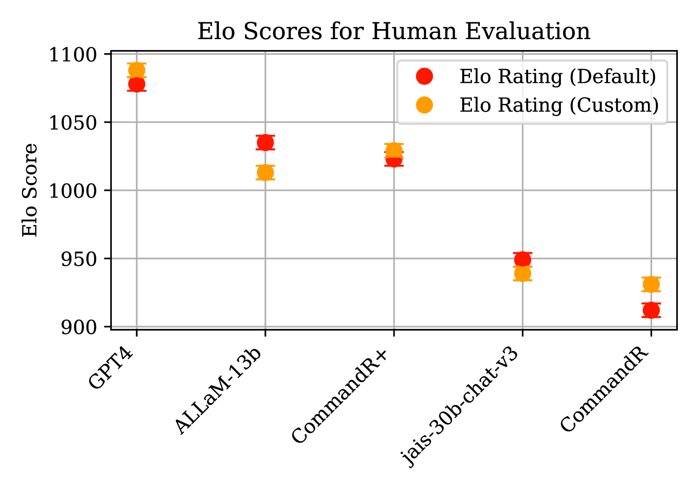

[Arxiv](https://arxiv.org/abs/2407.15390)