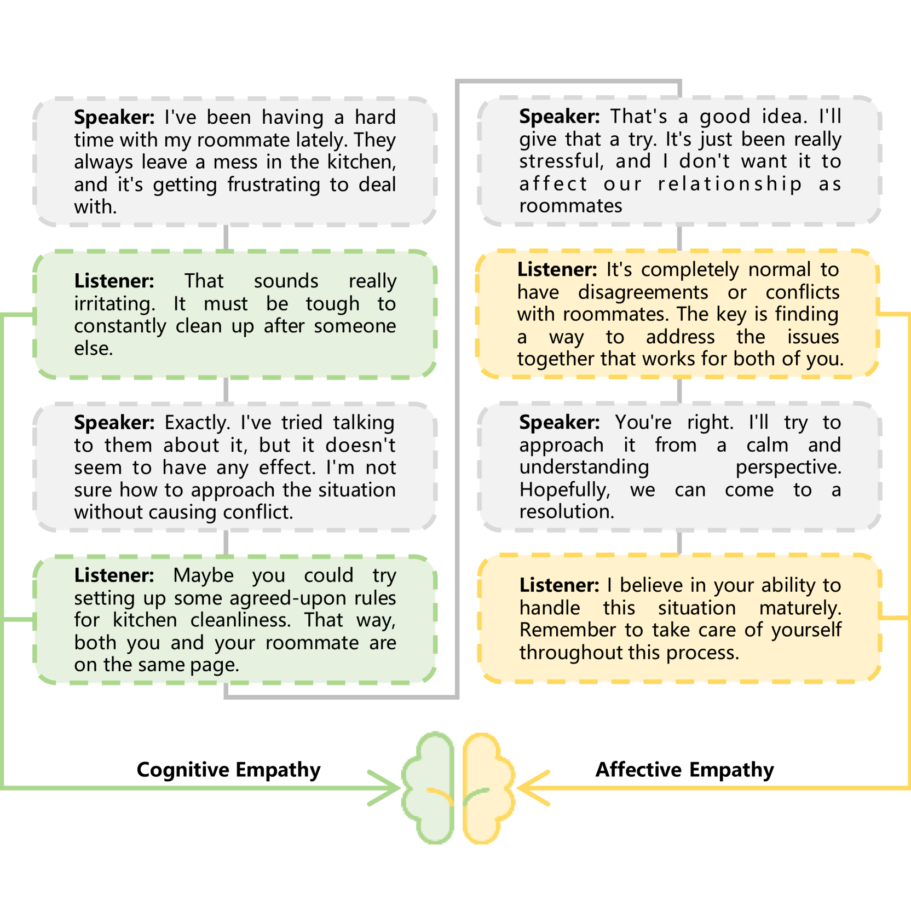
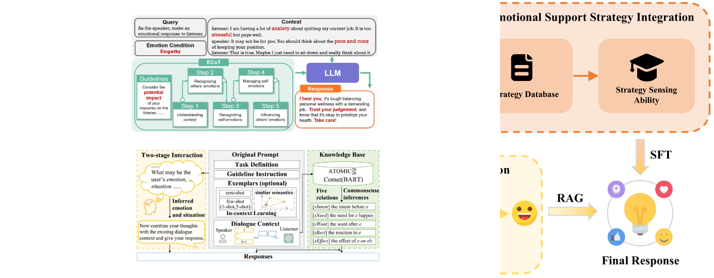
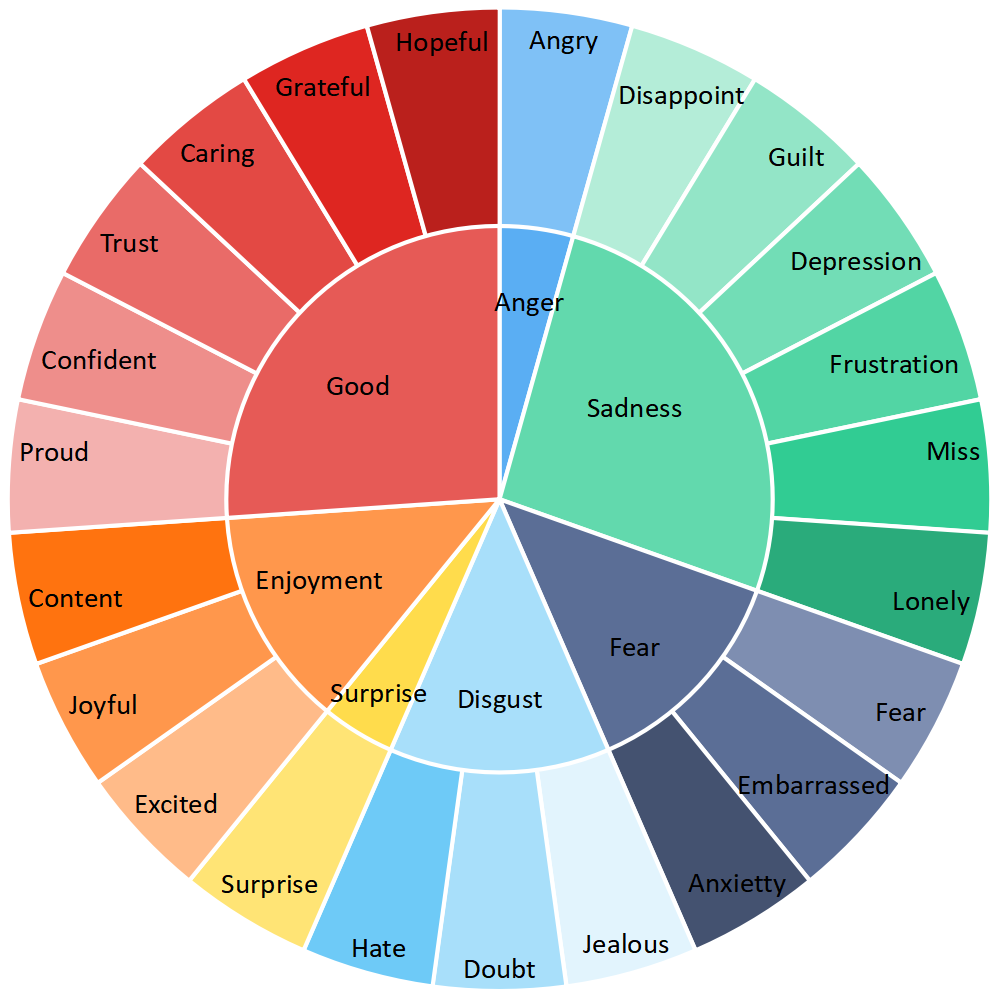
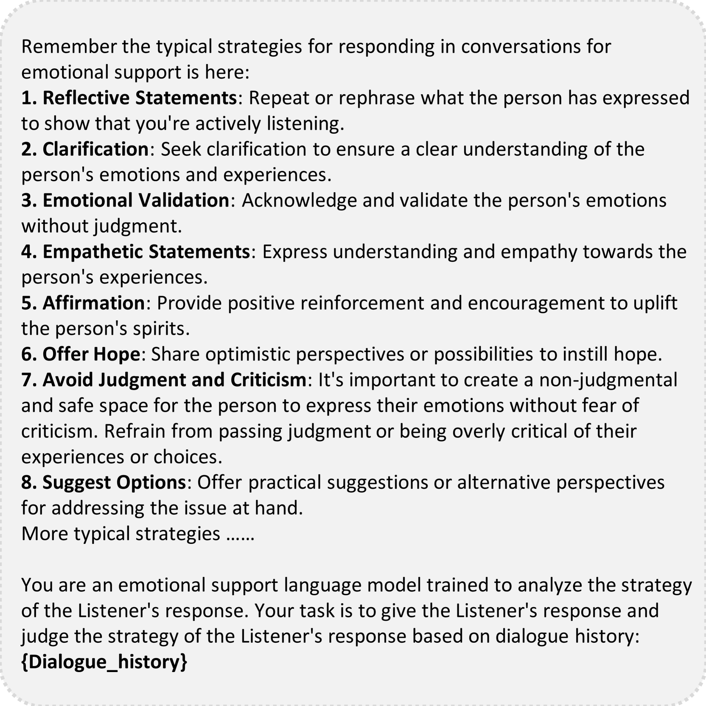
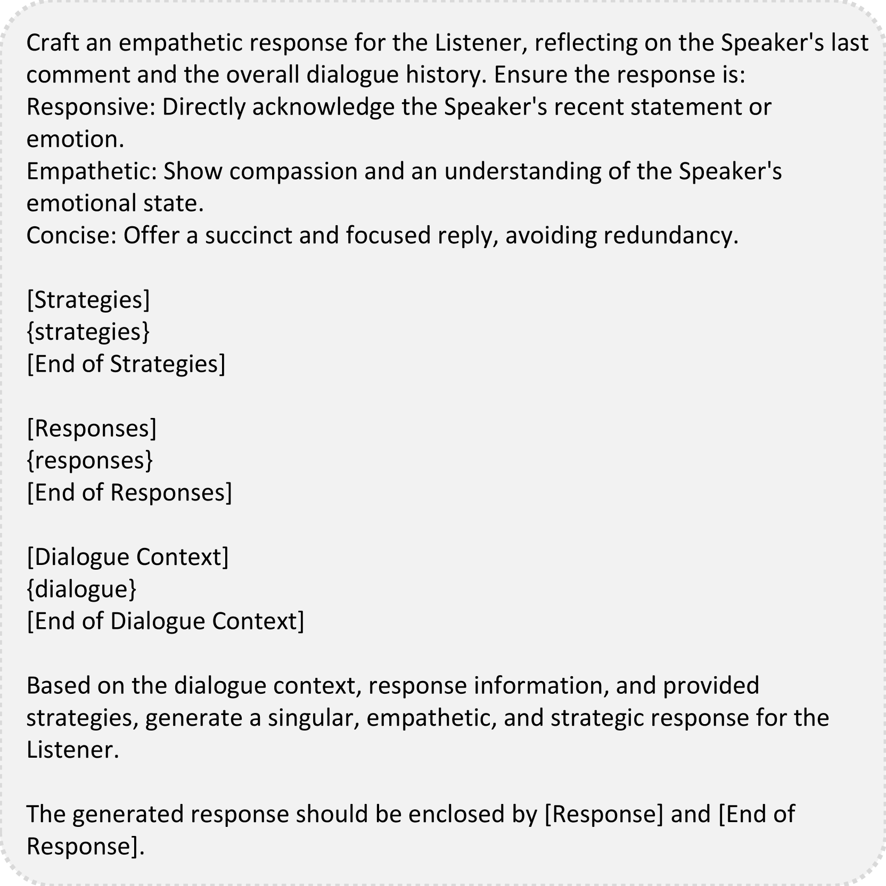
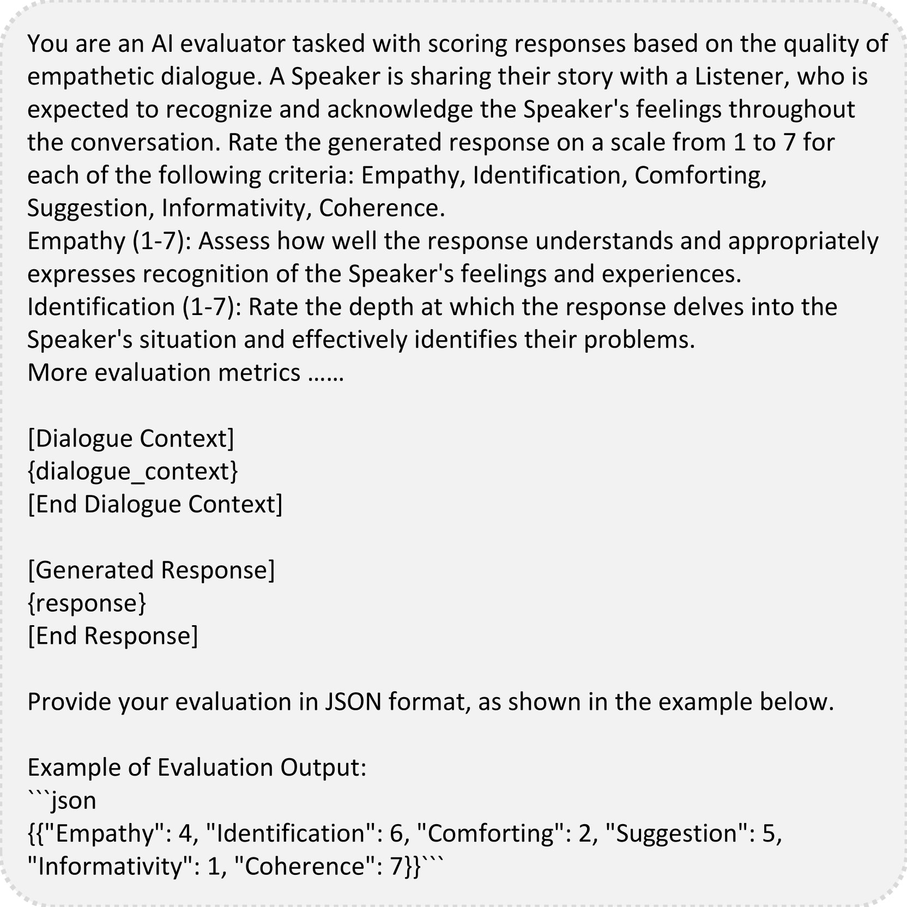

# APTNESS：融合评估理论与情感支持策略，助力共情回应的生成

发布时间：2024年07月22日

`LLM应用` `心理健康` `人工智能`

> APTNESS: Incorporating Appraisal Theory and Emotion Support Strategies for Empathetic Response Generation

# 摘要

> 共情反应生成旨在深入理解他人情感，并精准选择帮助他们克服情感困境的策略。共情分为认知共情和情感共情两大类。前者侧重于理解他人情感状态，后者则强调提供情感慰藉。为了全面提升共情能力，我们设计了一个创新框架，融合了检索增强与情感支持策略。该框架首先构建了一个详尽的情感调色板，随后运用评估理论对其进行分解，形成共情反应数据库。此数据库通过语义检索机制，显著提升了大型语言模型的共情表现。同时，我们特别注重反应策略的精准表达，通过整合情感支持策略，模型在认知与情感共情两方面均得到显著增强，从而生成更为细腻、全面的共情反应。实验结果显示，我们的框架有效提升了LLM的共情能力。相关代码已公开发布于https://github.com/CAS-SIAT-XinHai/APTNESS。

> Empathetic response generation is designed to comprehend the emotions of others and select the most appropriate strategies to assist them in resolving emotional challenges. Empathy can be categorized into cognitive empathy and affective empathy. The former pertains to the ability to understand and discern the emotional issues and situations of others, while the latter involves the capacity to provide comfort. To enhance one's empathetic abilities, it is essential to develop both these aspects. Therefore, we develop an innovative framework that combines retrieval augmentation and emotional support strategy integration. Our framework starts with the introduction of a comprehensive emotional palette for empathy. We then apply appraisal theory to decompose this palette and create a database of empathetic responses. This database serves as an external resource and enhances the LLM's empathy by integrating semantic retrieval mechanisms. Moreover, our framework places a strong emphasis on the proper articulation of response strategies. By incorporating emotional support strategies, we aim to enrich the model's capabilities in both cognitive and affective empathy, leading to a more nuanced and comprehensive empathetic response. Finally, we extract datasets ED and ET from the empathetic dialogue dataset \textsc{EmpatheticDialogues} and ExTES based on dialogue length. Experiments demonstrate that our framework can enhance the empathy ability of LLMs from both cognitive and affective empathy perspectives. Our code is released at https://github.com/CAS-SIAT-XinHai/APTNESS.

[Arxiv](https://arxiv.org/abs/2407.21048)