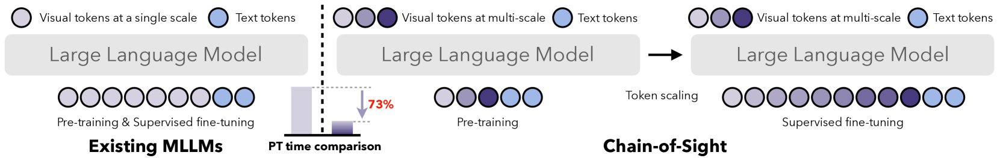
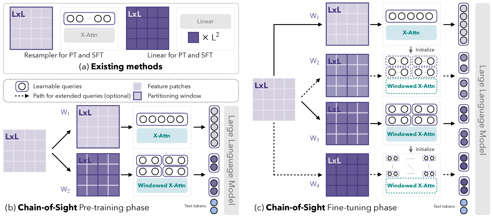
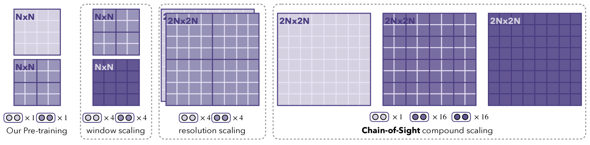
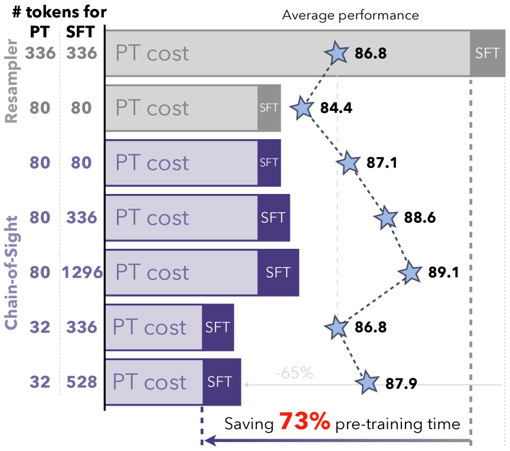
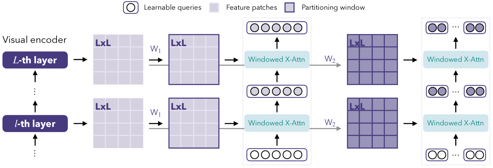

# 利用 Chain-of-Sight 技术，加速多模态大型语言模型的预训练进程。

发布时间：2024年07月22日

`LLM应用` `计算机视觉` `机器学习`

> Accelerating Pre-training of Multimodal LLMs via Chain-of-Sight

# 摘要

> 本文提出 Chain-of-Sight 模块，通过一系列视觉重采样器捕捉多尺度视觉细节，有效加速多模态大型语言模型的预训练。该架构不仅优化了视觉上下文利用，还通过复合令牌缩放策略灵活扩展视觉令牌，预训练后令牌数量可增至 16 倍。因此，预训练阶段所需视觉令牌大幅减少，显著缩短了训练时间（约 73%）。实证研究表明，Chain-of-Sight 在加速预训练的同时，性能不减，甚至超越传统全令牌训练流程。进一步增加预训练令牌数量，性能更佳，与现有方法在多个基准上竞争激烈。

> This paper introduces Chain-of-Sight, a vision-language bridge module that accelerates the pre-training of Multimodal Large Language Models (MLLMs). Our approach employs a sequence of visual resamplers that capture visual details at various spacial scales. This architecture not only leverages global and local visual contexts effectively, but also facilitates the flexible extension of visual tokens through a compound token scaling strategy, allowing up to a 16x increase in the token count post pre-training. Consequently, Chain-of-Sight requires significantly fewer visual tokens in the pre-training phase compared to the fine-tuning phase. This intentional reduction of visual tokens during pre-training notably accelerates the pre-training process, cutting down the wall-clock training time by ~73%. Empirical results on a series of vision-language benchmarks reveal that the pre-train acceleration through Chain-of-Sight is achieved without sacrificing performance, matching or surpassing the standard pipeline of utilizing all visual tokens throughout the entire training process. Further scaling up the number of visual tokens for pre-training leads to stronger performances, competitive to existing approaches in a series of benchmarks.

[Arxiv](https://arxiv.org/abs/2407.15819)