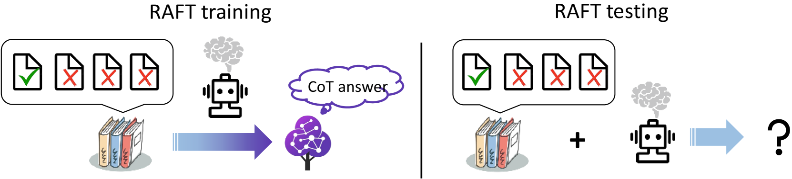
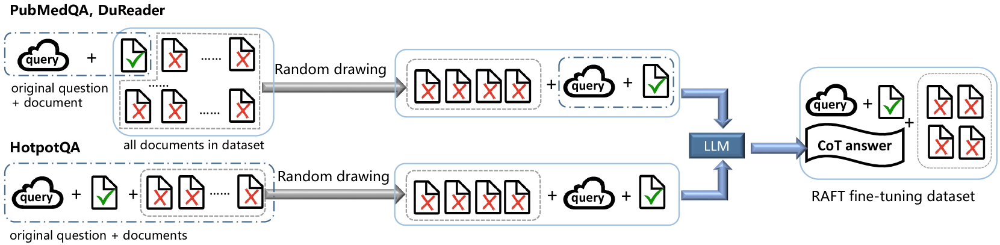
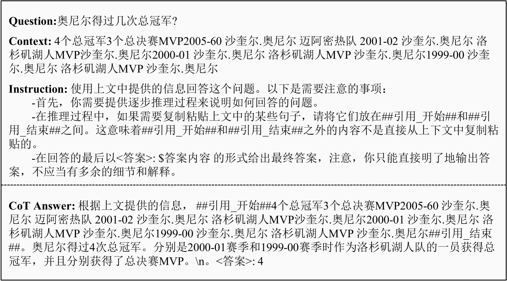
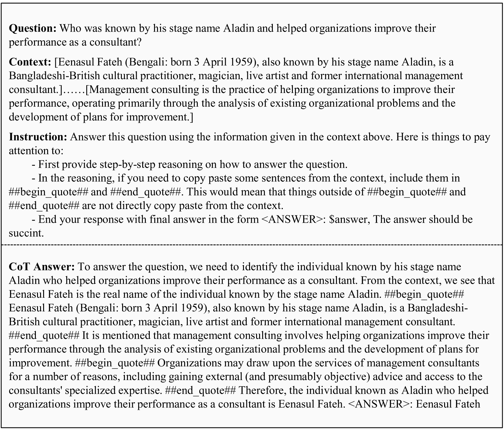

# 实证探究：思维链在检索增强生成中的应用

发布时间：2024年07月22日

`RAG` `人工智能` `对话系统`

> An Empirical Study of Retrieval Augmented Generation with Chain-of-Thought

# 摘要

> 自ChatGPT于2022年底问世以来，这类生成式对话模型已成为我们日常生活的核心工具。随着用户需求的日益增长，如何提升这些模型解决复杂问题的能力，已成为研究的热点。本文聚焦于RAFT方法，这是一种结合了思维链、模型监督微调及检索增强生成的技术，旨在显著提升模型的信息提取与逻辑推理能力。我们在多样的数据集上测试了RAFT，涵盖长、短格式问答，中英文任务，以及支持性与比较性推理等多种场景。特别值得一提的是，RAFT填补了以往研究在长格式问答及中文数据集方面的空白。此外，我们还探讨了思维链在RAFT中的应用价值。本研究为提升生成式对话模型性能的研究领域提供了深刻的洞见。

> Since the launch of ChatGPT at the end of 2022, generative dialogue models represented by ChatGPT have quickly become essential tools in daily life. As user expectations increase, enhancing the capability of generative dialogue models to solve complex problems has become a focal point of current research. This paper delves into the effectiveness of the RAFT (Retrieval Augmented Fine-Tuning) method in improving the performance of Generative dialogue models. RAFT combines chain-of-thought with model supervised fine-tuning (SFT) and retrieval augmented generation (RAG), which significantly enhanced the model's information extraction and logical reasoning abilities. We evaluated the RAFT method across multiple datasets and analysed its performance in various reasoning tasks, including long-form QA and short-form QA tasks, tasks in both Chinese and English, and supportive and comparison reasoning tasks. Notably, it addresses the gaps in previous research regarding long-form QA tasks and Chinese datasets. Moreover, we also evaluate the benefit of the chain-of-thought (CoT) in the RAFT method. This work offers valuable insights for studies focused on enhancing the performance of generative dialogue models.

[Arxiv](https://arxiv.org/abs/2407.15569)