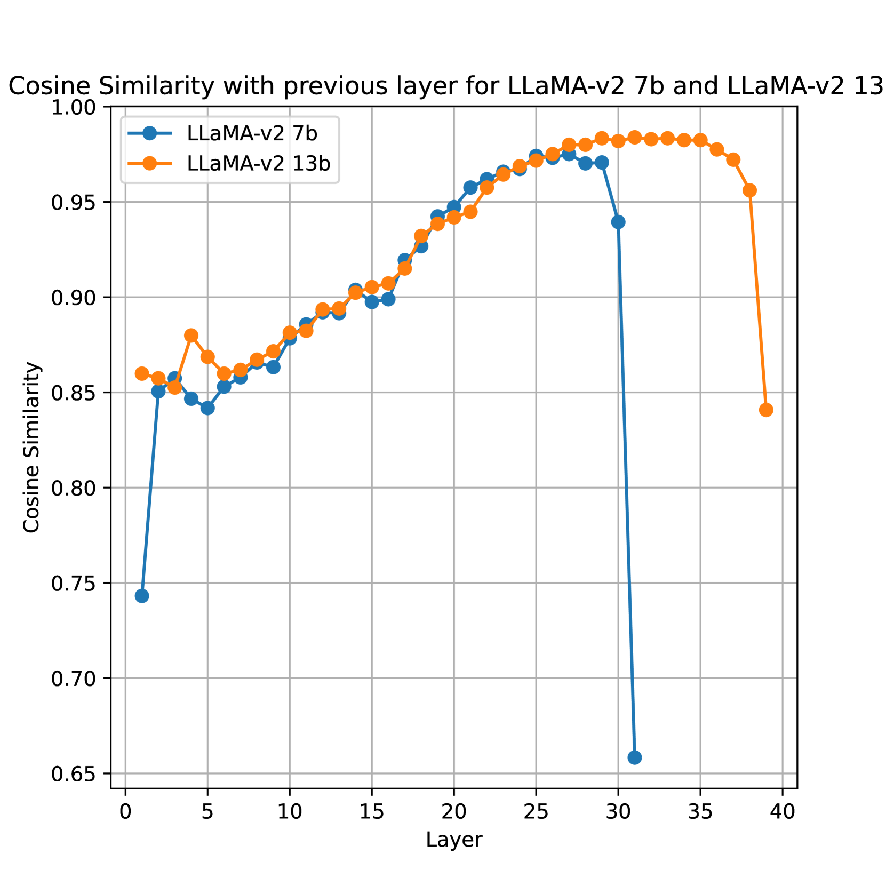
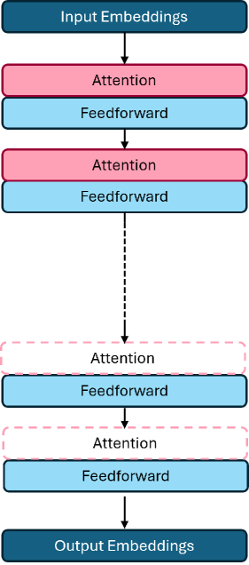
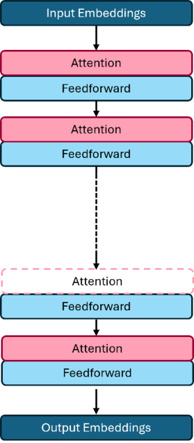
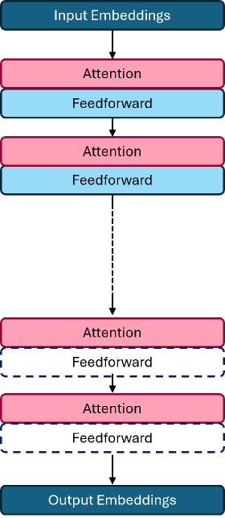
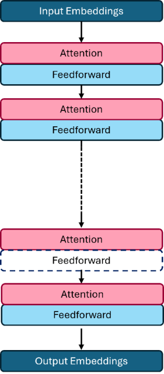
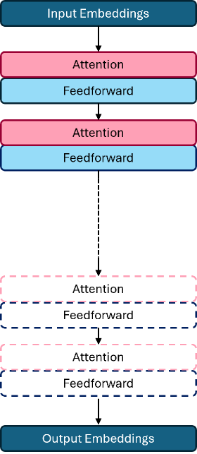
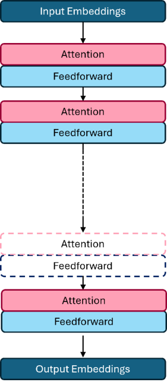

# 在大型语言模型的推理过程中，虽然注意力机制至关重要，但并非所有部分都不可或缺。

发布时间：2024年07月22日

`LLM应用` `人工智能` `计算机科学`

> Attention Is All You Need But You Don't Need All Of It For Inference of Large Language Models

# 摘要

> 近期，LLMs 的推理需求激增，而由于注意力层的输入长度二次复杂性，实现低延迟模型服务仍是一大挑战。我们探讨了在推理时丢弃 MLP 和注意力层对 Llama-v2 模型性能的影响。结果显示，丢弃深层注意力层虽略微影响性能，却能显著加速。例如，移除 13B Llama2 模型中 33% 的注意力层，仅使性能微降 1.8%。此外，我们发现，跳过除后层外的其他层会随着跳过层数的增加而降低性能，但跳过注意力层则不然。

> The inference demand for LLMs has skyrocketed in recent months, and serving models with low latencies remains challenging due to the quadratic input length complexity of the attention layers. In this work, we investigate the effect of dropping MLP and attention layers at inference time on the performance of Llama-v2 models. We find that dropping dreeper attention layers only marginally decreases performance but leads to the best speedups alongside dropping entire layers. For example, removing 33\% of attention layers in a 13B Llama2 model results in a 1.8\% drop in average performance over the OpenLLM benchmark. We also observe that skipping layers except the latter layers reduces performances for more layers skipped, except for skipping the attention layers.

[Arxiv](https://arxiv.org/abs/2407.15516)