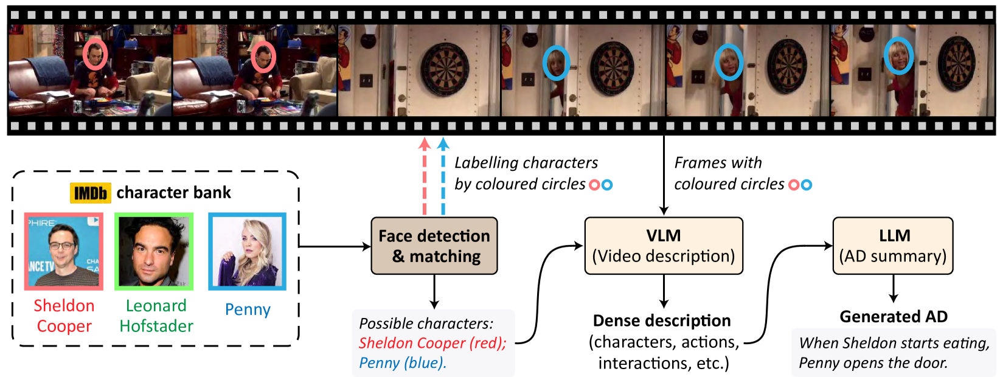
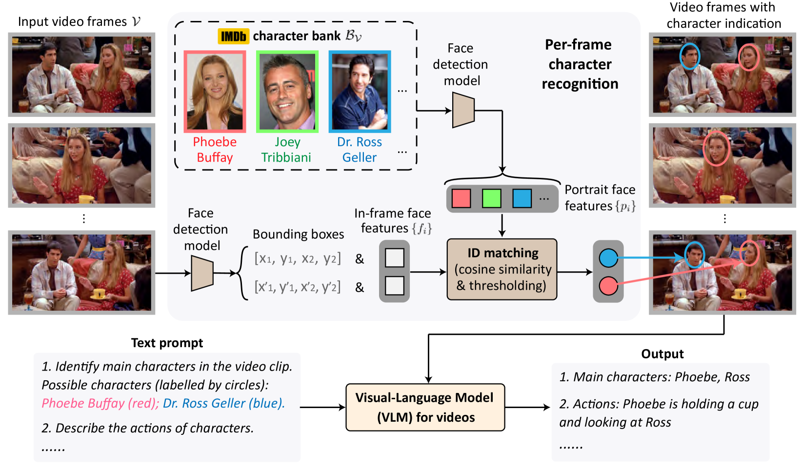
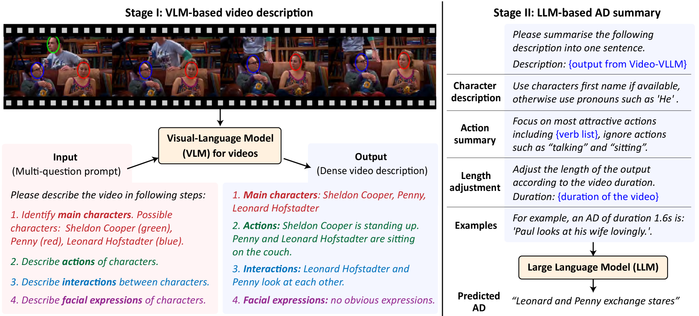
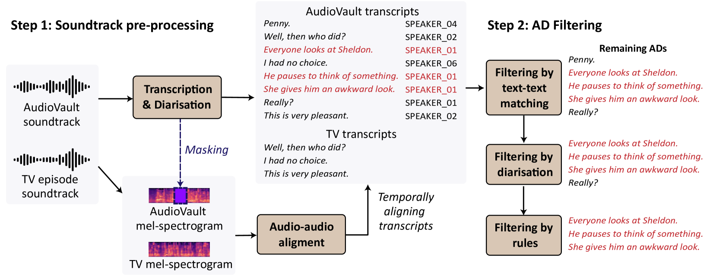
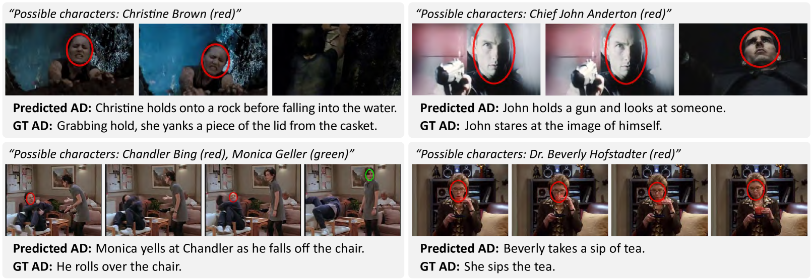
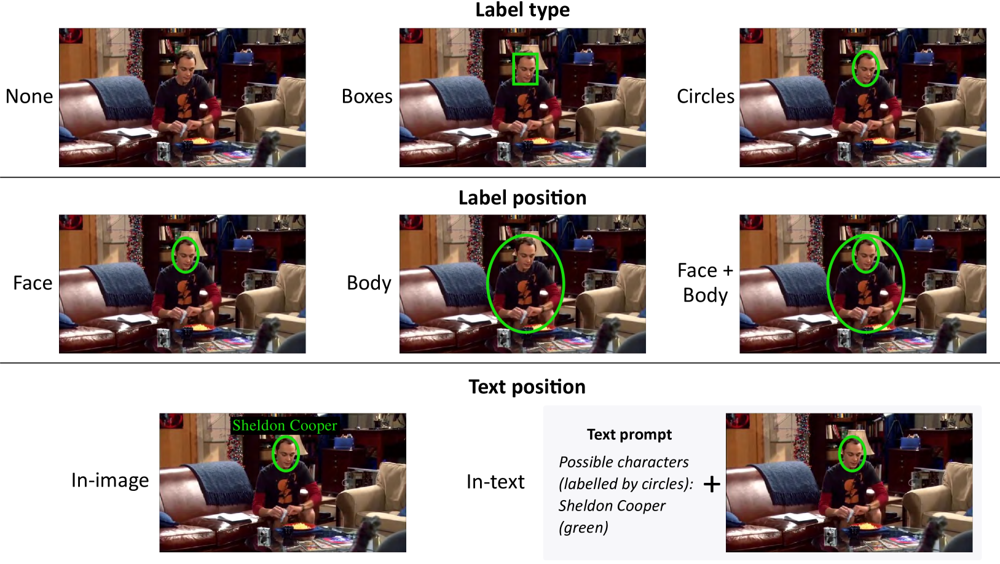
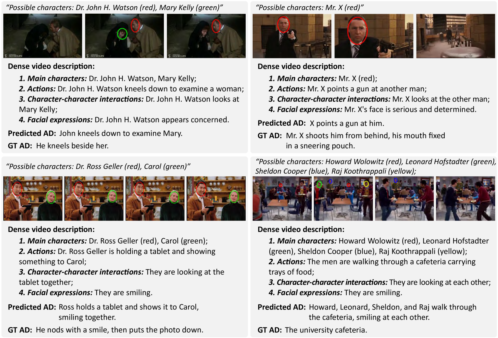

# AutoAD-Zero：一款无需训练的零-shot 音频描述框架，为音频内容提供了即时的描述能力。

发布时间：2024年07月22日

`LLM应用` `媒体制作`

> AutoAD-Zero: A Training-Free Framework for Zero-Shot Audio Description

# 摘要

> 我们的目标是无需训练即可为电影和电视剧生成音频描述。借助现成的视觉-语言模型和大型语言模型，我们设计了视觉和文本提示策略。我们的贡献包括：（i）展示VLM无需微调即可通过视觉提示识别角色；（ii）开发两阶段流程，先由VLM全面描述视频，再由LLM精炼成简洁的AD句子；（iii）创建新的电视剧音频描述数据集。AutoAD-Zero方法在AD生成方面表现卓越，甚至能与部分微调模型媲美，创下顶尖的CRITIC评分。

> Our objective is to generate Audio Descriptions (ADs) for both movies and TV series in a training-free manner. We use the power of off-the-shelf Visual-Language Models (VLMs) and Large Language Models (LLMs), and develop visual and text prompting strategies for this task. Our contributions are three-fold: (i) We demonstrate that a VLM can successfully name and refer to characters if directly prompted with character information through visual indications without requiring any fine-tuning; (ii) A two-stage process is developed to generate ADs, with the first stage asking the VLM to comprehensively describe the video, followed by a second stage utilising a LLM to summarise dense textual information into one succinct AD sentence; (iii) A new dataset for TV audio description is formulated. Our approach, named AutoAD-Zero, demonstrates outstanding performance (even competitive with some models fine-tuned on ground truth ADs) in AD generation for both movies and TV series, achieving state-of-the-art CRITIC scores.

[Arxiv](https://arxiv.org/abs/2407.15850)