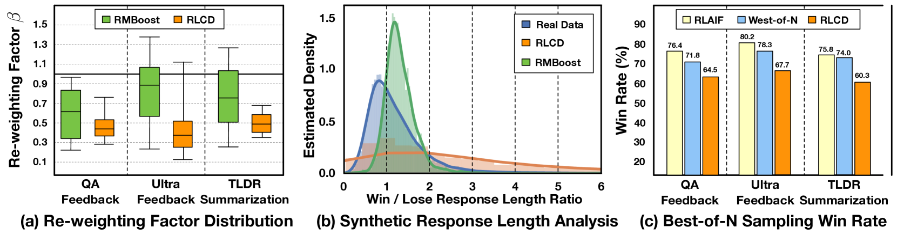

# 通过偏好条件下的多方面合成数据生成，我们旨在提升奖励模型的性能。

发布时间：2024年07月22日

`LLM应用` `人工智能` `机器学习`

> Boosting Reward Model with Preference-Conditional Multi-Aspect Synthetic Data Generation

# 摘要

> 奖励模型（RMs）在将大型语言模型（LLMs）与人类偏好对齐中扮演关键角色。这些模型通过包含输入提示、两个响应和偏好标签的偏好数据集进行训练。然而，构建高质量的人类标记偏好数据集既耗时又昂贵，因此常依赖现有LLMs生成偏好标签，这可能引入噪声，影响RM训练。为此，我们提出RMBoost，一种创新的合成偏好数据生成方法，旨在提升奖励模型质量。与先生成两个响应再获取偏好标签的传统方法不同，RMBoost先产生一个响应并选定偏好标签，随后基于此标签和首个响应生成第二个响应。此方法两大优势：一是减少标签噪声，偏好对精心构建；二是通过融入多维度质量要素（如帮助性、相关性、完整性），促进响应多样性。实验表明，RMBoost在三个不同数据集上超越其他技术，显著提升四个奖励模型的性能。

> Reward models (RMs) are crucial for aligning large language models (LLMs) with human preferences. They are trained using preference datasets where each example consists of one input prompt, two responses, and a preference label. As curating a high-quality human labeled preference dataset is both time-consuming and expensive, people often rely on existing powerful LLMs for preference label generation. This can potentially introduce noise and impede RM training. In this work, we present RMBoost, a novel synthetic preference data generation paradigm to boost reward model quality. Unlike traditional methods, which generate two responses before obtaining the preference label, RMBoost first generates one response and selects a preference label, followed by generating the second more (or less) preferred response conditioned on the pre-selected preference label and the first response. This approach offers two main advantages. First, RMBoost reduces labeling noise since preference pairs are constructed intentionally. Second, RMBoost facilitates the creation of more diverse responses by incorporating various quality aspects (e.g., helpfulness, relevance, completeness) into the prompts. We conduct extensive experiments across three diverse datasets and demonstrate that RMBoost outperforms other synthetic preference data generation techniques and significantly boosts the performance of four distinct reward models.

[Arxiv](https://arxiv.org/abs/2407.16008)