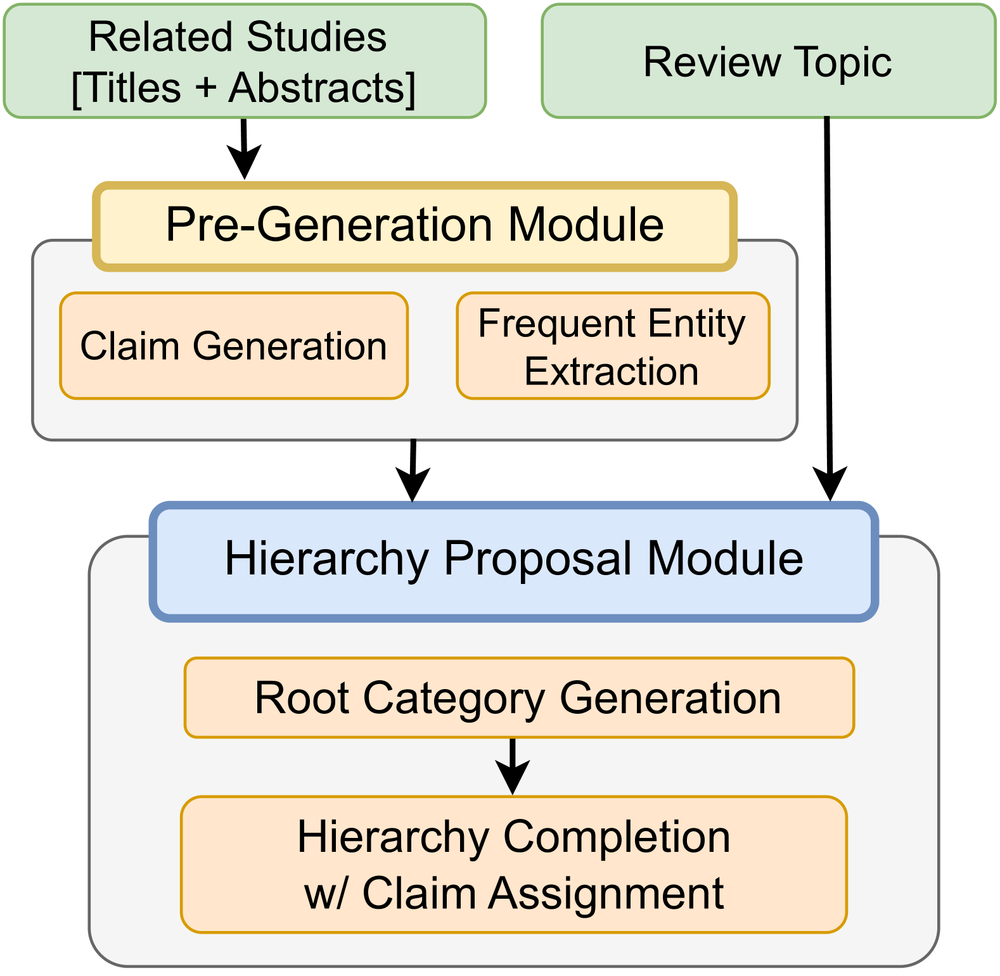

# CHIME：借助LLM进行科学研究文献综述的分层组织支持

发布时间：2024年07月22日

`LLM应用` `生物医学` `文献综述`

> CHIME: LLM-Assisted Hierarchical Organization of Scientific Studies for Literature Review Support

# 摘要

> 随着科学文献的激增，文献综述变得越来越困难。为此，我们研究了LLMs在生成科学研究层次结构方面的潜力，旨在辅助文献综述。我们定义的层次结构为树状结构，节点代表主题，每个节点关联相关研究。基于LLM的初步尝试虽有潜力但存在不足，因此我们创建了CHIME数据集，专注于生物医学领域。考虑到构建层次结构的复杂性，我们引入了专家参与的迭代流程，专家负责修正LLM生成的层次结构中的错误。CHIME数据集包含2,174个层次结构，覆盖472个主题，其中100个主题的层次结构经过专家校正。通过专家校正，我们评估了LLM的性能，发现其在类别生成与组织方面表现良好，但在研究分配上仍有提升空间。我们训练了一个结合人类反馈的校正模型，显著提升了研究分配的准确性。我们公开了数据集和模型，以促进更高效的文献综述辅助工具的研发。

> Literature review requires researchers to synthesize a large amount of information and is increasingly challenging as the scientific literature expands. In this work, we investigate the potential of LLMs for producing hierarchical organizations of scientific studies to assist researchers with literature review. We define hierarchical organizations as tree structures where nodes refer to topical categories and every node is linked to the studies assigned to that category. Our naive LLM-based pipeline for hierarchy generation from a set of studies produces promising yet imperfect hierarchies, motivating us to collect CHIME, an expert-curated dataset for this task focused on biomedicine. Given the challenging and time-consuming nature of building hierarchies from scratch, we use a human-in-the-loop process in which experts correct errors (both links between categories and study assignment) in LLM-generated hierarchies. CHIME contains 2,174 LLM-generated hierarchies covering 472 topics, and expert-corrected hierarchies for a subset of 100 topics. Expert corrections allow us to quantify LLM performance, and we find that while they are quite good at generating and organizing categories, their assignment of studies to categories could be improved. We attempt to train a corrector model with human feedback which improves study assignment by 12.6 F1 points. We release our dataset and models to encourage research on developing better assistive tools for literature review.

[Arxiv](https://arxiv.org/abs/2407.16148)