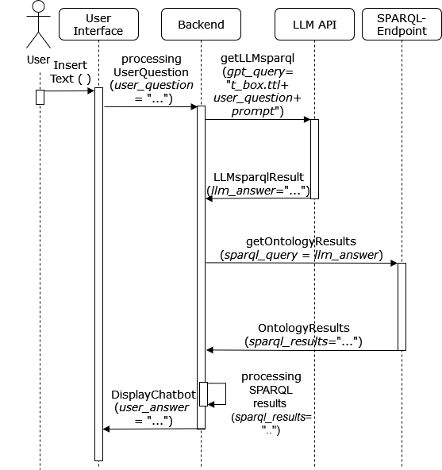

# 利用大型语言模型与特定领域标准，实现基于聊天机器人的本体交互

发布时间：2024年07月22日

`LLM应用` `知识图谱`

> Chatbot-Based Ontology Interaction Using Large Language Models and Domain-Specific Standards

# 摘要

> 本研究提出一种新方法，通过结合大型语言模型和聊天机器人界面，优化本体论的 SPARQL 查询生成，使形式化知识的获取更加直观。系统通过自然语言处理，将用户查询精准转化为 SPARQL 查询，确保查询结果的真实性，避免信息失真。此外，本研究还引入了特定领域标准文本，为本体论的概念和关系提供精确描述，进一步提升查询质量。实验结果显示，该方法在提高查询准确性方面效果显著，并为未来相关研究指明了方向。

> The following contribution introduces a concept that employs Large Language Models (LLMs) and a chatbot interface to enhance SPARQL query generation for ontologies, thereby facilitating intuitive access to formalized knowledge. Utilizing natural language inputs, the system converts user inquiries into accurate SPARQL queries that strictly query the factual content of the ontology, effectively preventing misinformation or fabrication by the LLM. To enhance the quality and precision of outcomes, additional textual information from established domain-specific standards is integrated into the ontology for precise descriptions of its concepts and relationships. An experimental study assesses the accuracy of generated SPARQL queries, revealing significant benefits of using LLMs for querying ontologies and highlighting areas for future research.

[Arxiv](https://arxiv.org/abs/2408.00800)