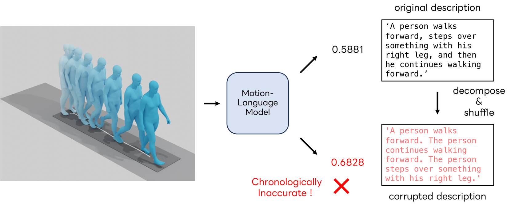
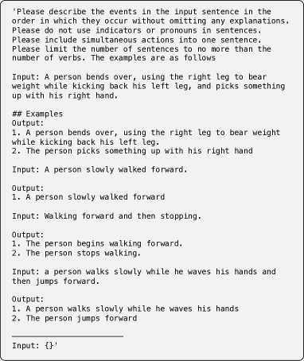
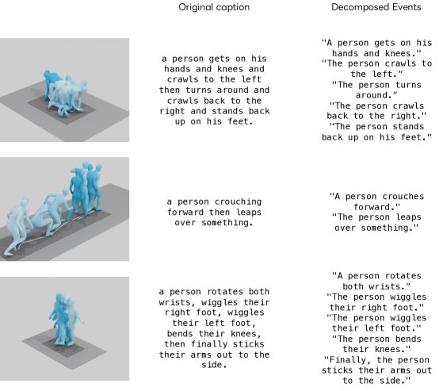
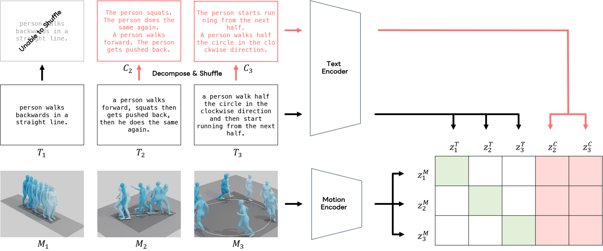
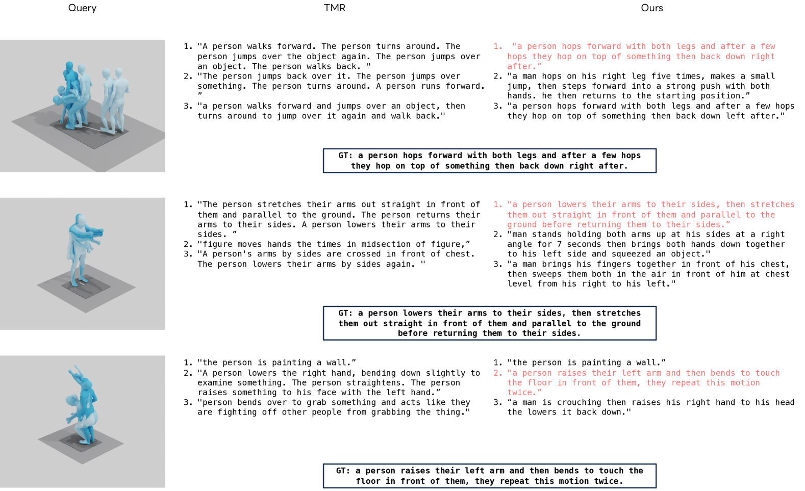
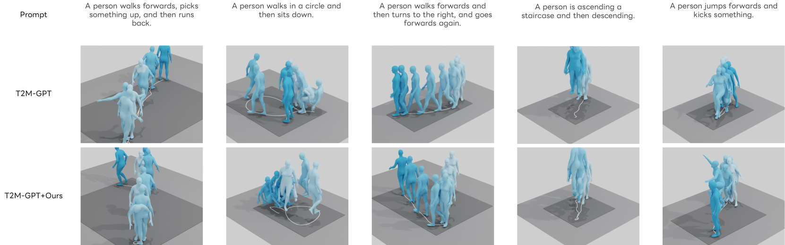
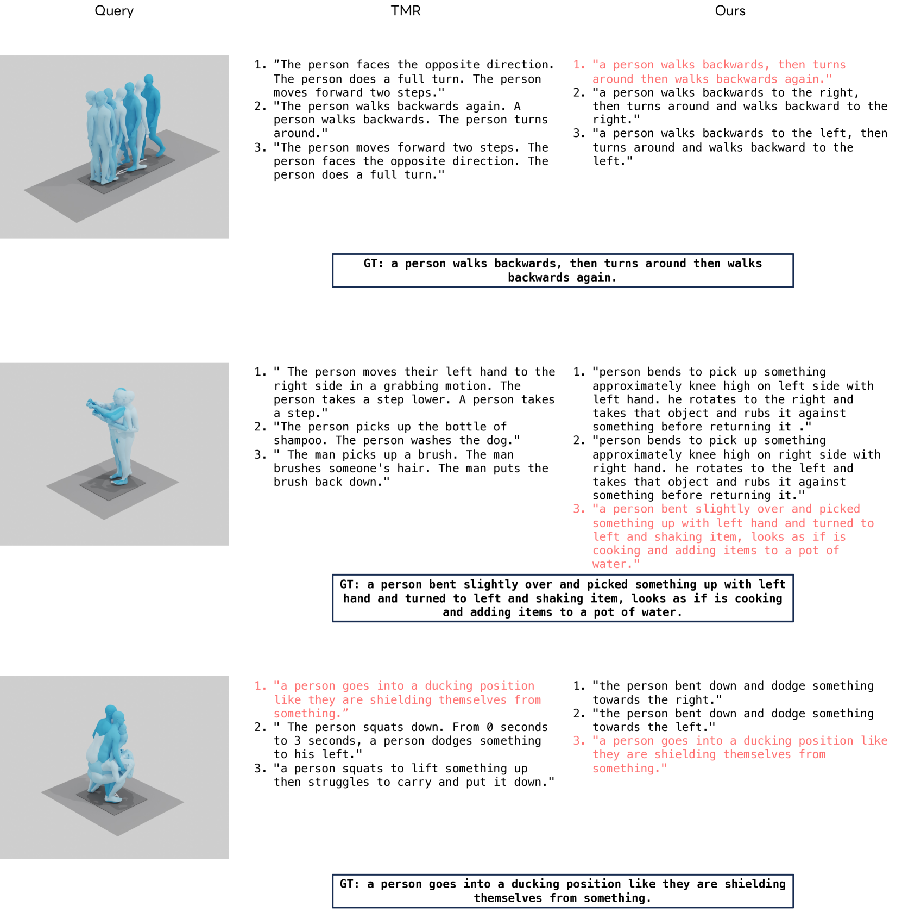

# 为运动-语言模型实现时间定位的精确检索

发布时间：2024年07月22日

`LLM应用`

> Chronologically Accurate Retrieval for Temporal Grounding of Motion-Language Models

# 摘要

> 随着带有文本注释的大规模运动数据集的问世，为语言和3D人体运动构建健壮的潜在空间这一任务近期备受瞩目。虽然已有方法尝试将人体运动与文本特征化以实现精准匹配，但我们发现，时间维度，尤其是复合动作中的时间顺序，常被忽略，导致时间上的不准确。为此，我们提出“按时间顺序准确检索”（CAR）方法，旨在评估模型对时间顺序的理解。我们分解文本描述为事件，并通过打乱复合动作描述中的事件顺序来构建负样本。接着，我们设计任务，让模型从真实描述和打乱顺序的版本中选择更合理的文本。CAR测试揭示，尽管模型在传统评估中表现优异，但在识别运动事件顺序上仍显不足。为改善时间对齐，我们建议在训练中引入这些打乱顺序的负样本，以增强模型。实验表明，强化后的模型在文本-运动检索和生成任务中表现更佳，凸显了在运动-语言对齐中考虑时间因素的重要性。

> With the release of large-scale motion datasets with textual annotations, the task of establishing a robust latent space for language and 3D human motion has recently witnessed a surge of interest. Methods have been proposed to convert human motion and texts into features to achieve accurate correspondence between them. Despite these efforts to align language and motion representations, we claim that the temporal element is often overlooked, especially for compound actions, resulting in chronological inaccuracies. To shed light on the temporal alignment in motion-language latent spaces, we propose Chronologically Accurate Retrieval (CAR) to evaluate the chronological understanding of the models. We decompose textual descriptions into events, and prepare negative text samples by shuffling the order of events in compound action descriptions. We then design a simple task for motion-language models to retrieve the more likely text from the ground truth and its chronologically shuffled version. CAR reveals many cases where current motion-language models fail to distinguish the event chronology of human motion, despite their impressive performance in terms of conventional evaluation metrics. To achieve better temporal alignment between text and motion, we further propose to use these texts with shuffled sequence of events as negative samples during training to reinforce the motion-language models. We conduct experiments on text-motion retrieval and text-to-motion generation using the reinforced motion-language models, which demonstrate improved performance over conventional approaches, indicating the necessity to consider temporal elements in motion-language alignment.

[Arxiv](https://arxiv.org/abs/2407.15408)