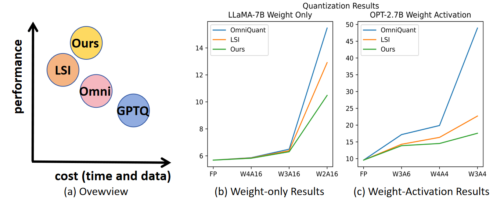
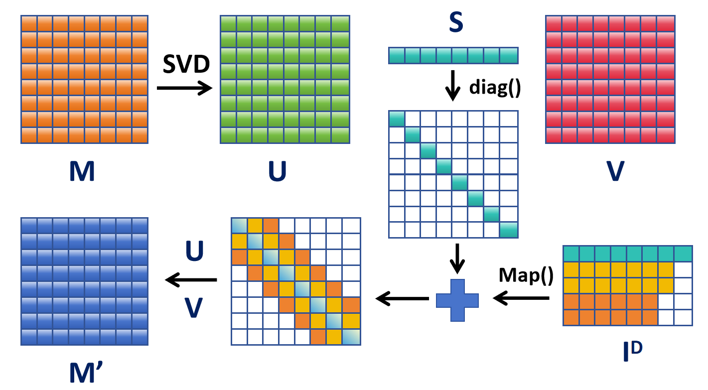
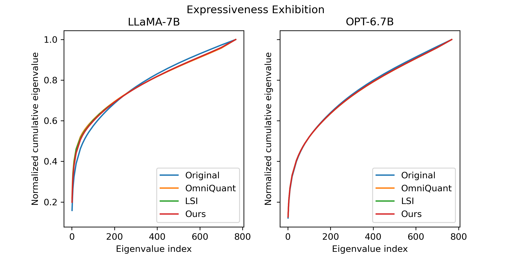
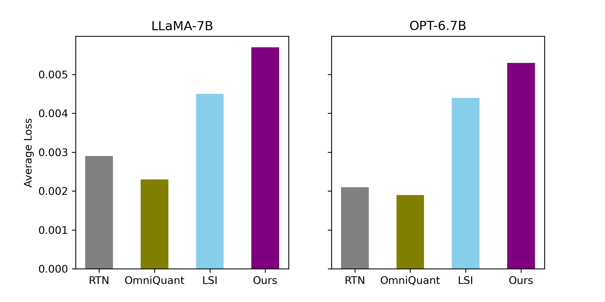
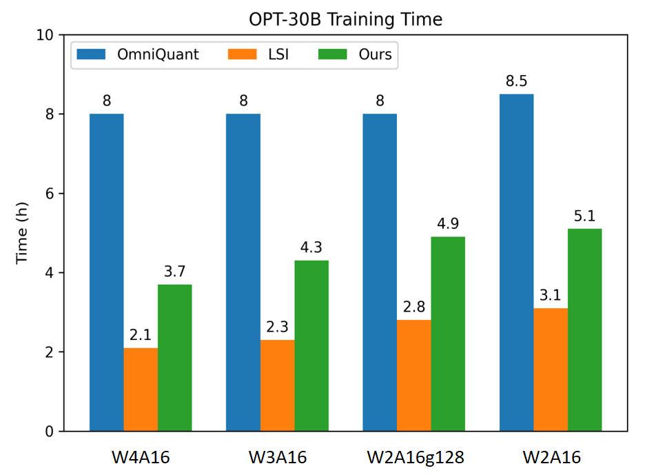

# 量化模型如同好奇的学生，不断补偿量化误差，以提升学习效果。

发布时间：2024年07月22日

`LLM理论` `信息技术` `环境可持续性`

> Compensate Quantization Errors+: Quantized Models Are Inquisitive Learners

# 摘要

> 尽管大型语言模型 (LLM) 性能卓越且推理能力强，但其庞大的体量不仅增加了部署难度，还因高资源消耗引发环境担忧。近期，Learnable Singular-value Increment (LSI) 量化技术的出现，为解决这些难题带来曙光。基于LSI的启发与深入研究，我们创新性地提升了量化LLM在低比特环境下的表现。这些方法不仅在多场景量化中屡创佳绩，更从理论层面深刻揭示了量化模型广泛应用的可能性。

> Large Language Models (LLMs) showcase remarkable performance and robust deductive capabilities, yet their expansive size complicates deployment and raises environmental concerns due to substantial resource consumption. The recent development of a quantization technique known as Learnable Singular-value Increment (LSI) has addressed some of these quantization challenges. Leveraging insights from LSI and our extensive research, we have developed innovative methods that enhance the performance of quantized LLMs, particularly in low-bit settings. Our methods consistently deliver state-of-the-art results across various quantization scenarios and offer deep theoretical insights into the quantization process, elucidating the potential of quantized models for widespread application.

[Arxiv](https://arxiv.org/abs/2407.15508)