# 本研究全面探讨了模型压缩的性能评估与优化，旨在架起传统深度学习与大型语言模型之间的桥梁。

发布时间：2024年07月22日

`LLM应用` `计算机视觉`

> Comprehensive Study on Performance Evaluation and Optimization of Model Compression: Bridging Traditional Deep Learning and Large Language Models

# 摘要

> 近年来，深度学习模型在多个行业取得了显著成就。然而，模型规模的扩大和能源需求的增加，使得在低计算设备上的部署变得复杂。随着全球设备连接数的增长，我们需要能够在本地低计算设备上轻松部署的压缩模型。研究者们提出了多种解决方案，如权重量化、参数剪枝等，以简化模型。在本研究中，我们评估了通过量化和剪枝技术压缩的深度学习模型在图像分类、对象检测等领域的性能。我们还分析了大型语言模型在量化和低秩适应后的表现。通过使用模型大小、准确性和推理时间等标准指标，我们探讨了当前的挑战并展望了未来的研究方向。

> Deep learning models have achieved tremendous success in most of the industries in recent years. The evolution of these models has also led to an increase in the model size and energy requirement, making it difficult to deploy in production on low compute devices. An increase in the number of connected devices around the world warrants compressed models that can be easily deployed at the local devices with low compute capacity and power accessibility. A wide range of solutions have been proposed by different researchers to reduce the size and complexity of such models, prominent among them are, Weight Quantization, Parameter Pruning, Network Pruning, low-rank representation, weights sharing, neural architecture search, knowledge distillation etc. In this research work, we investigate the performance impacts on various trained deep learning models, compressed using quantization and pruning techniques. We implemented both, quantization and pruning, compression techniques on popular deep learning models used in the image classification, object detection, language models and generative models-based problem statements. We also explored performance of various large language models (LLMs) after quantization and low rank adaptation. We used the standard evaluation metrics (model's size, accuracy, and inference time) for all the related problem statements and concluded this paper by discussing the challenges and future work.

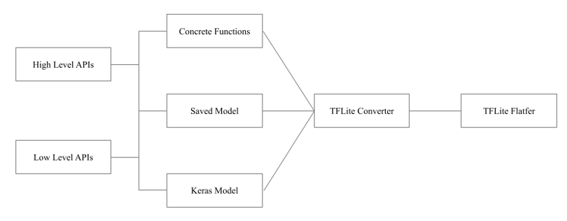

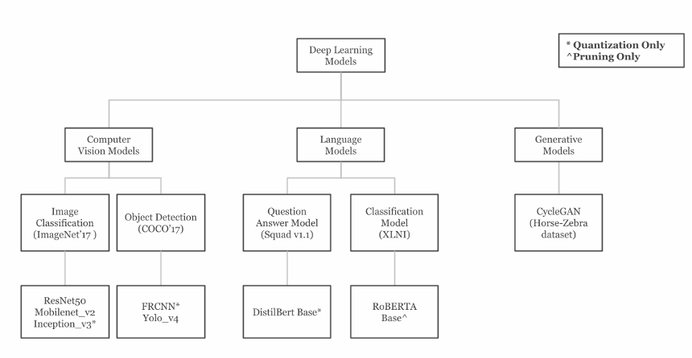

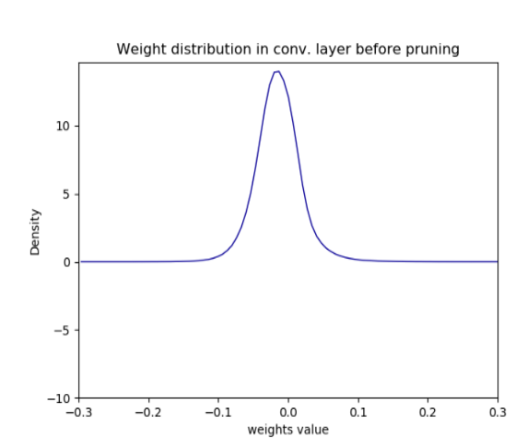

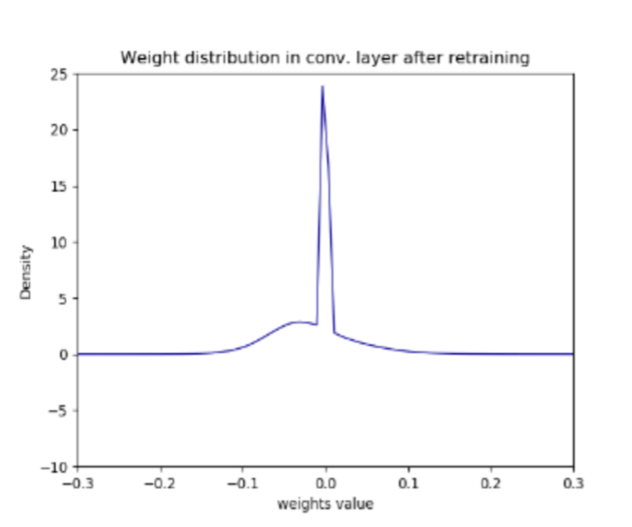

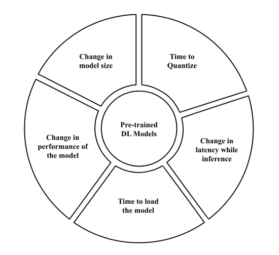

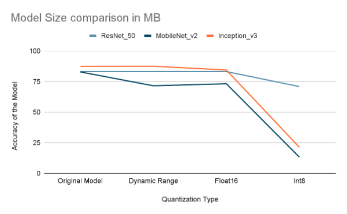

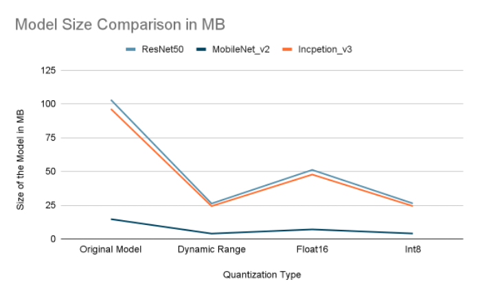

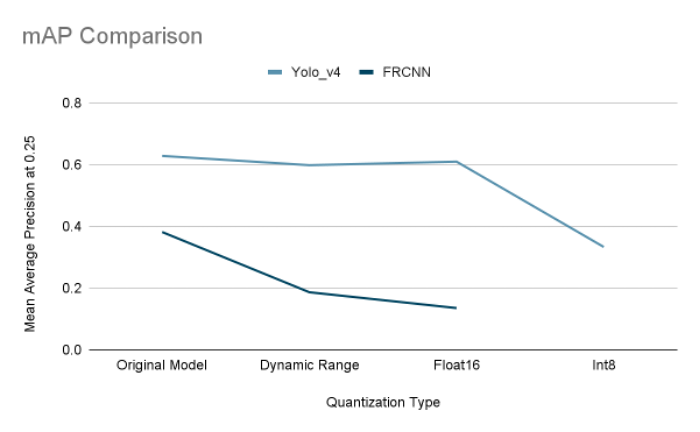

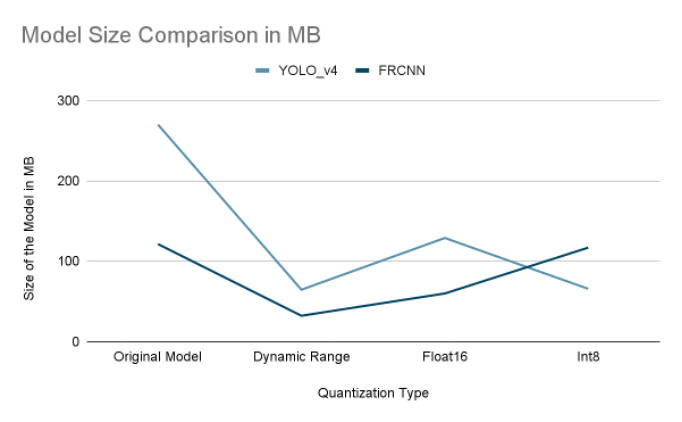

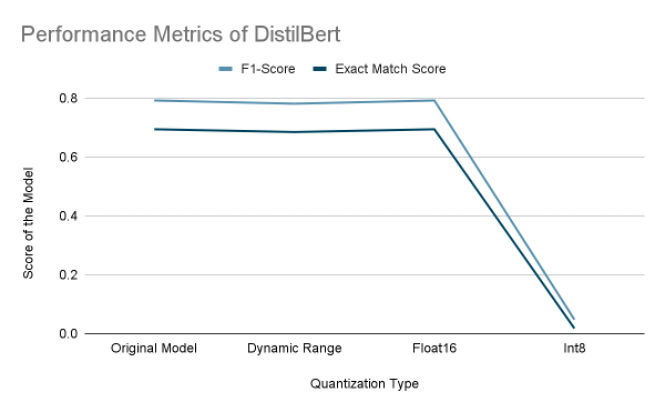

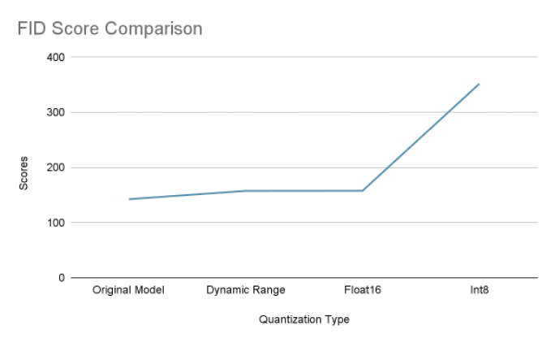

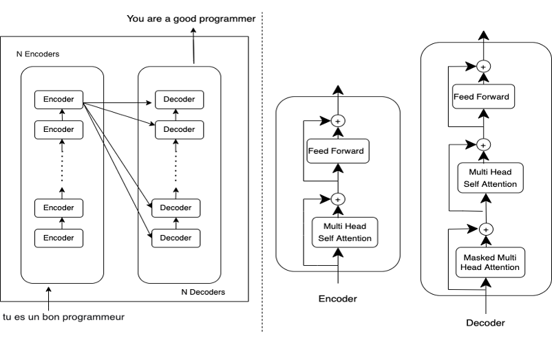

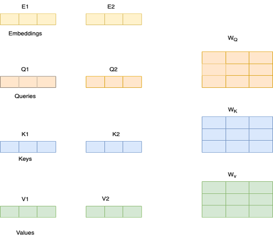

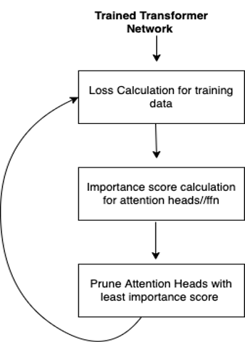

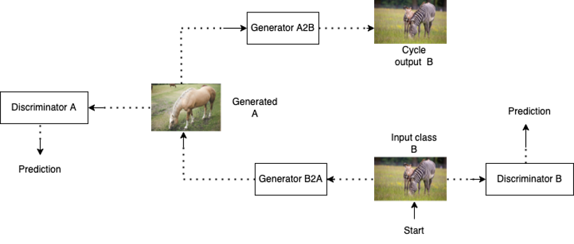

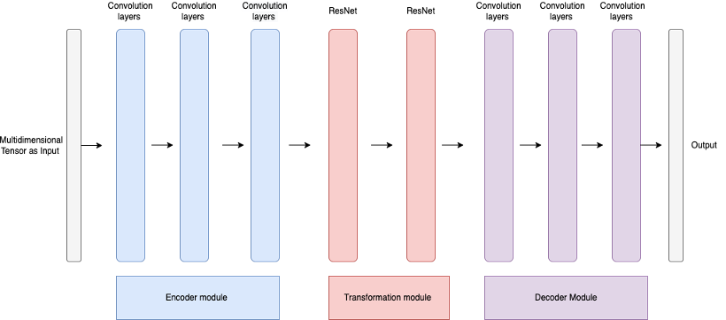

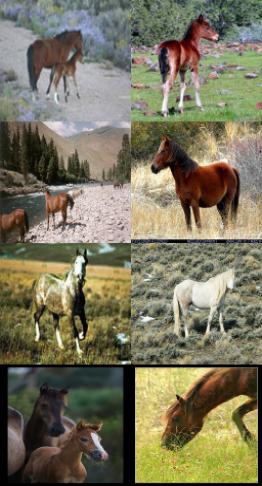

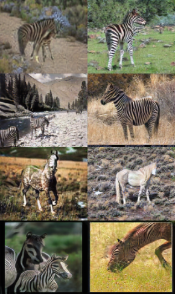

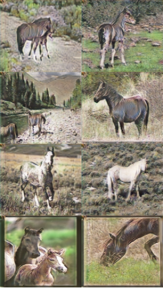

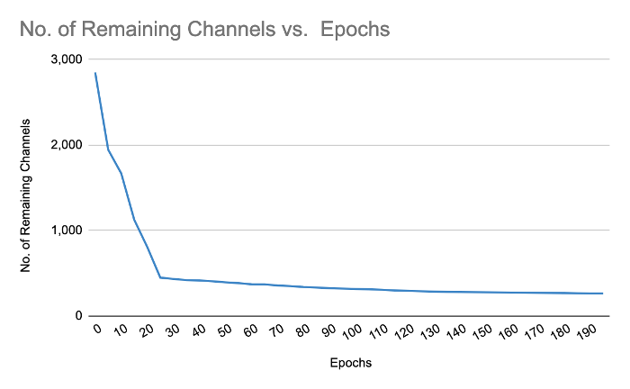

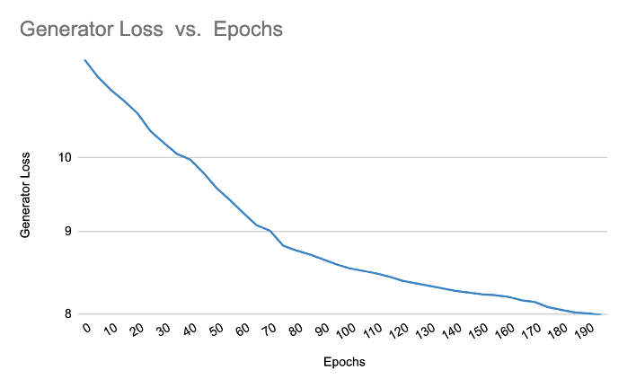

[Arxiv](https://arxiv.org/abs/2407.15904)