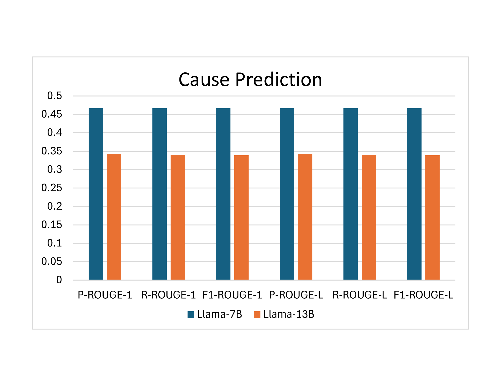

# CrashEventLLM：借助大型语言模型预测系统崩溃事件

发布时间：2024年07月22日

`LLM应用` `计算机系统` `故障预测`

> CrashEventLLM: Predicting System Crashes with Large Language Models

# 摘要

> 随着计算机系统在多领域的广泛应用，提升其可靠性以保障业务连续性和用户满意度变得至关重要。系统日志记录了历史趋势和故障信息，利用机器学习进行故障预测已成为行业标准。大型语言模型在摘要、推理和事件预测等任务中表现出色。本文探讨了大型语言模型在系统故障预测中的应用，通过分析历史故障数据来优化推理和决策。我们基于英特尔计算改进计划的崩溃日志数据，开发了CrashEventLLM模型，用于预测崩溃事件并分析其潜在原因。这一研究为基于日志的事件预测提供了新的视角。

> As the dependence on computer systems expands across various domains, focusing on personal, industrial, and large-scale applications, there arises a compelling need to enhance their reliability to sustain business operations seamlessly and ensure optimal user satisfaction. System logs generated by these devices serve as valuable repositories of historical trends and past failures. The use of machine learning techniques for failure prediction has become commonplace, enabling the extraction of insights from past data to anticipate future behavior patterns. Recently, large language models have demonstrated remarkable capabilities in tasks including summarization, reasoning, and event prediction. Therefore, in this paper, we endeavor to investigate the potential of large language models in predicting system failures, leveraging insights learned from past failure behavior to inform reasoning and decision-making processes effectively. Our approach involves leveraging data from the Intel Computing Improvement Program (ICIP) system crash logs to identify significant events and develop CrashEventLLM. This model, built upon a large language model framework, serves as our foundation for crash event prediction. Specifically, our model utilizes historical data to forecast future crash events, informed by expert annotations. Additionally, it goes beyond mere prediction, offering insights into potential causes for each crash event. This work provides the preliminary insights into prompt-based large language models for the log-based event prediction task.

[Arxiv](https://arxiv.org/abs/2407.15716)