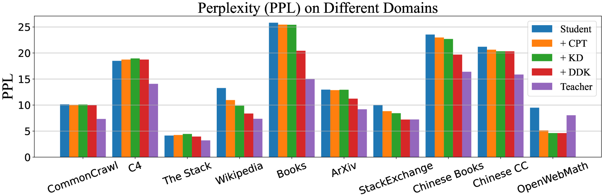
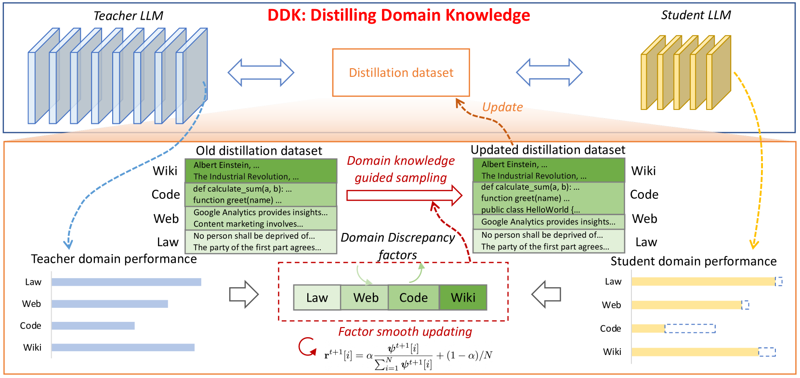
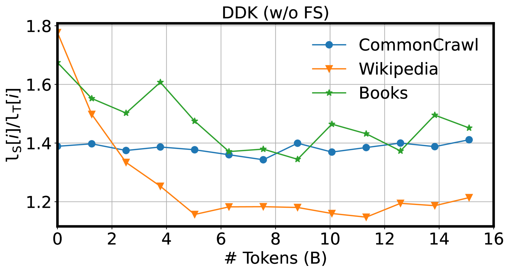
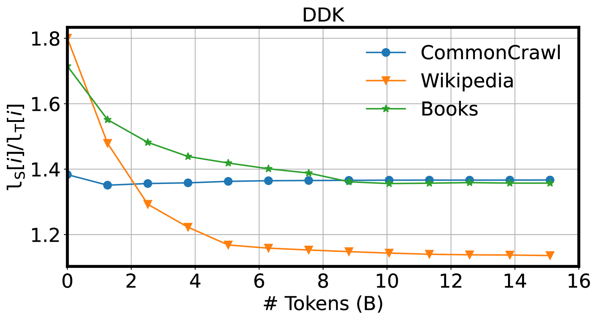

# DDK：精炼领域智慧，助力高效大型语言模型

发布时间：2024年07月22日

`LLM理论` `人工智能`

> DDK: Distilling Domain Knowledge for Efficient Large Language Models

# 摘要

> 尽管大型语言模型在多领域表现卓越，但其高计算和存储需求仍是一大挑战。知识蒸馏通过从教师模型向学生模型传递知识，有效提升了小型模型的性能。然而，现有蒸馏技术往往忽视了模型间跨领域的知识差异，导致对性能差距小的领域过度关注，而对差距大的领域关注不足，影响了整体性能。为此，我们提出了动态蒸馏框架 DDK，该框架根据教师与学生模型在各领域的性能差异，动态调整蒸馏数据集的构成，使蒸馏过程更为稳定高效。实验证明，DDK 大幅提升了学生模型的性能，显著优于传统预训练和现有蒸馏方法。

> Despite the advanced intelligence abilities of large language models (LLMs) in various applications, they still face significant computational and storage demands. Knowledge Distillation (KD) has emerged as an effective strategy to improve the performance of a smaller LLM (i.e., the student model) by transferring knowledge from a high-performing LLM (i.e., the teacher model). Prevailing techniques in LLM distillation typically use a black-box model API to generate high-quality pretrained and aligned datasets, or utilize white-box distillation by altering the loss function to better transfer knowledge from the teacher LLM. However, these methods ignore the knowledge differences between the student and teacher LLMs across domains. This results in excessive focus on domains with minimal performance gaps and insufficient attention to domains with large gaps, reducing overall performance. In this paper, we introduce a new LLM distillation framework called DDK, which dynamically adjusts the composition of the distillation dataset in a smooth manner according to the domain performance differences between the teacher and student models, making the distillation process more stable and effective. Extensive evaluations show that DDK significantly improves the performance of student models, outperforming both continuously pretrained baselines and existing knowledge distillation methods by a large margin.

[Arxiv](https://arxiv.org/abs/2407.16154)