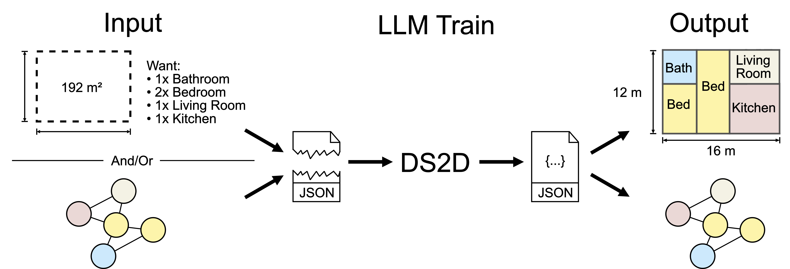
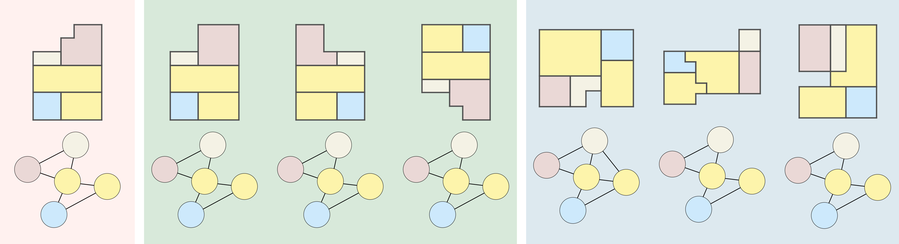
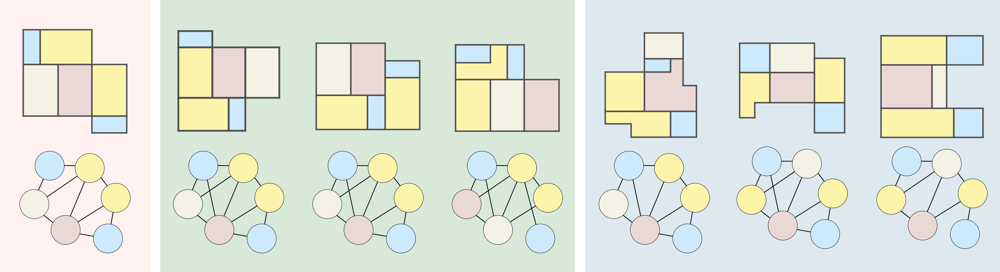
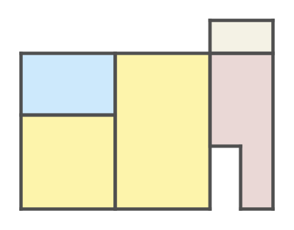

# DStruct2Design：数据结构驱动下的楼层平面生成设计数据与基准测试

发布时间：2024年07月22日

`LLM应用` `建筑设计` `人工智能`

> DStruct2Design: Data and Benchmarks for Data Structure Driven Generative Floor Plan Design

# 摘要

> 文本条件下的图像生成模型已取得显著成果，而文本条件下的平面图生成任务也备受瞩目。但在平面图生成中，数值属性往往比外观更为关键。例如，用户可能需要为特定房间设定尺寸，并比较生成结果与既定规格。现有方法和评估体系尚不支持此类约束。为此，我们提出一种策略：先构建包含数值属性的中间数据结构，再据此生成最终平面图。具体而言，我们（1）基于RPLAN和ProcTHOR-10k数据集创建新数据集，并提供工具将更多ProcTHOR数据转换为我们的格式。（2）针对部分或完整约束下的平面图生成任务，设计了评估指标和基准。（3）通过微调大型语言模型Llama3，建立了多个基线，验证了以平面图数据结构为条件的LLM在遵守数值约束的平面图生成中的可行性。我们期待这些新数据集和基准能推动相关领域的深入研究，提升生成模型在处理部分指定且必须遵守的定量约束时的性能。

> Text conditioned generative models for images have yielded impressive results. Text conditioned floorplan generation as a special type of raster image generation task also received particular attention. However there are many use cases in floorpla generation where numerical properties of the generated result are more important than the aesthetics. For instance, one might want to specify sizes for certain rooms in a floorplan and compare the generated floorplan with given specifications Current approaches, datasets and commonly used evaluations do not support these kinds of constraints. As such, an attractive strategy is to generate an intermediate data structure that contains numerical properties of a floorplan which can be used to generate the final floorplan image. To explore this setting we (1) construct a new dataset for this data-structure to data-structure formulation of floorplan generation using two popular image based floorplan datasets RPLAN and ProcTHOR-10k, and provide the tools to convert further procedurally generated ProcTHOR floorplan data into our format. (2) We explore the task of floorplan generation given a partial or complete set of constraints and we design a series of metrics and benchmarks to enable evaluating how well samples generated from models respect the constraints. (3) We create multiple baselines by finetuning a large language model (LLM), Llama3, and demonstrate the feasibility of using floorplan data structure conditioned LLMs for the problem of floorplan generation respecting numerical constraints. We hope that our new datasets and benchmarks will encourage further research on different ways to improve the performance of LLMs and other generative modelling techniques for generating designs where quantitative constraints are only partially specified, but must be respected.

[Arxiv](https://arxiv.org/abs/2407.15723)