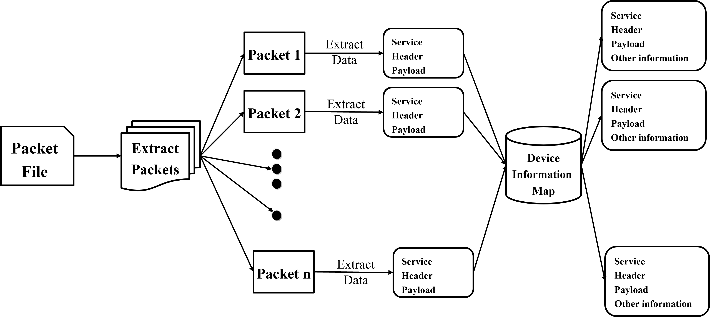

# BACnet 数据包解码：利用大型语言模型进行数据包解析的新方法

发布时间：2024年07月22日

`LLM应用` `工业控制` `网络安全`

> Decoding BACnet Packets: A Large Language Model Approach for Packet Interpretation

# 摘要

> 在工业控制系统（ICS）环境中，复杂的通信协议给安全运营中心（SOC）分析师带来了挑战。为了更好地理解这些协议，我们开发了一种基于大型语言模型（LLM）的软件，专注于BACnet协议。该软件通过处理数据包并结合现代上下文检索技术，生成简洁明了的网络活动摘要，助力SOC分析师更有效地监控和评估控制系统的安全状态。

> The Industrial Control System (ICS) environment encompasses a wide range of intricate communication protocols, posing substantial challenges for Security Operations Center (SOC) analysts tasked with monitoring, interpreting, and addressing network activities and security incidents. Conventional monitoring tools and techniques often struggle to provide a clear understanding of the nature and intent of ICS-specific communications. To enhance comprehension, we propose a software solution powered by a Large Language Model (LLM). This solution currently focused on BACnet protocol, processes a packet file data and extracts context by using a mapping database, and contemporary context retrieval methods for Retrieval Augmented Generation (RAG). The processed packet information, combined with the extracted context, serves as input to the LLM, which generates a concise packet file summary for the user. The software delivers a clear, coherent, and easily understandable summary of network activities, enabling SOC analysts to better assess the current state of the control system.

[Arxiv](https://arxiv.org/abs/2407.15428)