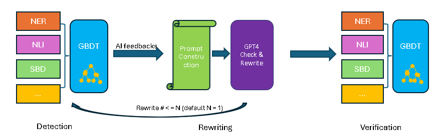
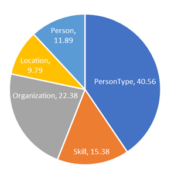
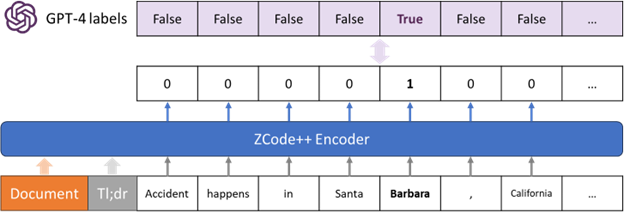
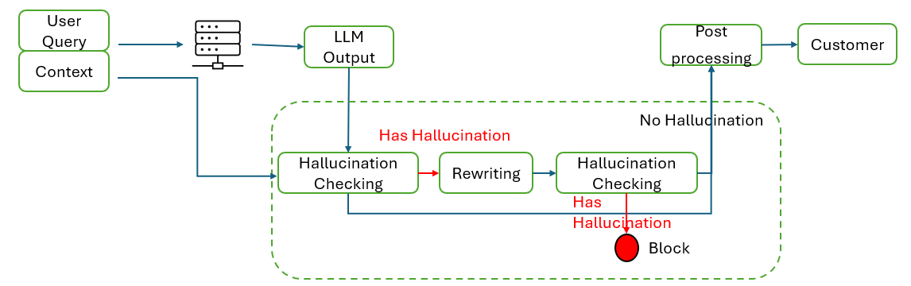

# 打造一款可靠且通用的幻觉检测与缓解服务，我们从中获得了宝贵的见解与经验。

发布时间：2024年07月22日

`LLM应用` `人工智能`

> Developing a Reliable, General-Purpose Hallucination Detection and Mitigation Service: Insights and Lessons Learned

# 摘要

> 幻觉现象，即 LLM 输出与事实不符或与输入无关，是追求准确性和可靠性的 LLM 应用的一大难题。本文介绍了一个高速且可靠的系统，旨在检测并修正 LLM 中的幻觉问题。该系统融合了 NER、NLI、SBD 及复杂的决策树流程，有效识别 LLM 响应中的多种幻觉。同时，我们团队还开发了重写机制，确保了精确度、响应速度与成本效益的完美结合。文中详细阐述了框架核心要素，并强调了响应时间、系统可用性及性能指标等关键挑战，这些都是技术实际应用中的重要考量。通过离线数据与实时生产流量的广泛评估，我们验证了所提框架与服务的实际效果。

> Hallucination, a phenomenon where large language models (LLMs) produce output that is factually incorrect or unrelated to the input, is a major challenge for LLM applications that require accuracy and dependability. In this paper, we introduce a reliable and high-speed production system aimed at detecting and rectifying the hallucination issue within LLMs. Our system encompasses named entity recognition (NER), natural language inference (NLI), span-based detection (SBD), and an intricate decision tree-based process to reliably detect a wide range of hallucinations in LLM responses. Furthermore, our team has crafted a rewriting mechanism that maintains an optimal mix of precision, response time, and cost-effectiveness. We detail the core elements of our framework and underscore the paramount challenges tied to response time, availability, and performance metrics, which are crucial for real-world deployment of these technologies. Our extensive evaluation, utilizing offline data and live production traffic, confirms the efficacy of our proposed framework and service.

[Arxiv](https://arxiv.org/abs/2407.15441)