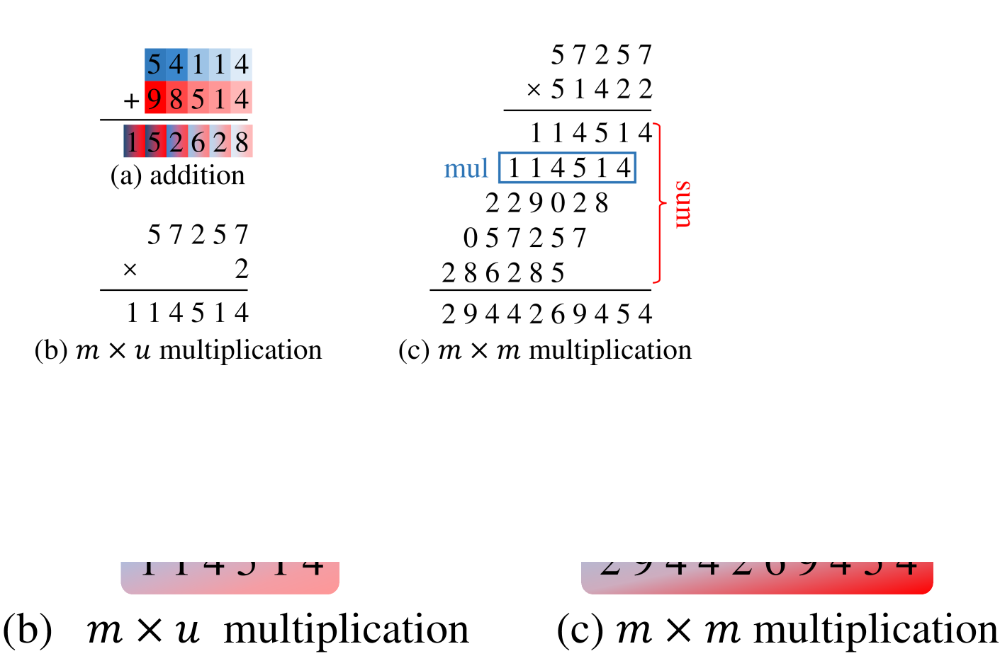
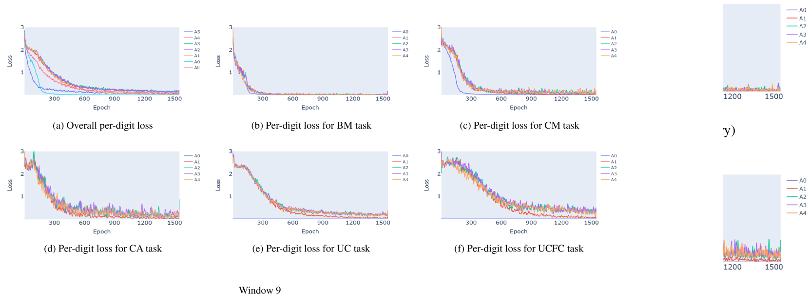
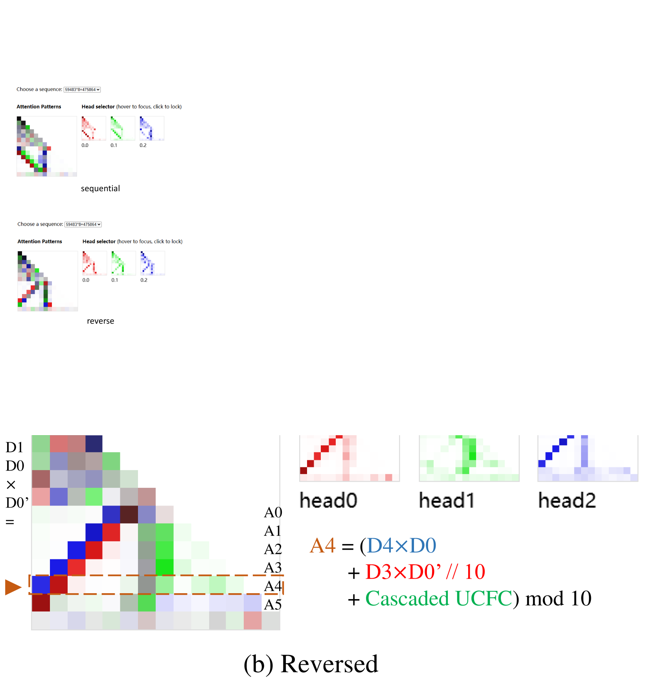
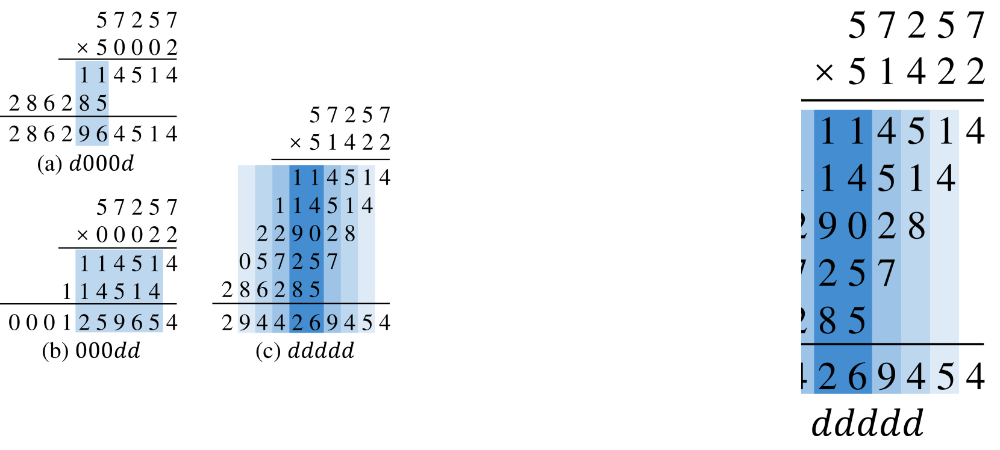
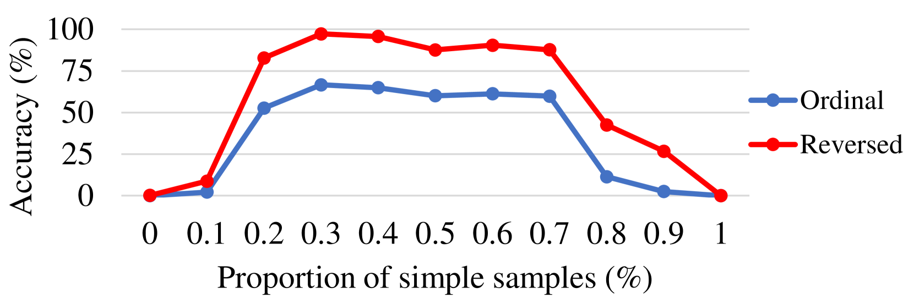

# 深入解析Transformer中的乘法机制，揭示LLMs的内在奥秘。

发布时间：2024年07月22日

`LLM理论` `人工智能`

> Dissecting Multiplication in Transformers: Insights into LLMs

# 摘要

> 尽管基于Transformer的大型语言模型在众多NLP任务中表现卓越，但在简单的算术任务上却常显不足。这种性能差异引发了对其安全性和伦理使用的广泛关注，限制了其普及。本文聚焦于整数乘法这一典型算术任务，深入剖析Transformer在此领域的表现不足。通过详尽分析一个专为n位整数乘法训练的Transformer模型，我们发现模型将乘法分解为多个并行子任务，逐位优化以完成最终乘法。基于此，我们推断Transformer在处理连续进位和缓存中间结果时存在困难，并通过实验验证了这一推断。以此为基础，我们提出了一系列改进措施，旨在提升Transformer在乘法任务上的性能。这些改进措施经过严格测试和数学建模验证，不仅增强了模型的可解释性，还显著提升了其性能，例如，我们使用一个小型Transformer在5位整数乘法上实现了超过99.9%的准确率，超越了GPT-4。这些成果不仅推动了模型理解和可解释性的发展，也为分析更复杂任务和Transformer模型奠定了基础。这项研究强调了可解释AI的重要性，有助于增强对大型语言模型的信任，并促进其在关键应用中的广泛采用。

> Transformer-based large language models have achieved remarkable performance across various natural language processing tasks. However, they often struggle with seemingly easy tasks like arithmetic despite their vast capabilities. This stark disparity raise human's concerns about their safe and ethical use, hinder their widespread adoption.In this paper, we focus on a typical arithmetic task, integer multiplication, to explore and explain the imperfection of transformers in this domain. We provide comprehensive analysis of a vanilla transformer trained to perform n-digit integer multiplication. Our observations indicate that the model decomposes multiplication task into multiple parallel subtasks, sequentially optimizing each subtask for each digit to complete the final multiplication. Based on observation and analysis, we infer the reasons of transformers deficiencies in multiplication tasks lies in their difficulty in calculating successive carryovers and caching intermediate results, and confirmed this inference through experiments. Guided by these findings, we propose improvements to enhance transformers performance on multiplication tasks. These enhancements are validated through rigorous testing and mathematical modeling, not only enhance transformer's interpretability, but also improve its performance, e.g., we achieve over 99.9% accuracy on 5-digit integer multiplication with a tiny transformer, outperform LLMs GPT-4. Our method contributes to the broader fields of model understanding and interpretability, paving the way for analyzing more complex tasks and Transformer models. This work underscores the importance of explainable AI, helping to build trust in large language models and promoting their adoption in critical applications.

[Arxiv](https://arxiv.org/abs/2407.15360)