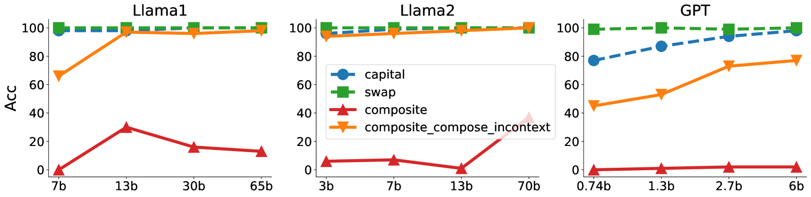
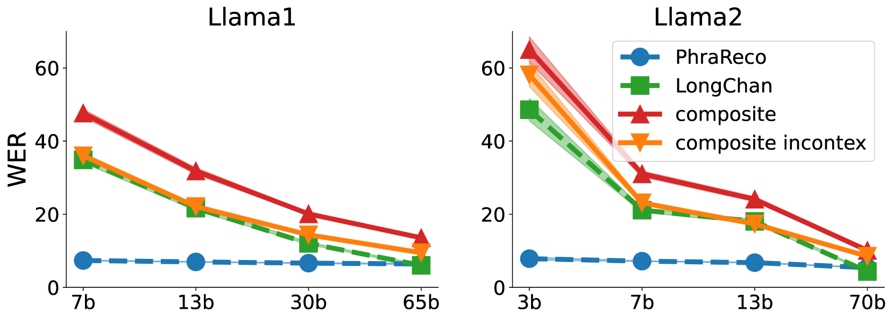
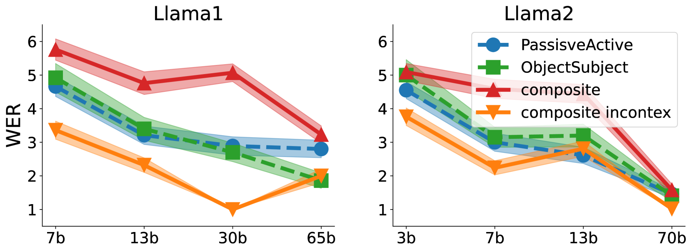
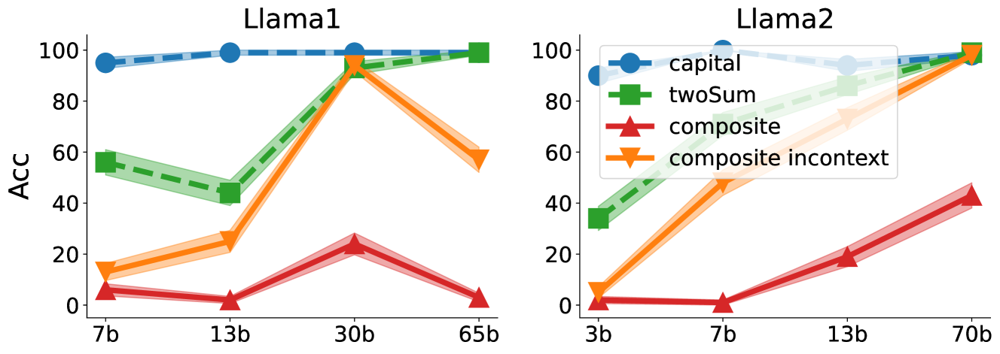
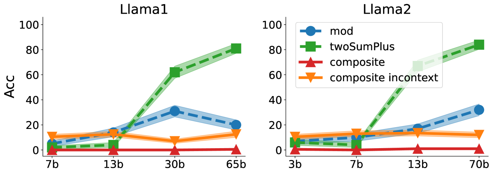
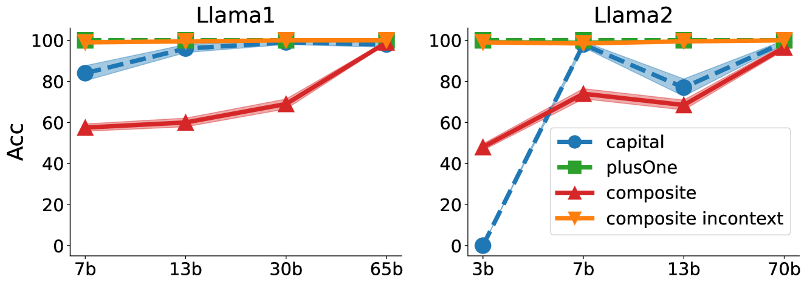

# 大型语言模型是否拥有组合能力？本研究深入探讨其局限与可扩展性。

发布时间：2024年07月22日

`LLM理论` `人工智能`

> Do Large Language Models Have Compositional Ability? An Investigation into Limitations and Scalability

# 摘要

> 大型语言模型 (LLM) 在 AI 领域崭露头角，其 in-context learning (ICL) 能力尤为突出。组合能力，即解决未见复杂任务的能力，是实现人工通用智能的关键。尽管 LLM 成就斐然，但其处理复合任务的能力，尤其是预训练阶段未遇任务的能力，仍待深入探究。本研究聚焦于 LLM 在复合任务上的 ICL 表现，以简单任务为示例。我们构建了一套涵盖语言与逻辑挑战的复合任务测试集，并进行了跨 LLM 系列的实证研究。研究发现：(1) 对于较简单的复合任务，模型展现出良好的组合能力，且模型规模扩大可提升此能力；(2) 对于复杂的多步骤推理任务，模型表现通常不佳，且规模扩大并无显著改善。我们通过简化设置的理论分析，揭示了模型在分别处理不同输入部分时展现组合能力的原因。本研究为 LLM 在复合任务解决方面的能力提供了新视角，涉及任务本质与模型规模。相关数据集与代码已公开于 {\url{https://github.com/OliverXUZY/LLM_Compose}}。

> Large language models (LLMs) have emerged as powerful tools for many AI problems and exhibit remarkable in-context learning (ICL) capabilities. Compositional ability, solving unseen complex tasks that combine two or more simple tasks, is an essential reasoning ability for Artificial General Intelligence. Despite LLM's tremendous success, how they approach composite tasks, especially those not encountered during the pretraining phase, remains an open question and largely ununderstood. In this study, we delve into the ICL capabilities of LLMs on composite tasks, with only simple tasks as in-context examples. We develop a test suite of composite tasks that include linguistic and logical challenges and perform empirical studies across different LLM families. We observe that models exhibit divergent behaviors: (1) For simpler composite tasks that apply distinct mapping mechanisms to different input segments, the models demonstrate decent compositional ability, while scaling up the model enhances this ability; (2) for more complex composite tasks that involving reasoning multiple steps, where each step represent one task, models typically underperform, and scaling up generally provide no improvements. We offer theoretical analysis in a simplified setting, explaining that models exhibit compositional capability when the task handles different input parts separately. We believe our work sheds new light on the capabilities of LLMs in solving composite tasks regarding the nature of the tasks and model scale. Our dataset and code are available at {\url{https://github.com/OliverXUZY/LLM_Compose}}.

[Arxiv](https://arxiv.org/abs/2407.15720)