# 自注意力神经网络的经验容量模型研究

发布时间：2024年07月22日

`LLM理论` `人工智能` `机器学习`

> Empirical Capacity Model for Self-Attention Neural Networks

# 摘要

> 大型预训练转换器模型在多领域表现卓越，但其记忆与泛化能力受限于当前优化算法。本文探讨了这些模型在标准训练下的记忆容量，并据此构建了经验容量模型（ECM），助力设计参数优化、任务适应的转换器模型。

> Large pretrained self-attention neural networks, or transformers, have been very successful in various tasks recently. The performance of a model on a given task depends on its ability to memorize and generalize the training data. Large transformer models, which may have billions of parameters, in theory have a huge capacity to memorize content. However, the current algorithms for the optimization fall short of the theoretical capacity, and the capacity is also highly dependent on the content. In this paper, we focus on the memory capacity of these models obtained using common training algorithms and synthetic training data. Based on the results, we derive an empirical capacity model (ECM) for a generic transformer. The ECM can be used to design task-specific transformer models with an optimal number of parameters in cases where the target memorization capability of the task can be defined.

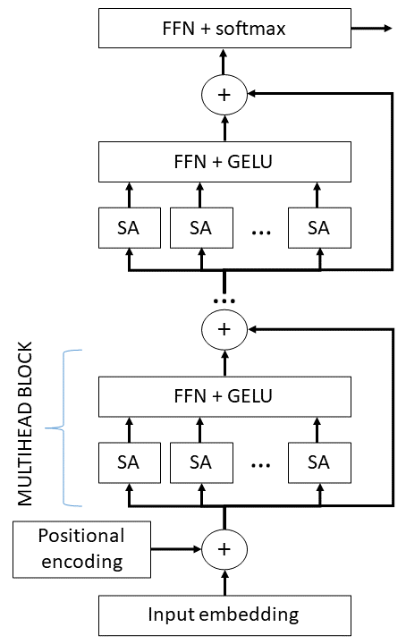

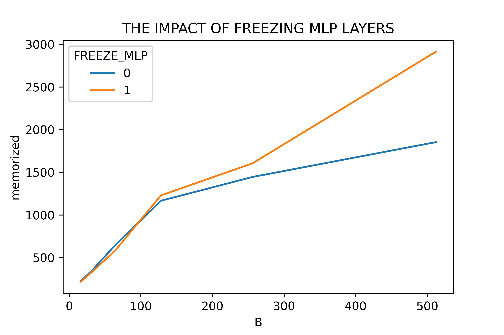

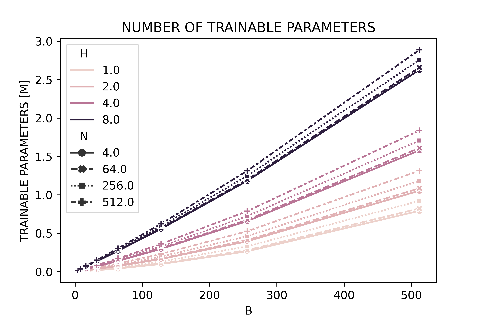

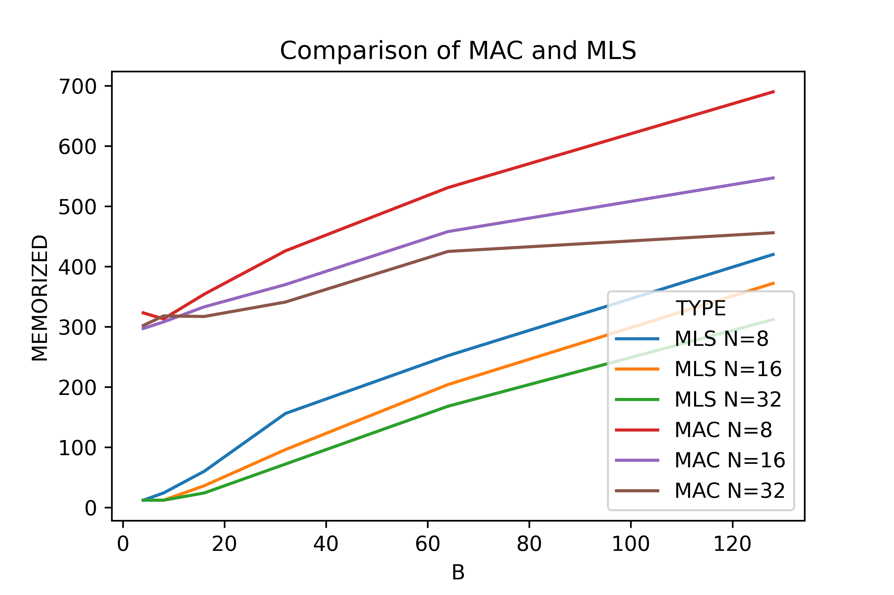

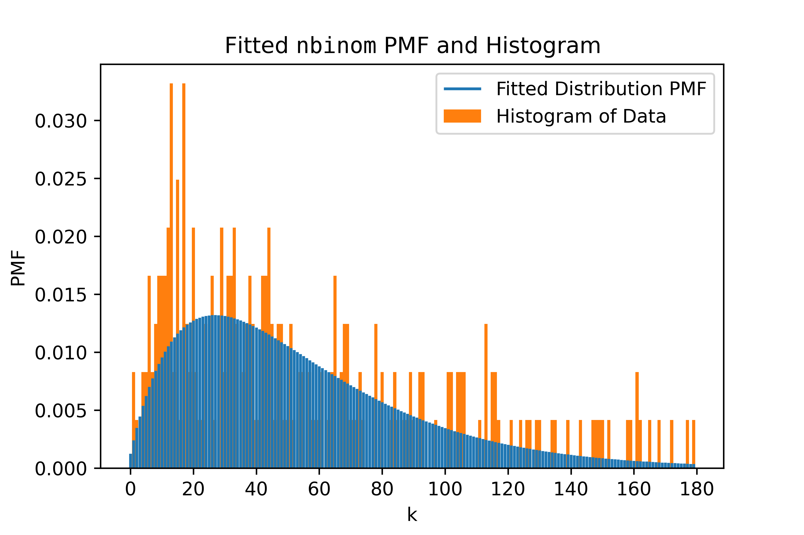

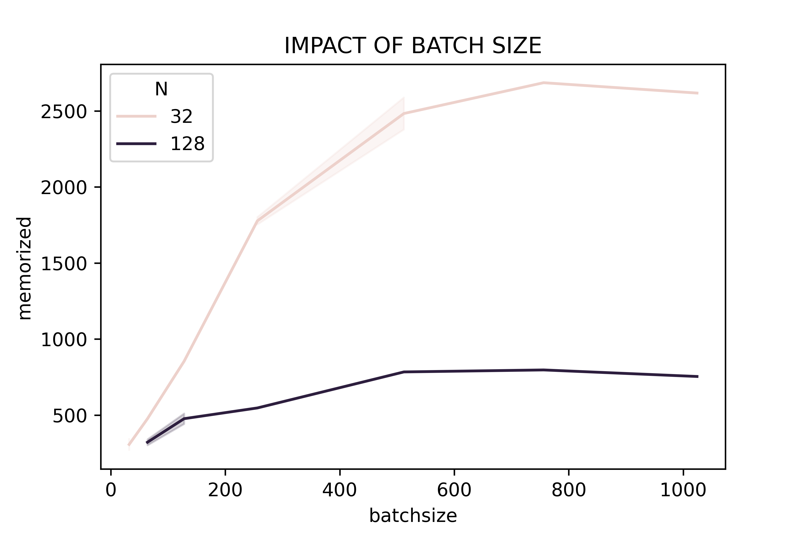

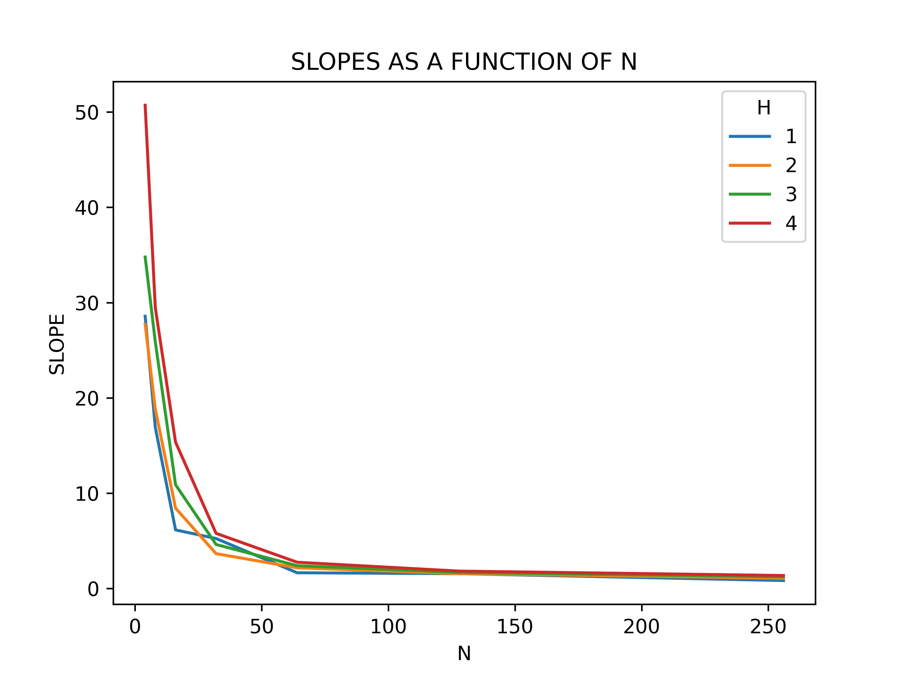

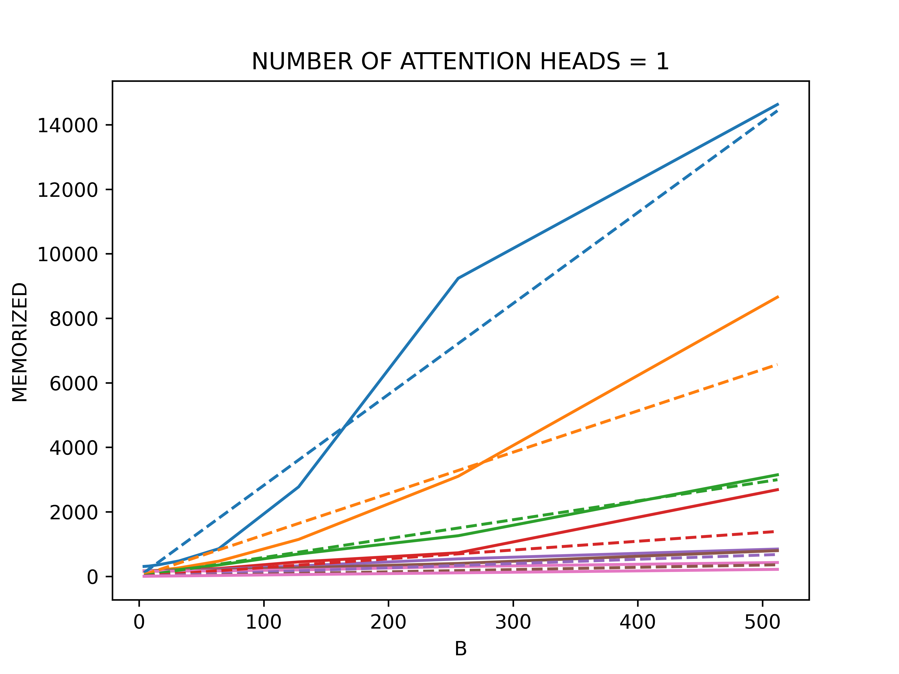

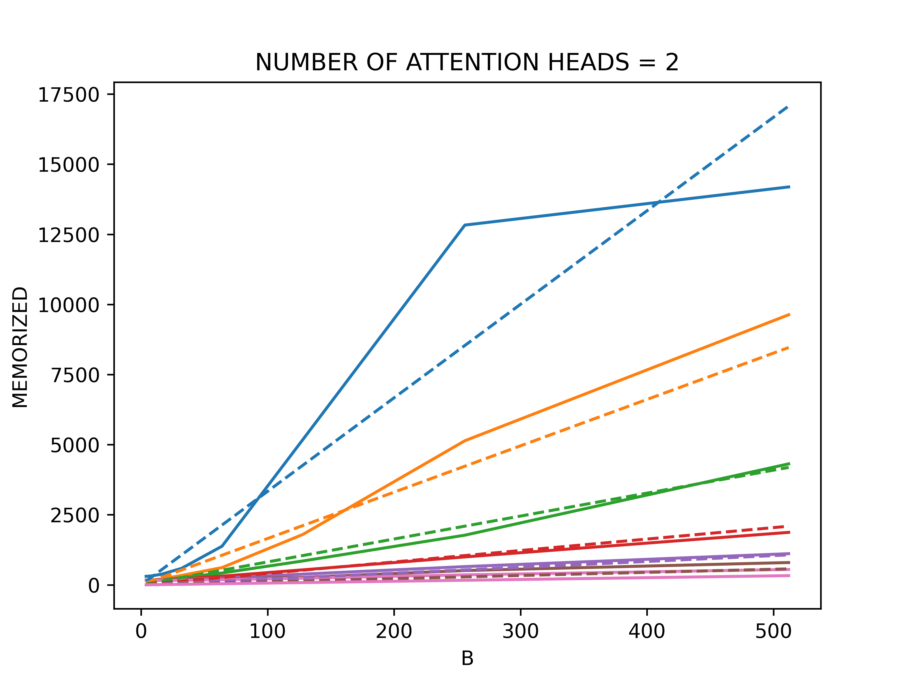

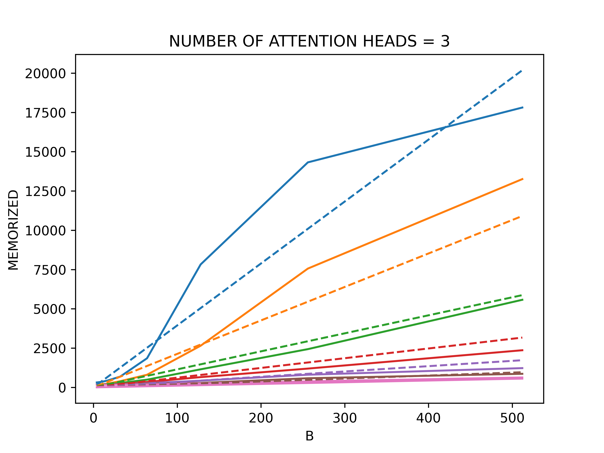

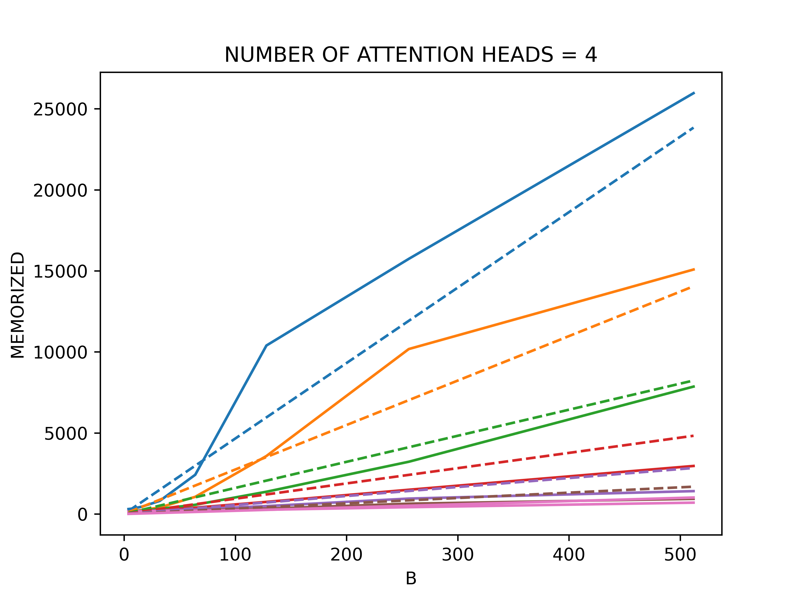

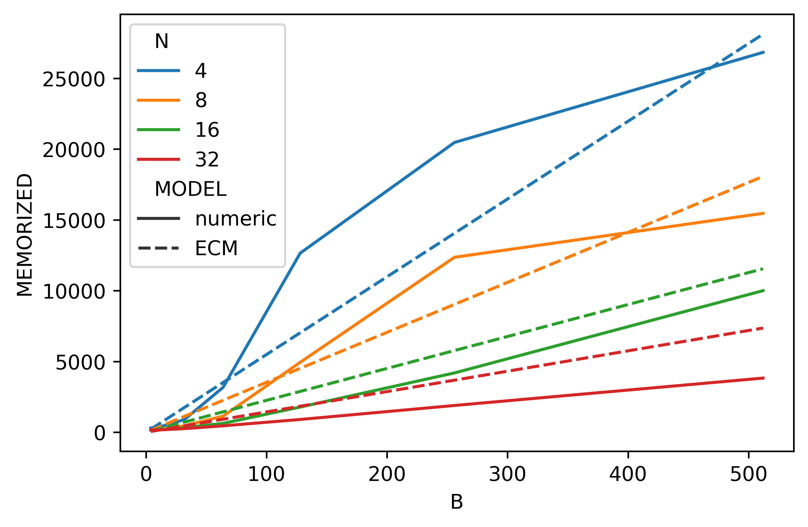

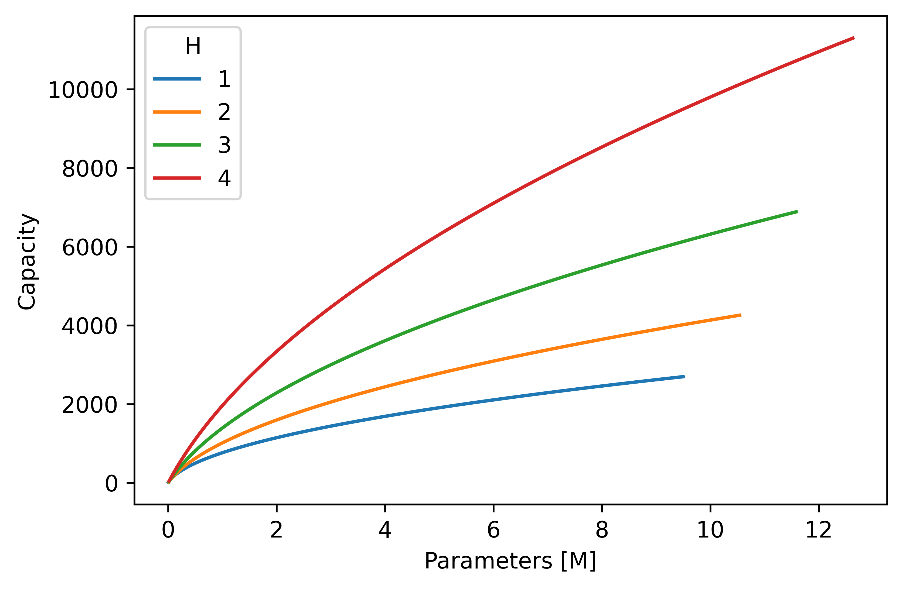

[Arxiv](https://arxiv.org/abs/2407.15425)