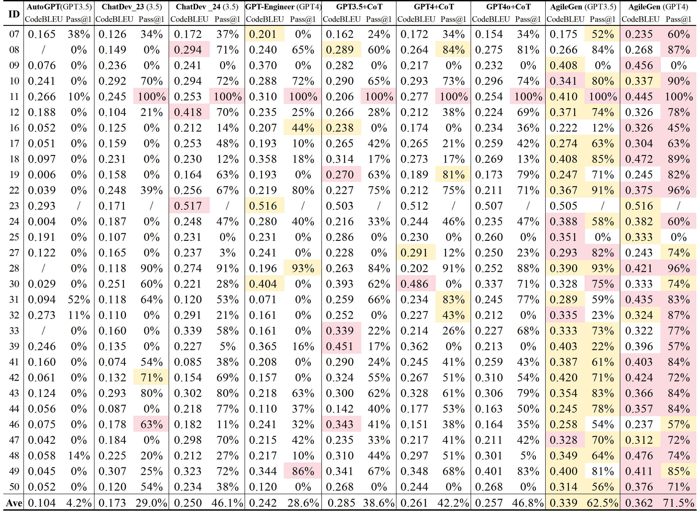
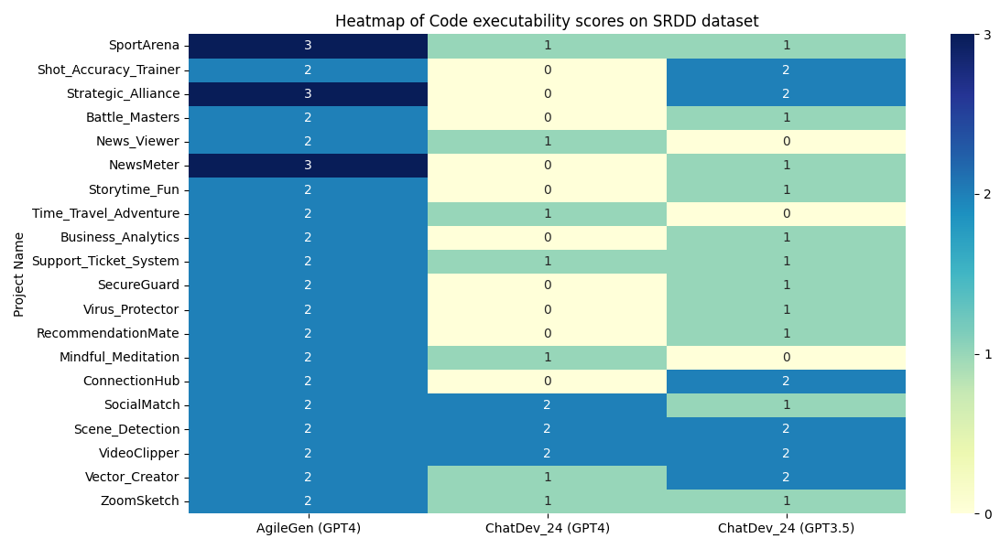
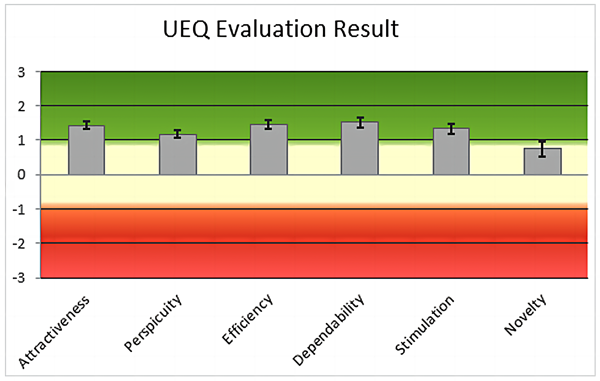
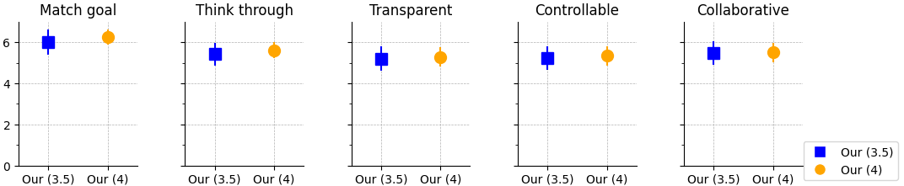

# 人-AI 团队合作助力敏捷生成式软件开发

发布时间：2024年07月22日

`Agent` `软件开发` `人机协作`

> Empowering Agile-Based Generative Software Development through Human-AI Teamwork

# 摘要

> 在软件开发领域，用户原始需求的不完整性常导致应用功能实现受阻。借助大型语言模型，近期采用瀑布模型的方法通过提问来完善需求，但用户因领域知识限制，难以提供有效验收标准，无法捕捉隐性需求。瀑布模型的累积错误还可能使代码与用户需求脱节。敏捷方法虽通过迭代和协作减少错误，但确保需求与代码语义一致仍是一大挑战。为此，我们提出AgileGen，一种基于敏捷的人机协作生成软件开发方法。AgileGen首次采用Gherkin可测试需求确保需求与代码的语义一致，并在人机协作中创新，让用户参与其擅长的决策过程，提升应用功能完整性。此外，我们引入记忆池机制收集用户决策场景，向新用户推荐，以提高场景可靠性。AgileGen作为用户友好系统，性能超越现有最佳方法16.4%，用户满意度显著提升。

> In software development, the raw requirements proposed by users are frequently incomplete, which impedes the complete implementation of application functionalities. With the emergence of large language models, recent methods with the top-down waterfall model employ a questioning approach for requirement completion, attempting to explore further user requirements. However, users, constrained by their domain knowledge, lack effective acceptance criteria, which fail to capture the implicit needs of the user. Moreover, the cumulative errors of the waterfall model can lead to discrepancies between the generated code and user requirements. The Agile methodologies reduce cumulative errors through lightweight iteration and collaboration with users, but the challenge lies in ensuring semantic consistency between user requirements and the code generated. We propose AgileGen, an agile-based generative software development through human-AI teamwork. AgileGen attempts for the first time to use testable requirements by Gherkin for semantic consistency between requirements and code. Additionally, we innovate in human-AI teamwork, allowing users to participate in decision-making processes they do well and enhancing the completeness of application functionality. Finally, to improve the reliability of user scenarios, a memory pool mechanism is used to collect user decision-making scenarios and recommend them to new users. AgileGen, as a user-friendly interactive system, significantly outperformed existing best methods by 16.4% and garnered higher user satisfaction.

[Arxiv](https://arxiv.org/abs/2407.15568)