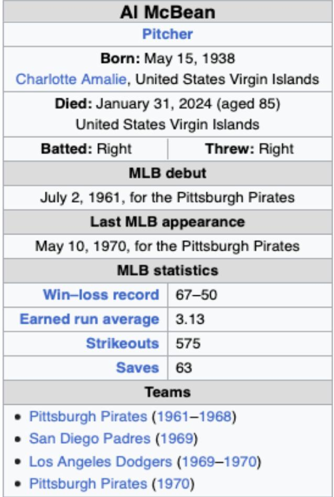
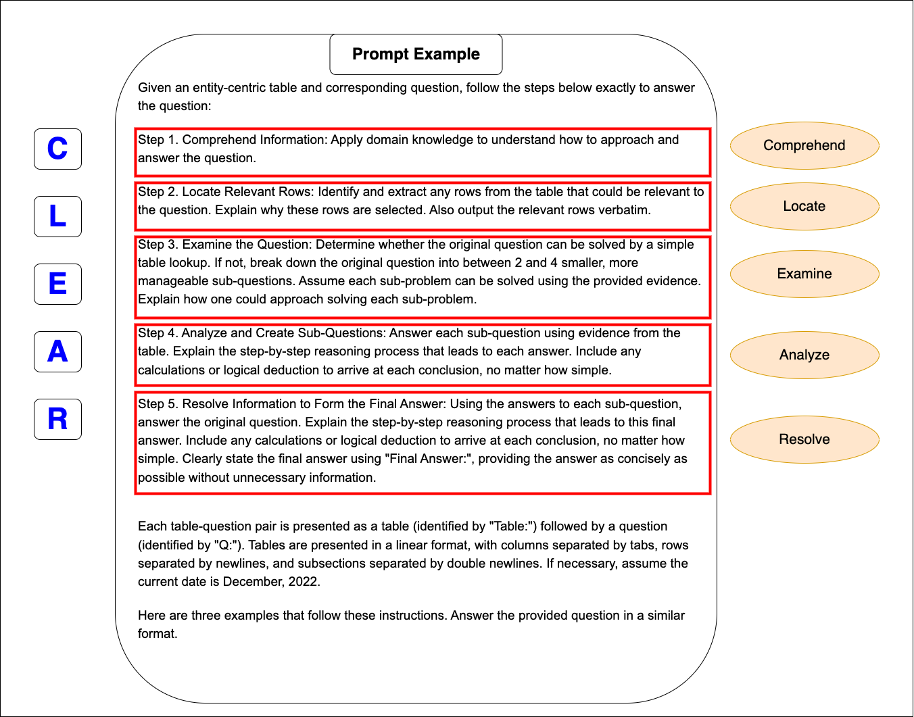
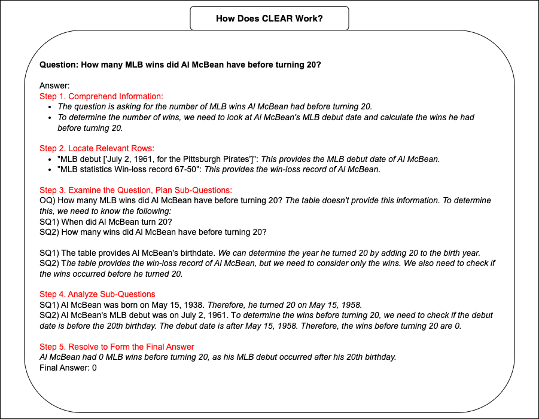

# 提升 LLM 对半结构化表格的时间感知能力

发布时间：2024年07月22日

`LLM应用` `时间数据分析` `人工智能`

> Enhancing Temporal Understanding in LLMs for Semi-structured Tables

# 摘要

> 近期研究表明，大型语言模型在表格数据的时间推理上存在显著挑战。本研究通过深入分析时间数据集，揭示了 LLM 的具体局限，并优化了专为表格时间问答设计的 TempTabQA 数据集。我们不仅提供了提升 LLM 在时间推理任务中表现的宝贵见解，还创新性地引入了 C.L.E.A.R 方法，强化了 LLM 在这一领域的能力。实验证明，该方法大幅提升了模型基于证据的推理能力。同时，利用辅助数据的间接监督也显著增强了模型性能。这一研究不仅深化了对 LLM 时间推理能力的理解，还推动了其在多领域的应用发展。

> Temporal reasoning over tabular data presents substantial challenges for large language models (LLMs), as evidenced by recent research. In this study, we conduct a comprehensive analysis of temporal datasets to pinpoint the specific limitations of LLMs. Our investigation leads to enhancements in TempTabQA, a dataset specifically designed for tabular temporal question answering. We provide critical insights for improving LLM performance in temporal reasoning tasks with tabular data. Furthermore, we introduce a novel approach, C.L.E.A.R to strengthen LLM capabilities in this domain. Our findings demonstrate that our method significantly improves evidence-based reasoning across various models. Additionally, our experimental results reveal that indirect supervision with auxiliary data substantially boosts model performance in these tasks. This work contributes to a deeper understanding of LLMs' temporal reasoning abilities over tabular data and promotes advancements in their application across diverse fields.

[Arxiv](https://arxiv.org/abs/2407.16030)